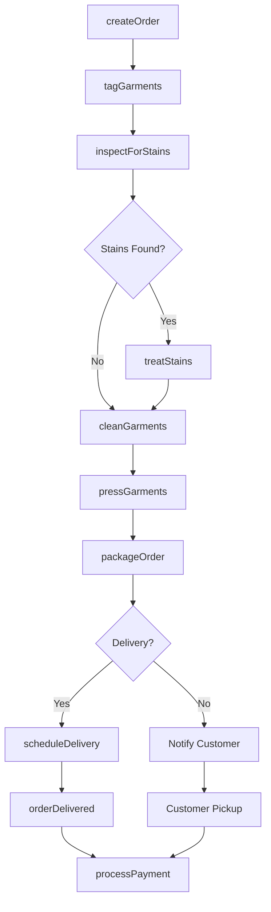
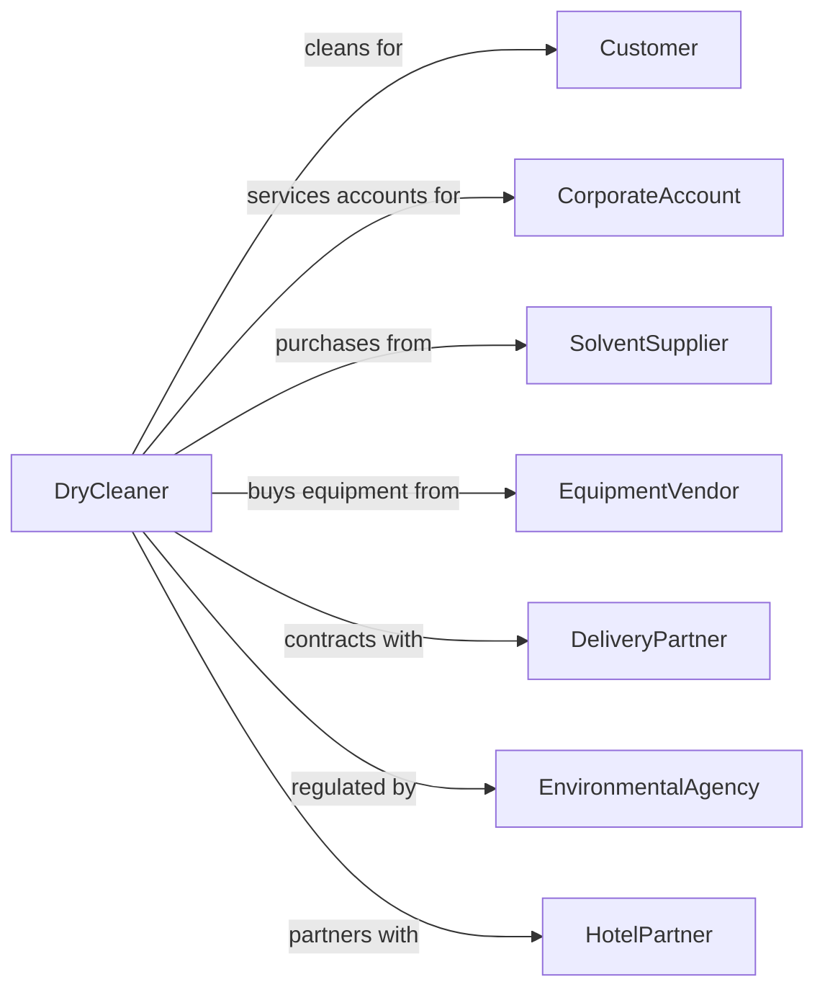

# Drycleaning and Laundry Services (except Coin-Operated)

> Business-as-Code definition for full-service dry cleaning and laundry operations. Models garment cleaning, specialty cleaning, and pickup/delivery services.

## Overview

Dry cleaning and laundry services provide professional garment cleaning using dry cleaning solvents, wet cleaning, and specialty treatment for leather, suede, and delicate fabrics. This definition exposes actions for order intake, cleaning processes, and delivery, with events for order tracking and searches for service options.

## Actors

| Actor | Description |
|-------|-------------|
| Customer | Individual bringing garments for cleaning |
| CorporateAccount | Business with regular cleaning needs |
| SolventSupplier | Provides dry cleaning chemicals |
| EquipmentVendor | Supplies cleaning machines and presses |
| DeliveryPartner | Provides route delivery services |
| EnvironmentalAgency | Regulates solvent use and disposal |
| HotelPartner | Provides guest cleaning services |

## Roles

| Role | Description |
|------|-------------|
| StoreOwner | Owns and operates the dry cleaner |
| CounterClerk | Receives orders and handles customers |
| Spotter | Treats stains before cleaning |
| Presser | Irons and finishes garments |
| RouteDriver | Picks up and delivers orders |
| PlantManager | Oversees cleaning operations |
| WeddingGownSpecialist | Cleans, preserves, and boxes bridal gowns using heirloom-safe techniques |

## Entities

| Entity | Description |
|--------|-------------|
| Garment | Item being cleaned |
| Order | Collection of items for one customer |
| Ticket | Order tracking documentation |
| Stain | Mark requiring special treatment |
| CleaningMethod | Dry clean, wet clean, or specialty process |
| Press | Finishing treatment for garments |
| Alteration | Repair or modification service |
| Route | Delivery schedule and stops |
| Invoice | Billing for services |
| Hanger | Garment presentation and storage |

## Actions

| Action | Description |
|--------|-------------|
| createOrder | Receive garments and document items |
| tagGarments | Attach tracking labels to items |
| inspectForStains | Identify spots requiring treatment |
| treatStains | Apply pre-cleaning spot removal |
| cleanGarments | Process through dry clean or wet clean |
| pressGarments | Iron and finish items |
| packageOrder | Prepare items for pickup or delivery |
| schedulePickup | Arrange customer pickup time |
| scheduleDelivery | Arrange route delivery |
| processPayment | Collect payment for services |
| handleClaim | Address damage or loss complaints |
| performAlteration | Execute repair or modification |

## Events

| Event | Description |
|-------|-------------|
| orderCreated | New order has been received |
| garmentsTagged | Items have been labeled |
| stainsIdentified | Spots have been documented |
| stainsTreated | Pre-treatment has been applied |
| cleaningCompleted | Items have been cleaned |
| pressingCompleted | Items have been finished |
| orderPackaged | Items are ready for customer |
| orderDelivered | Items have been returned to customer |
| paymentProcessed | Payment has been received |
| claimFiled | Customer complaint has been logged |

## Searches

| Search | Description |
|--------|-------------|
| findOrderStatus | Check progress of customer order |
| getCustomerHistory | Retrieve previous orders |
| searchRouteSchedule | View delivery routes and times |
| findPendingOrders | List orders ready for pickup |
| getCleaningPrices | View pricing by garment type |
| checkSpecialtyServices | Find available specialty treatments |

## Workflow



## Actor Relationships



## Usage

### Calling Actions

```typescript
import { launderDryCleaning } from '@headlessly/launder-dry-cleaning'

const cleaner = launderDryCleaning()

// Check progress of customer order
const findOrderStatusResult = await cleaner.findOrderStatus({ status: 'active' })

// Retrieve previous orders
const getCustomerHistoryResult = await cleaner.getCustomerHistory({ status: 'active' })

// Create new order
const order = await cleaner.createOrder({
  customerId: 'cust-123',
  items: [
    { type: 'suit', description: 'Navy wool suit', quantity: 1 },
    { type: 'shirt', description: 'White dress shirts', quantity: 5 },
    { type: 'dress', description: 'Silk cocktail dress', quantity: 1 }
  ],
  rushService: false,
  deliveryRequested: true
})

// Inspect and treat stains
const inspection = await cleaner.inspectForStains({
  orderId: order.id,
  findings: [
    { itemIndex: 0, stainType: 'oil', location: 'jacket front' },
    { itemIndex: 2, stainType: 'wine', location: 'hem' }
  ]
})

await cleaner.treatStains({
  orderId: order.id,
  treatments: inspection.recommendedTreatments
})

// Schedule delivery
await cleaner.scheduleDelivery({
  orderId: order.id,
  routeId: 'route-tuesday',
  preferredWindow: 'afternoon'
})
```

### Event-Driven Automation

```typescript
// Auto-notify when order ready
cleaner.orderPackaged(async ({ orderId, customerId, deliveryScheduled }) => {
  if (!deliveryScheduled) {
    await cleaner.notifyCustomer({
      customerId,
      message: 'Your dry cleaning is ready for pickup!'
    })
  }
})

// Alert for specialty items requiring attention
cleaner.stainsIdentified(async ({ orderId, items }) => {
  const difficultStains = items.filter(i => i.stainDifficulty === 'high')
  if (difficultStains.length > 0) {
    await cleaner.alertSpotter({
      orderId,
      items: difficultStains,
      message: 'Difficult stains require attention'
    })
  }
})

// Handle damage claims
cleaner.claimFiled(async ({ orderId, customerId, claimType }) => {
  await cleaner.createClaimRecord({
    orderId,
    customerId,
    claimType,
    status: 'underReview'
  })
  await cleaner.notifyManager({
    message: `Claim filed for order ${orderId}: ${claimType}`
  })
})
```
