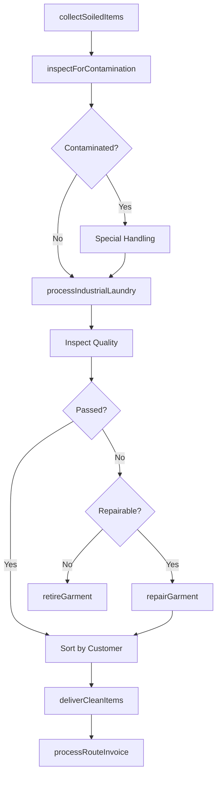
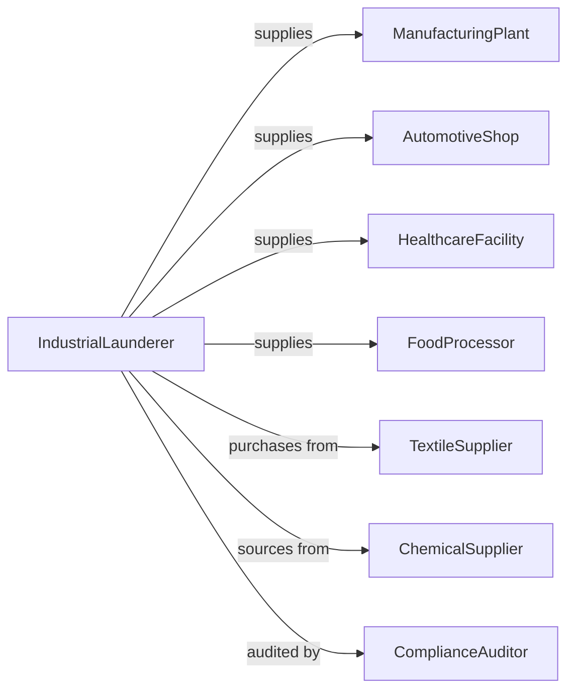

# Industrial Launderers

> Business-as-Code definition for industrial laundry operations. Models rental and laundering of work uniforms, protective apparel, and industrial textiles.

## Overview

Industrial launderers provide rental and laundering services for work uniforms, protective apparel, cleanroom garments, floor mats, shop towels, and industrial dust control items. This definition exposes actions for uniform program management, route operations, and specialized laundering, with events for compliance tracking and searches for inventory.

## Actors

| Actor | Description |
|-------|-------------|
| ManufacturingPlant | Industrial customer needing uniforms and mats |
| AutomotiveShop | Automotive customer needing shop towels |
| HealthcareFacility | Medical customer needing cleanroom garments |
| FoodProcessor | Food industry customer needing hygienic apparel |
| TextileSupplier | Provides garments and mats |
| ChemicalSupplier | Provides specialized detergents |
| ComplianceAuditor | Verifies safety and hygiene standards |

## Roles

| Role | Description |
|------|-------------|
| AccountManager | Manages customer relationships |
| RouteServiceRep | Delivers and collects at customer sites |
| PlantSupervisor | Oversees laundry processing |
| GarmentTech | Repairs and sizes uniforms |
| SafetyOfficer | Ensures compliance with regulations |
| InventoryController | Manages garment and mat inventory |

## Entities

| Entity | Description |
|--------|-------------|
| Uniform | Work garment for employee wear |
| ProtectiveApparel | Flame-resistant or safety clothing |
| CleanroomGarment | Contamination-controlled clothing |
| FloorMat | Entrance or anti-fatigue mat |
| ShopTowel | Industrial wiping cloth |
| WipingCloth | Cleaning rag or towel |
| Employee | Individual wearing assigned uniform |
| Locker | Storage for employee garments |
| Route | Delivery and pickup schedule |
| ServiceAgreement | Contract for industrial laundry |

## Actions

| Action | Description |
|--------|-------------|
| deliverCleanItems | Drop off laundered uniforms and mats |
| collectSoiledItems | Pick up dirty items from customer |
| processIndustrialLaundry | Wash with specialized protocols |
| assignUniforms | Allocate garments to employees |
| sizeEmployee | Measure and fit employee for uniforms |
| repairGarment | Fix tears, replace zippers, or buttons |
| inspectForContamination | Check for hazardous materials |
| retireGarment | Remove worn items from service |
| manageLockers | Maintain employee garment storage |
| trackCompliance | Document safety and hygiene standards |
| adjustServiceLevel | Modify items or frequency for customer |
| processRouteInvoice | Bill for services rendered |

## Events

| Event | Description |
|-------|-------------|
| itemsDelivered | Clean items have been dropped off |
| itemsCollected | Soiled items have been picked up |
| laundryProcessed | Items have been cleaned |
| uniformsAssigned | Garments allocated to employee |
| employeeSized | Measurements taken for fitting |
| garmentRepaired | Item has been fixed |
| garmentRetired | Item removed from circulation |
| contaminationDetected | Hazardous material found |
| complianceVerified | Standards have been met |
| invoiceProcessed | Billing has been completed |

## Searches

| Search | Description |
|--------|-------------|
| getEmployeeUniforms | List garments assigned to worker |
| checkInventoryByCustomer | View items in circulation |
| findRouteSchedule | View delivery and pickup times |
| getComplianceReport | Retrieve safety documentation |
| searchRetiredGarments | Track items removed from service |
| findRepairQueue | View garments needing repair |

## Workflow



## Actor Relationships



## Usage

### Calling Actions

```typescript
import { launderUniforms } from '@headlessly/launder-uniforms'

const launderer = launderUniforms()

// List garments assigned to worker
const getEmployeeUniformsResult = await launderer.getEmployeeUniforms({ status: 'active' })

// View items in circulation
const checkInventoryByCustomerResult = await launderer.checkInventoryByCustomer({ status: 'active' })

// Assign uniforms to new employee
await launderer.assignUniforms({
  customerId: 'mfg-plant-123',
  employeeId: 'emp-456',
  employeeName: 'John Smith',
  garments: [
    { type: 'shirt', size: 'L', quantity: 5 },
    { type: 'pants', size: '34x32', quantity: 5 },
    { type: 'jacket', size: 'L', quantity: 2 }
  ]
})

// Deliver clean items on route
await launderer.deliverCleanItems({
  customerId: 'mfg-plant-123',
  routeId: 'route-wed-industrial',
  items: {
    uniforms: 150,
    floorMats: 12,
    shopTowels: 500,
    fenderCovers: 25
  }
})

// Process specialized industrial laundry
await launderer.processIndustrialLaundry({
  batchId: 'batch-789',
  itemTypes: ['flameResistant', 'hiVis'],
  specialProtocol: 'NFPA2112',
  sanitizationLevel: 'industrial'
})
```

### Event-Driven Automation

```typescript
// Alert safety team when contamination detected
launderer.contaminationDetected(async ({ batchId, contaminantType, customerId }) => {
  await launderer.alertSafetyTeam({
    batchId,
    contaminantType,
    customerId,
    action: 'isolateAndInvestigate'
  })
  await launderer.notifyCustomer({
    customerId,
    message: `Potential contamination detected. Items isolated for investigation.`
  })
})

// Auto-size new employees
launderer.uniformsAssigned(async ({ employeeId, customerId }) => {
  const employee = await launderer.getEmployee(employeeId)
  if (!employee.sized) {
    await launderer.schedulesSizing({
      employeeId,
      customerId,
      appointmentType: 'onSite'
    })
  }
})

// Track compliance documentation
launderer.complianceVerified(async ({ customerId, standard, auditDate }) => {
  await launderer.recordCompliance({
    customerId,
    standard,
    auditDate,
    expirationDate: addYears(auditDate, 1)
  })
})
```
