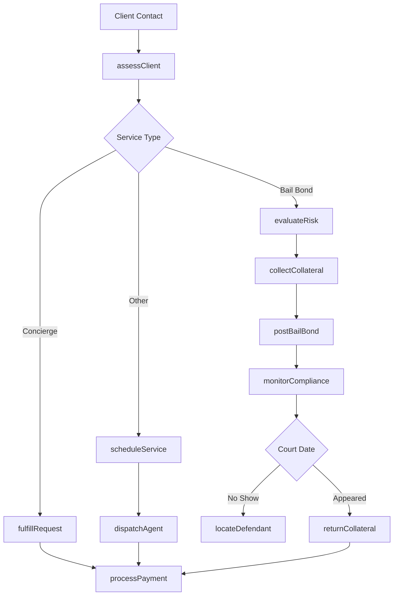
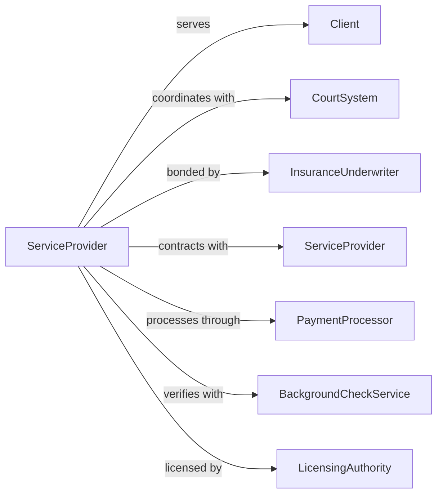

# All Other Personal Services

> Business-as-Code definition for miscellaneous personal services. Models bail bonding, concierge services, and other specialized personal services.

## Overview

This industry includes personal services not classified elsewhere such as bail bonding, dating services, concierge services, and personal assistant services. This definition exposes actions for service delivery, client management, and transaction processing, with events for service completion and searches for service options.

## Actors

| Actor | Description |
|-------|-------------|
| Client | Individual seeking personal services |
| CourtSystem | Interacts with bail bonding services |
| InsuranceUnderwriter | Provides bail bond surety |
| ServiceProvider | Contracted providers for various services |
| PaymentProcessor | Handles financial transactions |
| BackgroundCheckService | Verifies client information |
| LicensingAuthority | Regulates service providers |

## Roles

| Role | Description |
|------|-------------|
| BusinessOwner | Owns and operates the service |
| BailBondAgent | Processes and manages bail bonds |
| ConciergeSpecialist | Fulfills concierge requests |
| PersonalAssistant | Provides administrative support |
| IntakeCoordinator | Receives and processes new clients |
| FieldAgent | Performs off-site services |

## Entities

| Entity | Description |
|--------|-------------|
| Client | Individual receiving services |
| ServiceRequest | Specific task or service needed |
| BailBond | Surety for court appearance |
| Contract | Agreement for services |
| Defendant | Individual requiring bail |
| Collateral | Security for bail bond |
| Membership | Subscription to ongoing services |
| Task | Individual action to complete |
| Invoice | Billing for services |
| Referral | Source of new business |

## Actions

| Action | Description |
|--------|-------------|
| assessClient | Evaluate client needs and eligibility |
| createContract | Establish service agreement |
| postBailBond | Secure release from custody |
| collectCollateral | Obtain security for bond |
| fulfillRequest | Complete service task |
| dispatchAgent | Send field representative |
| processPayment | Collect fees for services |
| monitorCompliance | Track bail conditions |
| surrenderDefendant | Return to custody if needed |
| scheduleMeeting | Book appointment with client |
| provideReferral | Connect client with other services |
| renewMembership | Extend subscription |

## Events

| Event | Description |
|-------|-------------|
| clientAssessed | Needs evaluation completed |
| contractCreated | Service agreement established |
| bailPosted | Defendant released on bond |
| collateralCollected | Security obtained |
| requestFulfilled | Task completed |
| agentDispatched | Field representative sent |
| paymentProcessed | Fees collected |
| complianceVerified | Conditions met |
| courtAppearanceMade | Defendant appeared as required |
| membershipRenewed | Subscription extended |

## Searches

| Search | Description |
|--------|-------------|
| findClientHistory | Retrieve previous services |
| getBondStatus | Check bail bond conditions |
| searchCourtDates | Find upcoming appearances |
| findServiceOptions | View available services |
| getAgentAvailability | Check field representative schedules |
| searchReferralSources | Find partnership opportunities |

## Workflow



## Actor Relationships



## Usage

### Calling Actions

```typescript
import { servePersonal } from '@headlessly/serve-personal'

const service = servePersonal()

// Retrieve previous services
const findClientHistoryResult = await service.findClientHistory({ status: 'active' })

// Check bail bond conditions
const getBondStatusResult = await service.getBondStatus({ status: 'active' })

// Post bail bond
const bond = await service.postBailBond({
  defendantName: 'John Doe',
  chargeType: 'misdemeanor',
  bondAmount: 5000,
  courtDate: '2024-04-15',
  indemnitorName: 'Jane Doe',
  relationship: 'spouse'
})

await service.collectCollateral({
  bondId: bond.id,
  collateralType: 'property',
  collateralValue: 5000,
  description: 'Vehicle title'
})

// Fulfill concierge request
const request = await service.fulfillRequest({
  clientId: 'client-123',
  serviceType: 'errand',
  description: 'Pick up dry cleaning and deliver to home',
  preferredTime: 'afternoon',
  priority: 'normal'
})

await service.dispatchAgent({
  requestId: request.id,
  agentId: 'agent-456',
  estimatedDuration: '2 hours'
})
```

### Event-Driven Automation

```typescript
// Monitor bail compliance
service.bailPosted(async ({ bondId, courtDate }) => {
  await service.scheduleReminders({
    bondId,
    reminders: [
      { daysBeforeCourt: 7, method: 'call' },
      { daysBeforeCourt: 3, method: 'call' },
      { daysBeforeCourt: 1, method: 'call' }
    ]
  })
})

// Handle court appearance outcome
service.courtAppearanceMade(async ({ bondId, outcome }) => {
  if (outcome === 'appeared') {
    await service.returnCollateral({ bondId })
    await service.closeBond({ bondId, status: 'discharged' })
  }
})

// Notify client when service complete
service.requestFulfilled(async ({ requestId, clientId }) => {
  await service.notifyClient({
    clientId,
    message: 'Your request has been completed. Invoice attached.',
    attachInvoice: true
  })
})
```
