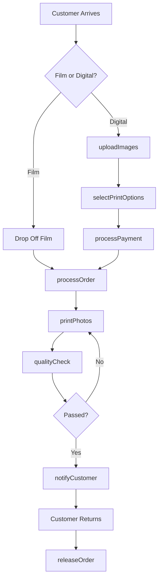
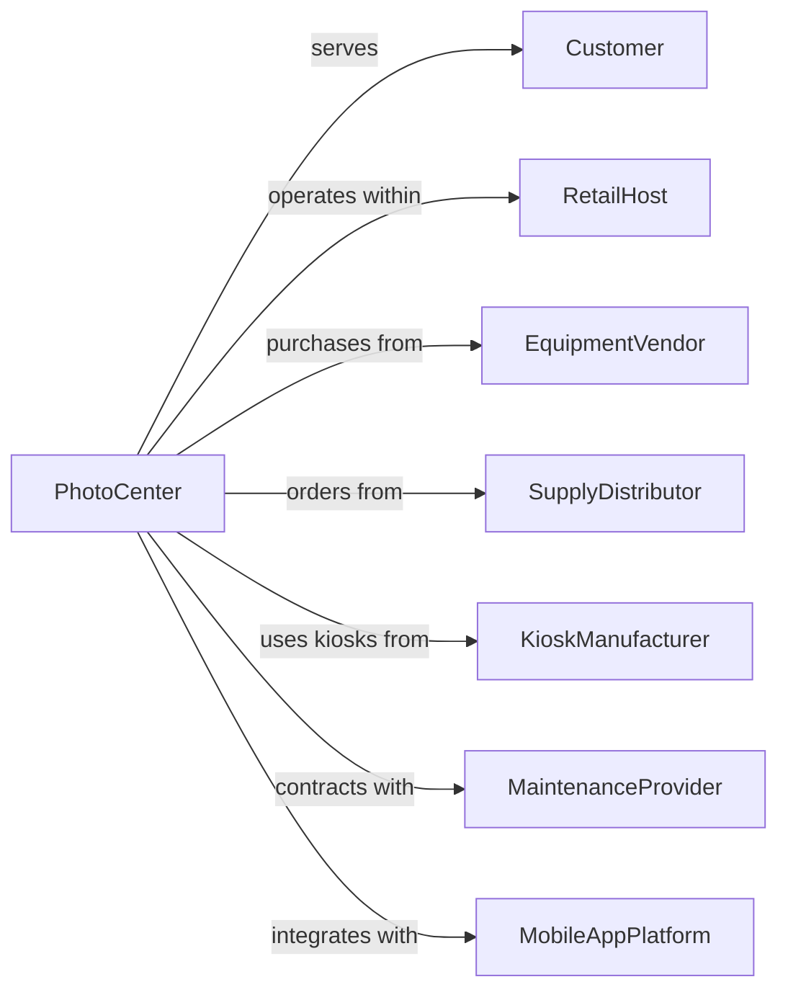

# One-Hour Photofinishing

> Business-as-Code definition for quick-service photofinishing operations. Models rapid film development and digital printing while-you-wait.

## Overview

One-hour photofinishing provides rapid film development and digital photo printing with quick turnaround times, typically while customers wait. This definition exposes actions for expedited processing, kiosk operations, and instant printing, with events for order completion and searches for service availability.

## Actors

| Actor | Description |
|-------|-------------|
| Customer | Individual seeking quick photo prints |
| RetailHost | Store hosting photo services |
| EquipmentVendor | Supplies mini-labs and kiosks |
| SupplyDistributor | Provides paper, chemicals, and ink |
| KioskManufacturer | Provides self-service terminals |
| MaintenanceProvider | Services equipment |
| MobileAppPlatform | Enables remote order submission |

## Roles

| Role | Description |
|------|-------------|
| StoreManager | Oversees photo department |
| PhotoTechnician | Operates mini-lab equipment |
| KioskAttendant | Assists customers with self-service |
| QualityChecker | Reviews prints before release |
| EquipmentTech | Maintains printing equipment |

## Entities

| Entity | Description |
|--------|-------------|
| Order | Customer print request |
| Film | Roll requiring quick development |
| DigitalFile | Image from phone, camera, or media |
| Print | Physical photograph |
| Kiosk | Self-service order terminal |
| MiniLab | Compact development and print system |
| PhotoPaper | Printing medium in various sizes |
| MemoryCard | Storage device with customer images |
| PhotoBook | Bound collection of printed images |
| Pickup | Order ready for customer collection |

## Actions

| Action | Description |
|--------|-------------|
| createOrder | Start new print order |
| uploadImages | Transfer files from device or media |
| selectPrintOptions | Choose size, quantity, and finish |
| processOrder | Develop film or prepare files |
| printPhotos | Produce physical prints |
| createPhotoGift | Make mugs, calendars, or gifts |
| qualityCheck | Verify print quality |
| notifyCustomer | Alert when order is ready |
| releaseOrder | Provide prints to customer |
| processPayment | Collect payment |
| assistWithKiosk | Help customer use self-service |
| maintainEquipment | Service mini-lab and kiosk |

## Events

| Event | Description |
|-------|-------------|
| orderCreated | New order has been started |
| imagesUploaded | Files have been transferred |
| optionsSelected | Print preferences confirmed |
| processingStarted | Order is being produced |
| printingCompleted | Prints are finished |
| qualityVerified | Prints passed inspection |
| customerNotified | Alert sent for pickup |
| orderReleased | Customer has received prints |
| paymentProcessed | Transaction completed |
| equipmentServiced | Maintenance completed |

## Searches

| Search | Description |
|--------|-------------|
| checkOrderStatus | View progress of order |
| findPrintOptions | View available sizes and products |
| getWaitTime | Estimate time to completion |
| searchPromotions | Find current discounts |
| checkSupplyLevels | Monitor paper and ink inventory |
| findEquipmentStatus | Check mini-lab operational status |

## Workflow



## Actor Relationships



## Usage

### Calling Actions

```typescript
import { servePrints } from '@headlessly/serve-prints'

const photoCenter = servePrints()

// Create kiosk order
const order = await photoCenter.createOrder({
  customerId: 'walk-in',
  sourceType: 'memoryCard',
  mediaType: 'SD'
})

// Upload and select images
await photoCenter.uploadImages({
  orderId: order.id,
  imageCount: 25,
  source: 'sdCard'
})

await photoCenter.selectPrintOptions({
  orderId: order.id,
  selections: [
    { imageIds: ['all'], size: '4x6', finish: 'glossy', quantity: 1 },
    { imageIds: ['img-5', 'img-12'], size: '8x10', finish: 'matte', quantity: 2 }
  ]
})

// Process and print
await photoCenter.processOrder({
  orderId: order.id,
  rushPriority: true
})
```

### Event-Driven Automation

```typescript
// Auto-start printing when images uploaded
photoCenter.optionsSelected(async ({ orderId, paymentComplete }) => {
  if (paymentComplete) {
    await photoCenter.processOrder({
      orderId,
      rushPriority: true
    })
  }
})

// Notify customer when prints ready
photoCenter.qualityVerified(async ({ orderId }) => {
  const order = await photoCenter.getOrder(orderId)
  await photoCenter.notifyCustomer({
    customerId: order.customerId,
    method: order.notificationPreference || 'inStore',
    message: 'Your photos are ready for pickup!'
  })
})

// Alert for low supplies
photoCenter.printingCompleted(async ({ paperId, paperUsed }) => {
  const levels = await photoCenter.checkSupplyLevels({ paperId })
  if (levels.remaining < levels.reorderPoint) {
    await photoCenter.alertManager({
      supplyType: 'paper',
      paperId,
      message: 'Paper supply low. Reorder needed.'
    })
  }
})
```
