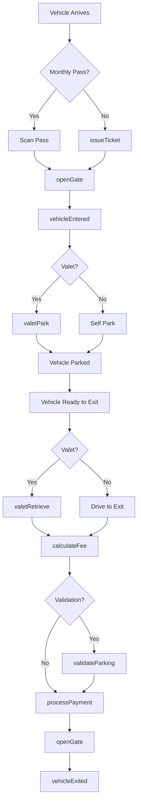
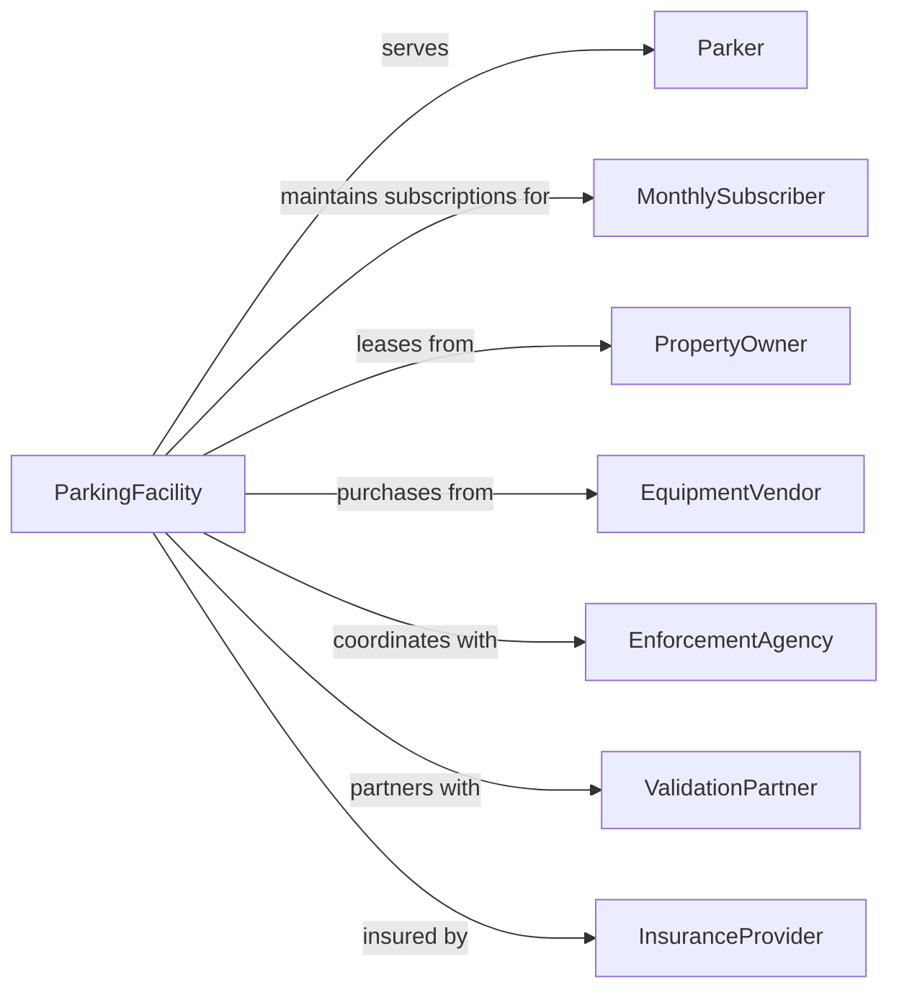

# Parking Lots and Garages

> Business-as-Code definition for parking facility operations. Models hourly, daily, and monthly parking services including valet operations.

## Overview

Parking lots and garages provide vehicle parking space on hourly, daily, or monthly basis, as well as valet parking services. This definition exposes actions for entry/exit processing, payment collection, and space management, with events for occupancy tracking and searches for availability.

## Actors

| Actor | Description |
|-------|-------------|
| Parker | Individual parking a vehicle |
| MonthlySubscriber | Customer with parking subscription |
| PropertyOwner | Owner of parking facility |
| EquipmentVendor | Supplies gates, kiosks, and payment systems |
| EnforcementAgency | Issues parking citations |
| ValidationPartner | Business validating customer parking |
| InsuranceProvider | Covers facility liability |

## Roles

| Role | Description |
|------|-------------|
| FacilityManager | Oversees parking operations |
| Attendant | Assists parkers and monitors lot |
| ValetDriver | Parks and retrieves vehicles |
| CashierOp | Processes payments at exit |
| MaintenanceTech | Maintains equipment and facility |
| SecurityGuard | Monitors facility safety |

## Entities

| Entity | Description |
|--------|-------------|
| ParkingSpace | Individual vehicle storage spot |
| Vehicle | Car or truck being parked |
| Ticket | Entry documentation with timestamp |
| MonthlyPass | Subscription for regular parking |
| Validation | Discount from partner business |
| Gate | Automated entry/exit barrier |
| PayStation | Payment kiosk or booth |
| Occupancy | Current space utilization |
| Rate | Pricing for parking duration |
| Reservation | Pre-booked parking spot |

## Actions

| Action | Description |
|--------|-------------|
| issueTicket | Generate entry ticket at gate |
| openGate | Raise barrier for entry or exit |
| calculateFee | Determine parking charges |
| processPayment | Collect parking fee |
| validateParking | Apply discount from partner |
| assignSpace | Allocate specific parking spot |
| valetPark | Park vehicle for customer |
| valetRetrieve | Return vehicle to customer |
| monitorOccupancy | Track space availability |
| enrollMonthly | Sign up customer for subscription |
| issueViolation | Cite improperly parked vehicle |
| reserveSpace | Book parking in advance |

## Events

| Event | Description |
|-------|-------------|
| vehicleEntered | Vehicle has entered facility |
| ticketIssued | Entry documentation created |
| vehicleParked | Vehicle is in assigned space |
| paymentProcessed | Fee has been collected |
| validationApplied | Discount has been added |
| vehicleExited | Vehicle has left facility |
| spaceOccupied | Parking space is now in use |
| spaceVacated | Parking space is now available |
| monthlyEnrolled | Subscription has been activated |
| violationIssued | Citation has been given |
| reservationCreated | Advance booking confirmed |

## Searches

| Search | Description |
|--------|-------------|
| findAvailableSpaces | Check current availability |
| getRateSchedule | View pricing by duration |
| getMonthlyStatus | Check subscription validity |
| findVehicleLocation | Locate parked vehicle |
| getOccupancyReport | View utilization statistics |
| searchValidationPartners | Find businesses offering validation |

## Workflow



## Actor Relationships



## Usage

### Calling Actions

```typescript
import { serveParking } from '@headlessly/serve-parking'

const facility = serveParking()

// Issue entry ticket
const entry = await facility.issueTicket({
  facilityId: 'garage-downtown',
  vehicleLicensePlate: 'ABC123',
  entryTime: new Date(),
  entryLane: 1
})

// Calculate fee at exit
const fee = await facility.calculateFee({
  ticketId: entry.ticketId,
  exitTime: new Date(),
  rateSchedule: 'standard'
})

// Apply validation
await facility.validateParking({
  ticketId: entry.ticketId,
  validationCode: 'HOTELGUEST',
  discountType: 'flat',
  discountAmount: 10
})

// Process payment and exit
await facility.processPayment({
  ticketId: entry.ticketId,
  amount: fee.totalDue,
  paymentMethod: 'creditCard'
})

await facility.openGate({
  gateId: 'exit-1',
  ticketId: entry.ticketId
})
```

### Event-Driven Automation

```typescript
// Update availability when vehicle enters
facility.vehicleEntered(async ({ facilityId, spaceType }) => {
  await facility.monitorOccupancy({
    facilityId,
    action: 'decrement',
    spaceType
  })
})

// Update availability when vehicle exits
facility.vehicleExited(async ({ facilityId, spaceType }) => {
  await facility.monitorOccupancy({
    facilityId,
    action: 'increment',
    spaceType
  })
})

// Alert when near capacity
facility.spaceOccupied(async ({ facilityId }) => {
  const occupancy = await facility.getOccupancy(facilityId)
  if (occupancy.percentFull > 90) {
    await facility.updateSignage({
      facilityId,
      status: 'NEARLY FULL'
    })
  }
})
```
