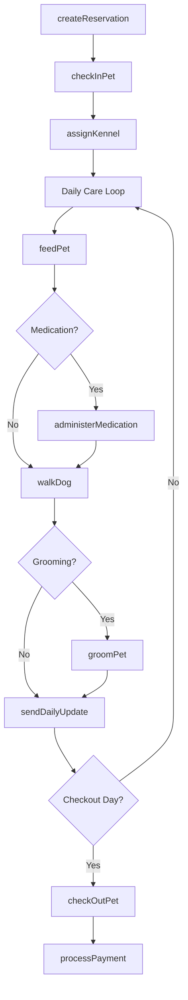
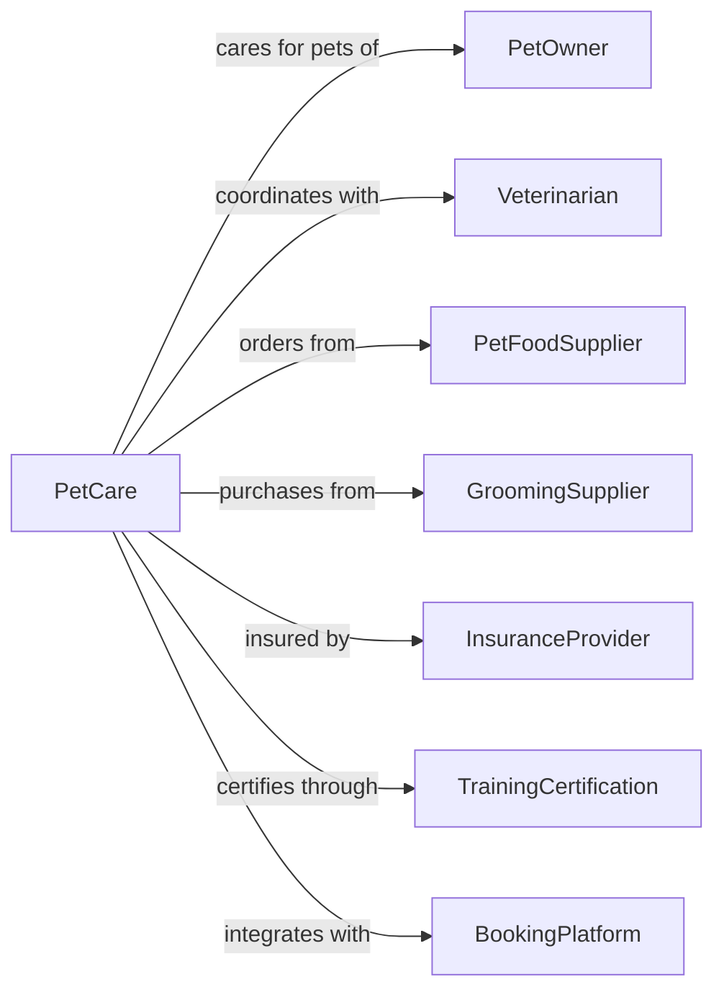

# Pet Care (except Veterinary) Services

> Business-as-Code definition for pet care operations. Models boarding, grooming, daycare, walking, and training services for pets.

## Overview

Pet care services provide non-veterinary care including boarding, grooming, daycare, dog walking, pet sitting, and training. This definition exposes actions for reservation management, daily care routines, and service delivery, with events for pet status tracking and searches for availability.

## Actors

| Actor | Description |
|-------|-------------|
| PetOwner | Individual bringing pets for care |
| Veterinarian | Provides health requirements and referrals |
| PetFoodSupplier | Supplies food and treats |
| GroomingSupplier | Provides grooming products and equipment |
| InsuranceProvider | Covers pet care liability |
| TrainingCertification | Provides trainer credentials |
| BookingPlatform | Provides online reservation system |

## Roles

| Role | Description |
|------|-------------|
| FacilityOwner | Owns and operates the pet care business |
| PetGroomer | Provides bathing, haircuts, and nail trims |
| KennelAttendant | Cares for boarded pets |
| DogWalker | Provides exercise and outdoor time |
| PetTrainer | Conducts obedience and behavior training |
| Receptionist | Manages reservations and customer service |
| CertifiedDogTrainer | Conducts specialized behavior modification and obedience programs |

## Entities

| Entity | Description |
|--------|-------------|
| Pet | Animal receiving care services |
| Reservation | Booked service or boarding stay |
| Kennel | Individual housing unit for boarding |
| GroomingSession | Scheduled grooming appointment |
| TrainingSession | Scheduled training class or lesson |
| FeedingSchedule | Pet dietary requirements and times |
| VaccinationRecord | Required health documentation |
| DailyReport | Summary of pet activities and status |
| EmergencyContact | Owner contact for urgent situations |
| MedicationSchedule | Required pet medications |

## Actions

| Action | Description |
|--------|-------------|
| createReservation | Book boarding or daycare stay |
| checkInPet | Receive pet and document health status |
| assignKennel | Allocate housing for boarded pet |
| feedPet | Provide meals according to schedule |
| administerMedication | Give required medications |
| walkDog | Provide outdoor exercise |
| groomPet | Perform bathing, haircut, or nail trim |
| conductTraining | Execute training session |
| sendDailyUpdate | Provide owner with pet status report |
| checkOutPet | Release pet to owner |
| handleEmergency | Respond to pet health or safety issue |
| processPayment | Collect payment for services |

## Events

| Event | Description |
|-------|-------------|
| reservationCreated | Booking has been confirmed |
| petCheckedIn | Pet has arrived at facility |
| kennelAssigned | Housing has been allocated |
| petFed | Meal has been provided |
| medicationAdministered | Required medication has been given |
| walkCompleted | Outdoor exercise is finished |
| groomingCompleted | Grooming service is finished |
| trainingCompleted | Training session is finished |
| dailyUpdateSent | Status report sent to owner |
| petCheckedOut | Pet has been released to owner |
| emergencyAlerted | Urgent situation has been reported |

## Searches

| Search | Description |
|--------|-------------|
| findAvailability | Check kennel or service openings |
| getPetProfile | Retrieve pet information and preferences |
| getVaccinationStatus | Check required vaccine documentation |
| findUpcomingReservations | View scheduled stays and services |
| getActivityLog | Retrieve pet daily activities |
| searchTrainingProgress | Find training history and achievements |

## Workflow



## Actor Relationships



## Usage

### Calling Actions

```typescript
import { carePets } from '@headlessly/care-pets'

const facility = carePets()

// Create boarding reservation
const reservation = await facility.createReservation({
  petId: 'pet-123',
  petName: 'Max',
  petType: 'dog',
  breed: 'Golden Retriever',
  checkInDate: '2024-03-15',
  checkOutDate: '2024-03-22',
  services: ['boarding', 'dailyWalk', 'bathOnCheckout'],
  feedingInstructions: 'Twice daily, 1 cup kibble',
  medications: [{ name: 'Heartgard', frequency: 'daily', dosage: '1 tablet' }]
})

// Check in pet
await facility.checkInPet({
  reservationId: reservation.id,
  healthCheck: 'passed',
  temperament: 'friendly',
  belongings: ['bed', 'toy', 'food']
})

// Groom pet
await facility.groomPet({
  petId: 'pet-123',
  services: ['bath', 'brushOut', 'nailTrim', 'earCleaning'],
  groomerId: 'groomer-456'
})
```

### Event-Driven Automation

```typescript
// Send daily photo updates to owner
facility.walkCompleted(async ({ petId, reservationId }) => {
  await facility.sendDailyUpdate({
    reservationId,
    petId,
    includePhoto: true,
    activities: ['walk', 'playtime'],
    mood: 'happy'
  })
})

// Alert for medication time
facility.petCheckedIn(async ({ petId, medications }) => {
  if (medications.length > 0) {
    for (const med of medications) {
      await facility.scheduleMedicationReminder({
        petId,
        medication: med.name,
        frequency: med.frequency
      })
    }
  }
})

// Handle emergency situations
facility.emergencyAlerted(async ({ petId, emergencyType }) => {
  const pet = await facility.getPetProfile(petId)
  await facility.contactOwner({
    ownerId: pet.ownerId,
    emergencyType,
    message: `Urgent: ${pet.name} requires attention. Please call us immediately.`
  })
  await facility.contactVet({
    vetId: pet.veterinarianId,
    petId,
    emergencyType
  })
})
```
