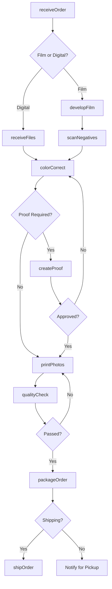
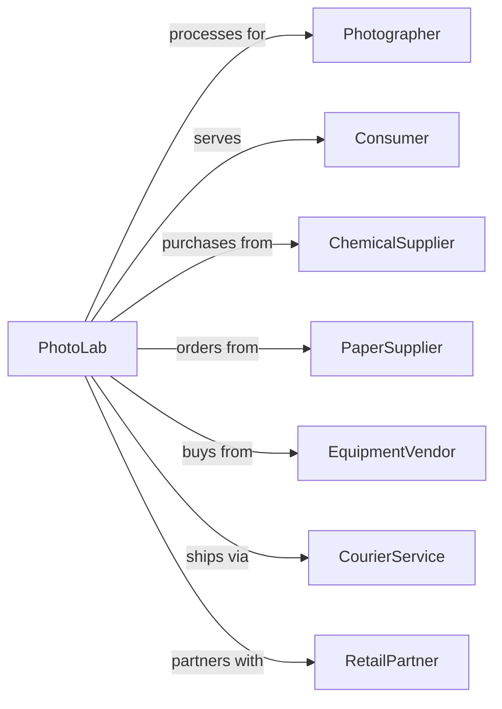

# Photofinishing Laboratories (except One-Hour)

> Business-as-Code definition for professional photofinishing laboratory operations. Models film development, print production, and digital photo services.

## Overview

Photofinishing laboratories provide professional film development, print production, enlargements, and digital photo services for photographers and consumers. This definition exposes actions for order processing, image development, and quality control, with events for order tracking and searches for service options.

## Actors

| Actor | Description |
|-------|-------------|
| Photographer | Professional submitting film or digital files |
| Consumer | Individual seeking photo prints |
| ChemicalSupplier | Provides developing chemicals |
| PaperSupplier | Provides photographic paper |
| EquipmentVendor | Supplies printers and processing equipment |
| CourierService | Delivers finished products |
| RetailPartner | Drop-off location for orders |

## Roles

| Role | Description |
|------|-------------|
| LabOwner | Owns and operates the laboratory |
| FilmTechnician | Develops film using chemical processes |
| PrintTechnician | Operates printing equipment |
| ColorCorrector | Adjusts images for optimal output |
| QualityController | Inspects finished products |
| CustomerService | Manages orders and inquiries |

## Entities

| Entity | Description |
|--------|-------------|
| Film | Exposed photographic film for development |
| Negative | Developed film ready for printing |
| Print | Physical photograph on paper |
| Enlargement | Oversized print from negative or file |
| DigitalFile | Electronic image for printing |
| Order | Customer request for services |
| ColorProfile | Calibration settings for accurate color |
| Paper | Photographic printing medium |
| Slide | Positive transparency for projection |
| Archive | Storage of negatives and files |

## Actions

| Action | Description |
|--------|-------------|
| receiveOrder | Accept film or digital files |
| developFilm | Process film through chemical development |
| scanNegatives | Digitize negatives for printing or archive |
| colorCorrect | Adjust image color and exposure |
| createProof | Generate preview prints for approval |
| printPhotos | Produce final prints |
| createEnlargement | Print oversized images |
| qualityCheck | Inspect prints for defects |
| packageOrder | Prepare prints for pickup or shipping |
| shipOrder | Send completed order to customer |
| archiveNegatives | Store negatives for future orders |
| processRetouching | Edit images per customer request |

## Events

| Event | Description |
|-------|-------------|
| orderReceived | Film or files have arrived |
| filmDeveloped | Negatives are ready |
| negativesScanned | Digital files have been created |
| colorCorrected | Images have been adjusted |
| proofsApproved | Customer has approved previews |
| printingCompleted | Prints have been produced |
| qualityPassed | Prints have been inspected |
| orderPackaged | Order is ready for delivery |
| orderShipped | Order has been sent |
| orderPickedUp | Customer has collected order |

## Searches

| Search | Description |
|--------|-------------|
| findOrderStatus | Check progress of customer order |
| getPrintOptions | View available sizes and finishes |
| searchArchive | Find stored negatives or files |
| getColorProfiles | View calibration settings |
| findPricingOptions | View service pricing |
| checkTurnaroundTime | Estimate completion time |

## Workflow



## Actor Relationships



## Usage

### Calling Actions

```typescript
import { servePhotos } from '@headlessly/serve-photos'

const lab = servePhotos()

// Check progress of customer order
const findOrderStatusResult = await lab.findOrderStatus({ status: 'active' })

// View available sizes and finishes
const getPrintOptionsResult = await lab.getPrintOptions({ status: 'active' })

// Receive film order
const order = await lab.receiveOrder({
  customerId: 'cust-123',
  orderType: 'film',
  filmRolls: 3,
  filmType: '35mm',
  services: ['develop', 'scan', 'print4x6'],
  rushOrder: false
})

// Develop and scan film
await lab.developFilm({
  orderId: order.id,
  processType: 'C41',
  pushPull: 0
})

await lab.scanNegatives({
  orderId: order.id,
  resolution: '4000dpi',
  outputFormat: 'TIFF'
})

// Print photos
await lab.printPhotos({
  orderId: order.id,
  printSize: '4x6',
  paperType: 'glossy',
  quantity: 'all'
})
```

### Event-Driven Automation

```typescript
// Auto-scan after film development
lab.filmDeveloped(async ({ orderId, negativeCount }) => {
  const order = await lab.getOrder(orderId)
  if (order.services.includes('scan')) {
    await lab.scanNegatives({
      orderId,
      resolution: order.scanResolution || '2400dpi',
      outputFormat: order.scanFormat || 'JPEG'
    })
  }
})

// Notify customer when order ready
lab.orderPackaged(async ({ orderId, customerId }) => {
  const order = await lab.getOrder(orderId)
  await lab.notifyCustomer({
    customerId,
    message: `Your photos are ready! ${order.pickupOrShip === 'pickup' ? 'Pick up at our lab.' : 'Shipped today.'}`
  })
})

// Archive negatives after order completion
lab.orderPickedUp(async ({ orderId }) => {
  const order = await lab.getOrder(orderId)
  if (order.orderType === 'film') {
    await lab.archiveNegatives({
      orderId,
      customerId: order.customerId,
      retentionDays: 90
    })
  }
})
```
