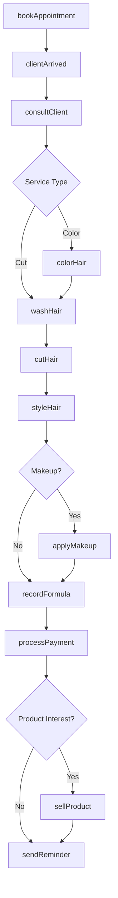
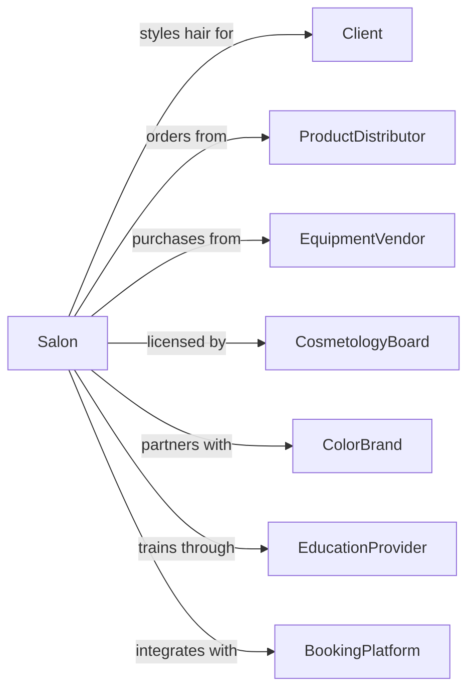

# Beauty Salons

> Business-as-Code definition for beauty salon operations. Models hair styling, coloring, facials, and makeup services for women and unisex clientele.

## Overview

Beauty salons provide hair cutting, styling, coloring, perming, facials, and makeup application services. This definition exposes actions for appointment management, service delivery, and retail product sales, with events for booking and searches for client history and preferences.

## Actors

| Actor | Description |
|-------|-------------|
| Client | Individual seeking beauty services |
| ProductDistributor | Supplies professional hair and beauty products |
| EquipmentVendor | Provides salon chairs, dryers, and equipment |
| CosmetologyBoard | Regulates licensing and salon compliance |
| ColorBrand | Provides professional hair color lines |
| EducationProvider | Offers continuing education and training |
| BookingPlatform | Provides online appointment scheduling |

## Roles

| Role | Description |
|------|-------------|
| SalonOwner | Owns and operates the salon |
| HairStylist | Cuts, colors, and styles hair |
| Colorist | Specializes in hair coloring and highlights |
| Esthetician | Provides facials and skincare services |
| MakeupArtist | Applies makeup for events and occasions |
| Receptionist | Manages appointments and greets clients |

## Entities

| Entity | Description |
|--------|-------------|
| Client | Customer receiving beauty services |
| Appointment | Scheduled time slot for service |
| Haircut | Hair cutting and shaping service |
| ColorService | Hair coloring, highlights, or balayage |
| Blowout | Blow dry and styling service |
| Facial | Skincare treatment service |
| Makeup | Cosmetic application service |
| Product | Shampoo, conditioner, styling products |
| Formula | Custom color mix for client |
| Station | Stylist work area with chair and mirror |

## Actions

| Action | Description |
|--------|-------------|
| bookAppointment | Schedule time slot for service |
| consultClient | Discuss desired style and service options |
| cutHair | Trim and shape hair to desired style |
| colorHair | Apply hair color, highlights, or treatments |
| styleHair | Blow dry and style hair |
| performFacial | Execute skincare treatment |
| applyMakeup | Apply cosmetics for event or occasion |
| washHair | Shampoo and condition hair |
| sellProduct | Retail professional products to client |
| recordFormula | Save custom color formula for future visits |
| processPayment | Collect payment and tips |
| sendReminder | Notify client of upcoming appointment |

## Events

| Event | Description |
|-------|-------------|
| appointmentBooked | Time slot has been reserved |
| clientArrived | Client has checked in |
| consultationCompleted | Style has been discussed and agreed |
| haircutCompleted | Hair cutting is finished |
| colorApplied | Hair color has been processed and rinsed |
| styleCompleted | Hair has been styled |
| facialCompleted | Skincare treatment is finished |
| makeupCompleted | Cosmetic application is finished |
| serviceCompleted | All requested services are done |
| paymentProcessed | Payment has been collected |
| productSold | Retail item has been purchased |

## Searches

| Search | Description |
|--------|-------------|
| getClientHistory | Retrieve previous services and formulas |
| findAvailableSlots | Check appointment availability |
| getStylistSchedule | View stylist appointments and availability |
| searchColorFormulas | Find saved color mixes for client |
| getProductInventory | Check retail product stock |
| findClientPreferences | Retrieve saved notes and preferences |

## Workflow



## Actor Relationships



## Usage

### Calling Actions

```typescript
import { groomBeautyClients } from '@headlessly/groom-beauty-clients'

const salon = groomBeautyClients()

// Book an appointment
const appointment = await salon.bookAppointment({
  clientId: 'client-123',
  stylistId: 'stylist-456',
  services: ['haircut', 'colorFullHead', 'blowout'],
  date: '2024-03-15',
  time: '10:00'
})

// Color client's hair
await salon.colorHair({
  appointmentId: appointment.id,
  colorType: 'permanent',
  formula: {
    base: '6N',
    highlight: '8G',
    developer: '20vol'
  },
  technique: 'balayage',
  processingTime: 35
})

// Cut and style
await salon.cutHair({
  appointmentId: appointment.id,
  style: 'longLayers',
  lengthRemoved: '2 inches',
  faceFraming: true
})
```

### Event-Driven Automation

```typescript
// Auto-send booking confirmation
salon.appointmentBooked(async ({ appointmentId, clientId, dateTime }) => {
  await salon.notifyClient({
    clientId,
    message: `Your appointment is confirmed for ${dateTime}. See you soon!`
  })
})

// Save color formula after service
salon.colorApplied(async ({ appointmentId, clientId, formula }) => {
  await salon.recordFormula({
    clientId,
    formula,
    date: new Date(),
    notes: 'Client loved the result'
  })
})

// Schedule color touch-up reminder
salon.serviceCompleted(async ({ appointmentId, services }) => {
  if (services.includes('colorFullHead')) {
    const appointment = await salon.getAppointment(appointmentId)
    await salon.sendReminder({
      clientId: appointment.clientId,
      triggerDate: addWeeks(new Date(), 6),
      message: 'Time for a color touch-up! Book your next appointment.'
    })
  }
})
```
