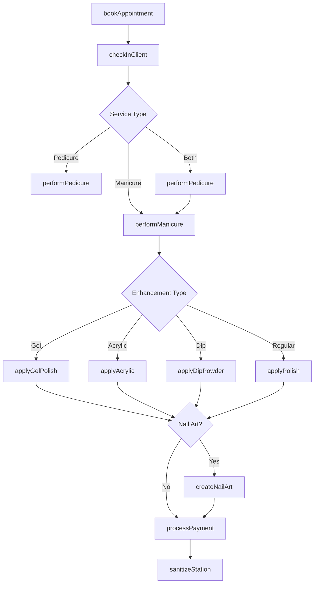
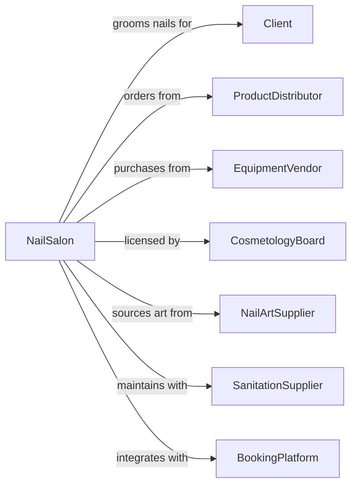

# Nail Salons

> Business-as-Code definition for nail salon operations. Models manicure, pedicure, and nail extension services.

## Overview

Nail salons provide manicure, pedicure, nail extensions, and nail art services. This definition exposes actions for nail care, polish application, and enhancement services, with events for appointment management and searches for client preferences.

## Actors

| Actor | Description |
|-------|-------------|
| Client | Individual seeking nail care services |
| ProductDistributor | Supplies nail polish, gels, and care products |
| EquipmentVendor | Provides manicure tables, pedicure chairs |
| CosmetologyBoard | Regulates licensing and salon compliance |
| NailArtSupplier | Provides decals, gems, and art supplies |
| SanitationSupplier | Provides disinfectants and sterilization equipment |
| BookingPlatform | Provides online appointment scheduling |

## Roles

| Role | Description |
|------|-------------|
| SalonOwner | Owns and operates the nail salon |
| NailTechnician | Performs manicure and pedicure services |
| NailArtist | Creates custom nail art and designs |
| Receptionist | Manages appointments and greets clients |
| SanitationTech | Maintains cleanliness and sterilization |

## Entities

| Entity | Description |
|--------|-------------|
| Client | Customer receiving nail services |
| Appointment | Scheduled time slot for service |
| Manicure | Hand and nail grooming service |
| Pedicure | Foot and toenail grooming service |
| GelManicure | Long-lasting gel polish application |
| Acrylic | Nail extension with acrylic material |
| DipPowder | Alternative to gel or acrylic nails |
| NailArt | Custom designs and decorations |
| Polish | Traditional nail lacquer |
| Enhancement | Extensions or overlays for length |

## Actions

| Action | Description |
|--------|-------------|
| bookAppointment | Schedule time slot for service |
| checkInClient | Record client arrival |
| performManicure | Shape, file, and care for fingernails |
| performPedicure | Shape, file, and care for toenails |
| applyGelPolish | Apply and cure gel nail polish |
| applyAcrylic | Build nail extensions with acrylic |
| applyDipPowder | Apply dip powder nail enhancement |
| createNailArt | Design and apply custom nail art |
| removeEnhancements | Safely remove gel, acrylic, or dip |
| applyPolish | Apply traditional nail lacquer |
| processPayment | Collect payment for services |
| sanitizeStation | Clean and sterilize work area |

## Events

| Event | Description |
|-------|-------------|
| appointmentBooked | Time slot has been reserved |
| clientCheckedIn | Client has arrived |
| manicureCompleted | Hand nail service is finished |
| pedicureCompleted | Foot nail service is finished |
| gelApplied | Gel polish has been cured |
| acrylicApplied | Acrylic extensions are complete |
| nailArtCompleted | Custom design has been applied |
| enhancementsRemoved | Previous nails have been removed |
| serviceCompleted | All requested services are done |
| paymentProcessed | Payment has been collected |
| stationSanitized | Work area has been cleaned |

## Searches

| Search | Description |
|--------|-------------|
| getClientHistory | Retrieve previous services and preferences |
| findAvailableSlots | Check appointment availability |
| getTechnicianSchedule | View technician availability |
| searchDesignCatalog | Browse nail art designs |
| checkPolishInventory | Search available polish colors |
| findClientAllergies | Check for product sensitivities |

## Workflow



## Actor Relationships



## Usage

### Calling Actions

```typescript
import { groomNails } from '@headlessly/groom-nails'

const salon = groomNails()

// Book an appointment
const appointment = await salon.bookAppointment({
  clientId: 'client-123',
  technicianId: 'tech-456',
  services: ['gelManicure', 'regularPedicure'],
  date: '2024-03-15',
  time: '14:00'
})

// Perform gel manicure
await salon.applyGelPolish({
  appointmentId: appointment.id,
  color: 'OPI Red',
  finish: 'glossy',
  baseCoat: true,
  topCoat: true
})

// Add nail art
await salon.createNailArt({
  appointmentId: appointment.id,
  design: 'frenchTips',
  accentNails: [3, 8],
  gems: true
})
```

### Event-Driven Automation

```typescript
// Auto-confirm appointment
salon.appointmentBooked(async ({ appointmentId, clientId, dateTime }) => {
  await salon.notifyClient({
    clientId,
    message: `Your nail appointment is confirmed for ${dateTime}.`
  })
})

// Schedule fill reminder for acrylics
salon.acrylicApplied(async ({ appointmentId, clientId }) => {
  await salon.sendReminder({
    clientId,
    triggerDate: addWeeks(new Date(), 2),
    message: 'Time for an acrylic fill! Book your appointment.'
  })
})

// Log sanitation for compliance
salon.stationSanitized(async ({ stationId, technicianId, timestamp }) => {
  await salon.logSanitation({
    stationId,
    technicianId,
    timestamp,
    compliant: true
  })
})
```
