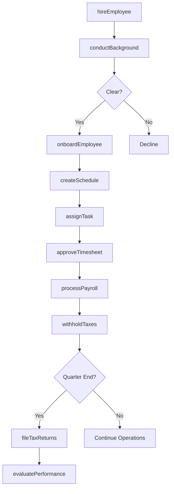
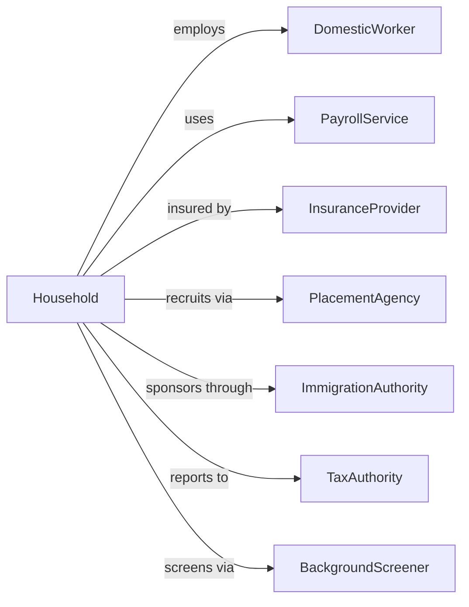

# Private Households

> Business-as-Code definition for private household employment operations. Models families employing domestic workers including nannies, housekeepers, personal assistants, and estate staff.

## Overview

Private households employ domestic workers for activities related to household operations including childcare, housekeeping, cooking, personal care, and property maintenance. This includes employing nannies, au pairs, butlers, maids, personal chefs, gardeners, and caretakers. This definition exposes actions for household employment management, events for payroll and compliance tracking, and searches for staff and schedule coordination.

## Actors

| Actor | Description |
|-------|-------------|
| HouseholdEmployer | Family or individual employing staff |
| DomesticWorker | Employee providing household services |
| PayrollService | Processes wages and tax withholdings |
| InsuranceProvider | Workers compensation coverage |
| PlacementAgency | Recruits domestic workers |
| ImmigrationAuthority | Visa sponsor for foreign workers |
| TaxAuthority | IRS and state tax agencies |
| BackgroundScreener | Conducts employee vetting |

## Roles

| Role | Description |
|------|-------------|
| Nanny | Provides childcare |
| Housekeeper | Maintains home cleanliness |
| PersonalChef | Prepares meals |
| Butler | Manages household operations |
| PersonalAssistant | Handles errands and scheduling |
| Gardener | Maintains landscaping |
| Caretaker | Oversees property |
| ElderCareAide | Provides senior support |

## Entities

| Entity | Description |
|--------|-------------|
| Employee | Domestic worker record |
| Schedule | Work hours and shifts |
| Payroll | Wage payment record |
| TaxWithholding | Federal and state deductions |
| WorkersComp | Insurance coverage |
| Contract | Employment agreement |
| TimeRecord | Hours worked tracking |
| Benefit | Health, PTO, or other perk |
| Performance | Employee evaluation |
| Task | Assigned work item |
| Expense | Reimbursable cost |
| BackgroundCheck | Screening record |

## Actions

| Action | Description |
|--------|-------------|
| hireEmployee | Engage new domestic worker |
| onboardEmployee | Complete new hire setup |
| createSchedule | Set work hours |
| processPayroll | Calculate and pay wages |
| withholdTaxes | Deduct required amounts |
| fileTaxReturns | Submit employer tax forms |
| provideWorkersComp | Maintain insurance |
| evaluatePerformance | Review employee work |
| assignTask | Delegate work item |
| approveTimesheet | Verify hours worked |
| reimburseExpense | Pay back costs |
| terminateEmployee | End employment |
| conductBackground | Screen potential hire |
| manageBenefits | Administer perks |

## Events

| Event | Description |
|-------|-------------|
| employeeHired | New worker engaged |
| employeeOnboarded | Setup completed |
| scheduleCreated | Hours set |
| payrollProcessed | Wages paid |
| taxesWithheld | Deductions made |
| taxReturnsFiled | Forms submitted |
| workersCompProvided | Insurance maintained |
| performanceEvaluated | Review completed |
| taskAssigned | Work delegated |
| timesheetApproved | Hours verified |
| expenseReimbursed | Costs repaid |
| employeeTerminated | Employment ended |
| backgroundCompleted | Screening finished |
| benefitsManaged | Perks administered |
| payPeriodEnd | Pay period closed and wages calculated |
| quarterEnd | Quarterly tax filing period reached |

## Searches

| Search | Description |
|--------|-------------|
| findEmployees | List domestic workers |
| getSchedules | View work hours |
| getPayrollHistory | Retrieve wage records |
| findTaxRecords | List withholding history |
| getPerformanceReviews | View evaluations |
| findTasks | List assigned work |
| getTimesheets | Retrieve hours records |
| getExpenses | View reimbursements |

## Workflow



## Actor Relationships



## Usage

### Calling Actions

```typescript
import { employStaff } from '@headlessly/employ-staff'

const household = employStaff()

// Hire new nanny
const employee = await household.hireEmployee({
  position: 'nanny',
  name: 'Maria Garcia',
  startDate: '2024-05-01',
  schedule: { type: 'fullTime', hoursPerWeek: 45 },
  compensation: { hourlyRate: 25, overtime: 1.5 },
  responsibilities: ['childcare', 'lightHousekeeping', 'mealPrep'],
  benefits: ['healthInsurance', 'paidVacation']
})

// Process weekly payroll
await household.processPayroll({
  employeeId: employee.id,
  payPeriod: { start: '2024-05-06', end: '2024-05-12' },
  regularHours: 40,
  overtimeHours: 5,
  deductions: ['federalTax', 'stateTax', 'fica', 'healthPremium']
})

// File quarterly taxes
await household.fileTaxReturns({
  quarter: 'Q2-2024',
  forms: ['form941', 'scheduleH'],
  employees: [employee.id],
  payrollService: 'payroll-provider-123'
})
```

### Event-Driven Automation

```typescript
// Process payroll on schedule
household.payPeriodEnd(async ({ periodEnd, employees }) => {
  for (const employeeId of employees) {
    const timesheet = await household.getTimesheet({
      employeeId,
      periodEnd
    })

    await household.approveTimesheet({
      employeeId,
      periodEnd,
      hours: timesheet.totalHours
    })

    await household.processPayroll({
      employeeId,
      payPeriod: { end: periodEnd },
      regularHours: timesheet.regularHours,
      overtimeHours: timesheet.overtimeHours
    })
  }
})

// Tax filing reminders
household.quarterEnd(async ({ quarter, year }) => {
  await household.prepareFilings({
    quarter,
    year,
    forms: ['form941', 'stateWithholding']
  })

  await notifyEmployer({
    type: 'taxFilingDue',
    deadline: getQuarterlyDeadline(quarter),
    estimatedLiability: calculateQuarterlyTax(quarter)
  })
})
```

## Related

- [Child Care Services](../../62-HealthCareAndSocialAssistance/624-SocialAssistance/6244-ChildCareServices/624410-ChildCareServices.mdx)
- [Services for the Elderly and Persons with Disabilities](../../62-HealthCareAndSocialAssistance/624-SocialAssistance/6241-IndividualAndFamilyServices/624120-ServicesForTheElderlyAndPersonsWithDisabilities.mdx)
