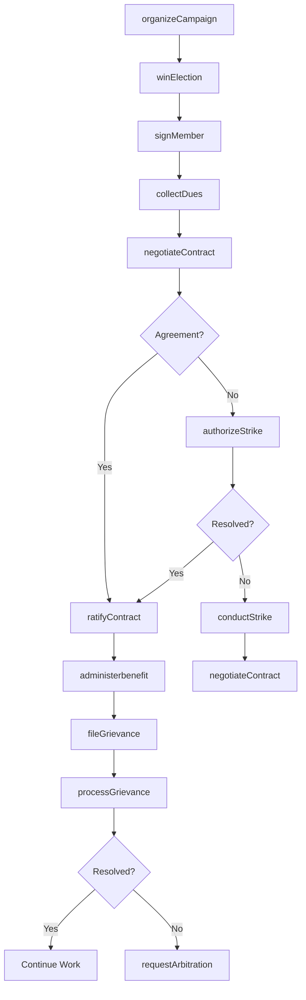
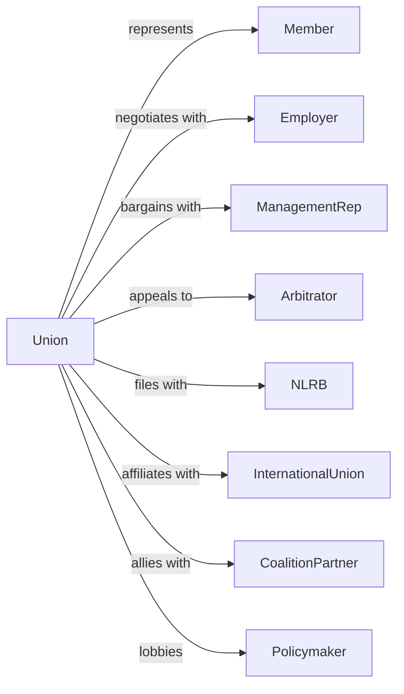

# Labor Unions and Similar Labor Organizations

> Business-as-Code definition for labor union operations. Models trade unions, industrial unions, and worker organizations representing members in collective bargaining and workplace advocacy.

## Overview

Labor unions represent the interests of workers in collective bargaining with employers, advocating for wages, benefits, and working conditions. Activities include contract negotiation, grievance handling, member organizing, and political advocacy for worker-friendly policies. This definition exposes actions for representation and bargaining, events for labor relations tracking, and searches for membership and contract management.

## Actors

| Actor | Description |
|-------|-------------|
| Member | Worker belonging to union |
| Employer | Company with unionized workforce |
| ManagementRep | Employer negotiation representative |
| Arbitrator | Neutral third party for disputes |
| NLRB | National Labor Relations Board |
| InternationalUnion | Parent labor organization |
| CoalitionPartner | Allied labor organization |
| Policymaker | Legislator or regulator |

## Roles

| Role | Description |
|------|-------------|
| President | Elected union leader |
| BusinessAgent | Handles employer relations |
| Organizer | Recruits new members and workplaces |
| Steward | On-site member representative |
| Secretary-Treasurer | Manages finances and records |
| Negotiator | Leads contract bargaining |
| GrievanceRep | Handles workplace disputes |
| CommunicationsDirector | Manages member communications |
| ShopSteward | Represents workers on the factory floor and files grievances on their behalf |

## Entities

| Entity | Description |
|--------|-------------|
| Member | Worker participant record |
| Contract | Collective bargaining agreement |
| Grievance | Workplace dispute |
| Bargaining | Contract negotiation process |
| Election | Union representation vote |
| Dues | Membership fee payment |
| Local | Geographic or employer unit |
| Strike | Work stoppage action |
| Arbitration | Third-party dispute resolution |
| Benefit | Health, pension, or other fund |
| Campaign | Organizing or political effort |
| Meeting | Membership gathering |

## Actions

| Action | Description |
|--------|-------------|
| organizeCampaign | Recruit new workplace |
| signMember | Enroll worker in union |
| collectDues | Receive membership payments |
| negotiateContract | Bargain with employer |
| fileGrievance | Initiate workplace dispute |
| processGrievance | Handle dispute resolution |
| requestArbitration | Escalate to neutral party |
| authorizeStrike | Vote on work stoppage |
| conductStrike | Execute work stoppage |
| administerbenefit | Manage health and pension |
| electOfficers | Select leadership |
| advocatePolicy | Lobby for worker rights |
| communicateMembers | Share union news |
| trainStewards | Develop representatives |

## Events

| Event | Description |
|-------|-------------|
| campaignOrganized | Workplace recruited |
| memberSigned | Worker enrolled |
| duesCollected | Payment received |
| contractNegotiated | Agreement reached |
| grievanceFiled | Dispute initiated |
| grievanceResolved | Dispute settled |
| arbitrationRequested | Escalation made |
| strikeAuthorized | Work stoppage approved |
| strikeEnded | Work stoppage concluded |
| benefitAdministered | Fund payment made |
| officersElected | Leadership selected |
| policyAdvocated | Lobbying completed |
| membersCommunicated | News shared |
| stewardsTrained | Representatives developed |

## Searches

| Search | Description |
|--------|-------------|
| findMembers | List worker participants |
| getContracts | View collective agreements |
| findGrievances | List workplace disputes |
| getBargainingStatus | Track negotiations |
| findLocals | List geographic units |
| getDuesStatus | Check payment records |
| getBenefits | View fund information |
| getElections | Track representation votes |

## Workflow



## Actor Relationships



## Usage

### Calling Actions

```typescript
import { representLabor } from '@headlessly/represent-labor'

const union = representLabor()

// Organize new workplace
const campaign = await union.organizeCampaign({
  employer: 'MegaCorp Industries',
  location: 'Detroit Plant',
  estimatedWorkers: 500,
  issues: ['wages', 'safety', 'healthcare'],
  organizer: 'org-001',
  electionPetitionTarget: '2024-06-01'
})

// Negotiate contract
const bargaining = await union.negotiateContract({
  employer: 'MegaCorp Industries',
  localId: 'local-123',
  expiringContract: 'cba-456',
  priorities: [
    { issue: 'wages', target: '5-percent-increase' },
    { issue: 'healthcare', target: 'maintainCoverage' },
    { issue: 'pto', target: 'additionalDay' }
  ],
  negotiationTeam: ['businessAgent', 'steward-1', 'steward-2']
})

// File grievance
await union.fileGrievance({
  memberId: 'member-789',
  employer: 'MegaCorp Industries',
  contractViolation: 'article12-overtime',
  incidentDate: '2024-04-10',
  description: 'Denied overtime pay for Saturday shift',
  remedy: 'backPay',
  steward: 'steward-001'
})
```

### Event-Driven Automation

```typescript
// Escalate unresolved grievances
union.grievanceDeadlinePassed(async ({ grievanceId, stage }) => {
  if (stage === 'step2') {
    await union.escalateGrievance({
      grievanceId,
      nextStage: 'step3',
      notifyManagement: true
    })
  } else if (stage === 'step3') {
    await union.requestArbitration({
      grievanceId,
      arbitrationPanel: 'AAA',
      urgency: 'standard'
    })
  }
})

// Contract expiration preparation
union.contractExpirationApproaching(async ({ contractId, expirationDate, daysRemaining }) => {
  if (daysRemaining === 90) {
    await union.prepareBargaining({
      contractId,
      surveyMembers: true,
      assignNegotiationTeam: true
    })

    await union.communicateMembers({
      type: 'bargainingUpdate',
      message: `Contract expires in 90 days. Survey coming soon.`,
      local: await getLocalFromContract(contractId)
    })
  }
})
```

## Related

- [Professional Organizations](./813920-ProfessionalOrganizations.mdx)
- [Political Organizations](./813940-PoliticalOrganizations.mdx)
