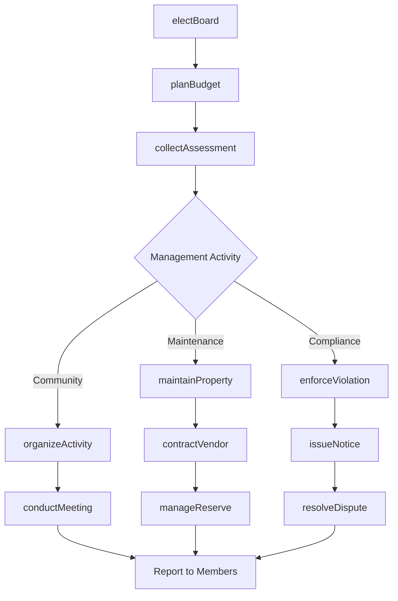
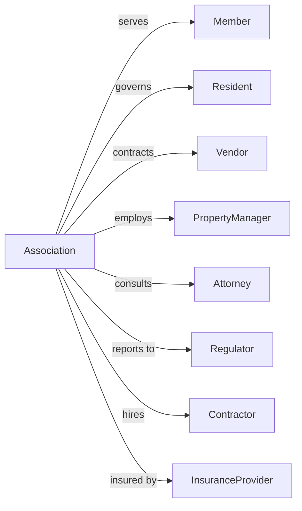

# Other Similar Organizations (except Business, Professional, Labor, and Political Organizations)

> Business-as-Code definition for membership organization operations. Models homeowners associations, athletic leagues, condominium associations, and other member-interest organizations.

## Overview

Other similar organizations promote the interests of members in areas not covered by business, professional, labor, or political organizations. This includes homeowners associations, condominium associations, athletic leagues, cooperative associations, and tenant organizations. This definition exposes actions for member governance, events for community management, and searches for assessment and compliance tracking.

## Actors

| Actor | Description |
|-------|-------------|
| Member | Property owner or participant |
| Resident | Individual living in community |
| Vendor | Service provider to organization |
| PropertyManager | Professional managing operations |
| Attorney | Legal counsel for organization |
| Regulator | State HOA or cooperative authority |
| Contractor | Maintenance service provider |
| InsuranceProvider | Coverage for common areas |

## Roles

| Role | Description |
|------|-------------|
| BoardPresident | Leads governing board |
| BoardSecretary | Handles correspondence and records |
| BoardTreasurer | Manages financial affairs |
| BoardMember | Participates in governance |
| CommunityManager | Professional managing operations |
| MaintenanceSupervisor | Oversees physical upkeep |
| ComplianceOfficer | Enforces rules and covenants |
| ActivitiesCoordinator | Plans community events |

## Entities

| Entity | Description |
|--------|-------------|
| Member | Property owner or participant record |
| Assessment | Regular dues or fee |
| Violation | Rule or covenant breach |
| Meeting | Board or member gathering |
| Reserve | Long-term maintenance fund |
| CommonArea | Shared property or facility |
| MaintenanceRequest | Service work order |
| Covenant | Community rule or restriction |
| Election | Board member selection |
| Budget | Annual financial plan |
| Insurance | Coverage policy |
| ArchitecturalRequest | Modification approval |

## Actions

| Action | Description |
|--------|-------------|
| collectAssessment | Receive regular dues |
| enforceViolation | Address rule breach |
| conductMeeting | Hold board or member gathering |
| maintainProperty | Care for common areas |
| manageReserve | Oversee long-term fund |
| electBoard | Select governing members |
| approveModification | Review architectural request |
| issueNotice | Send official communication |
| contractVendor | Engage service provider |
| planBudget | Develop annual finances |
| insureCommon | Maintain coverage |
| organizeActivity | Plan community event |
| resolveDispute | Handle member conflict |
| amendCovenant | Update community rules |

## Events

| Event | Description |
|-------|-------------|
| assessmentCollected | Dues received |
| violationEnforced | Rule breach addressed |
| meetingConducted | Gathering held |
| propertyMaintained | Common area cared for |
| reserveManaged | Fund adjusted |
| boardElected | Governance selected |
| modificationApproved | Architectural request granted |
| noticeIssued | Communication sent |
| vendorContracted | Service provider engaged |
| budgetApproved | Finances adopted |
| commonInsured | Coverage maintained |
| activityOrganized | Event completed |
| disputeResolved | Conflict settled |
| covenantAmended | Rules updated |
| assessmentBecameOverdue | Member assessment payment past due |
| reserveComponentBecameDue | Reserve fund contribution payment due |

## Searches

| Search | Description |
|--------|-------------|
| findMembers | List property owners |
| getAssessments | View dues records |
| findViolations | List rule breaches |
| getMeetings | View scheduled gatherings |
| getReserves | Check long-term funds |
| findMaintenanceRequests | List service orders |
| getArchitecturalRequests | View modification submissions |
| getBudgetStatus | Check financial position |

## Workflow



## Actor Relationships



## Usage

### Calling Actions

```typescript
import { representMembers } from '@headlessly/represent-members'

const hoa = representMembers()

// List property owners
const findMembersResult = await hoa.findMembers({ status: 'active', joinedAfter: '2024-01-01' })

// View dues records
const getAssessmentsResult = await hoa.getAssessments({ status: 'pending', type: 'residential' })

// Collect quarterly assessment
const assessment = await hoa.collectAssessment({
  memberId: 'unit-123',
  amount: 450,
  period: 'Q2-2024',
  dueDate: '2024-04-01',
  includeItems: ['commonArea', 'reserve', 'insurance']
})

// Enforce violation
await hoa.enforceViolation({
  memberId: 'unit-456',
  violationType: 'architecturalNonCompliance',
  description: 'Unapproved fence installation',
  covenantReference: 'Article 7, Section 3',
  cureDeadline: '2024-05-15',
  escalation: 'firstNotice'
})

// Plan annual meeting
await hoa.conductMeeting({
  type: 'annualMeeting',
  date: '2024-06-15',
  location: 'Community Clubhouse',
  agenda: [
    'boardElection',
    'budgetApproval',
    'reserveStudyReview',
    'openForum'
  ],
  quorumRequired: 0.25
})
```

### Event-Driven Automation

```typescript
// Follow up on overdue assessments
hoa.assessmentBecameOverdue(async ({ memberId, amount, daysOverdue }) => {
  if (daysOverdue === 30) {
    await hoa.issueNotice({
      memberId,
      type: 'lateNotice',
      amount: amount + calculateLateFee(amount),
      deadline: addDays(new Date(), 15)
    })
  } else if (daysOverdue === 60) {
    await hoa.escalateCollection({
      memberId,
      action: 'lienWarning',
      amount: amount + calculateLateFee(amount) + calculateInterest(amount, 60)
    })
  }
})

// Schedule maintenance from reserve study
hoa.reserveComponentBecameDue(async ({ componentId, replacementCost, dueYear }) => {
  if (dueYear === getCurrentYear()) {
    await hoa.contractVendor({
      projectType: componentId,
      budget: replacementCost,
      timeline: 'currentFiscalYear',
      bidRequirements: ['threeQuotes', 'licensed', 'insured']
    })
  }
})
```

## Related

- [Political Organizations](./813940-PoliticalOrganizations.mdx)
- [Civic and Social Organizations](../8134-CivicAndSocialOrganizations/813410-CivicAndSocialOrganizations.mdx)
