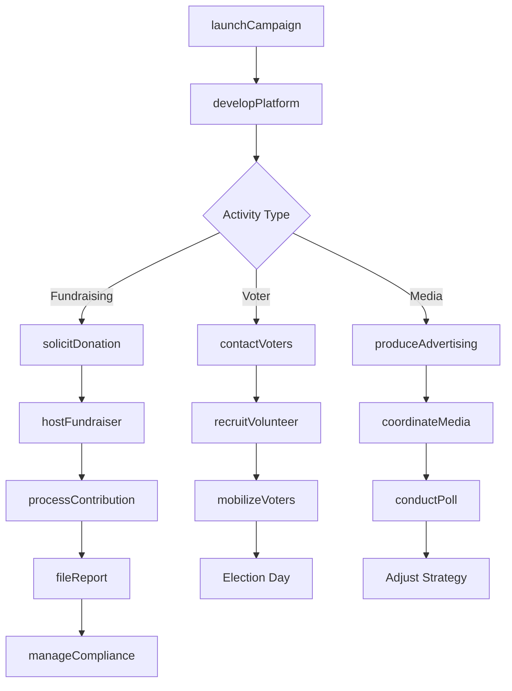
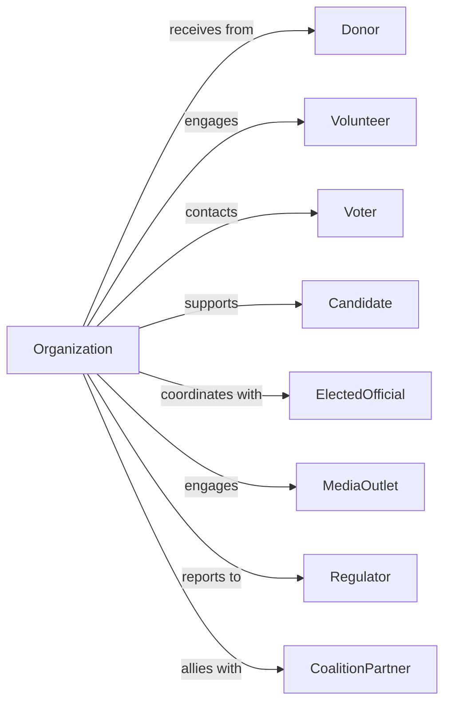

# Political Organizations

> Business-as-Code definition for political organization operations. Models political parties, political action committees, campaign organizations, and advocacy groups engaging in electoral and political activities.

## Overview

Political organizations promote the interests of political parties, candidates, and political causes through fundraising, voter mobilization, and campaign activities. This includes political parties, political action committees (PACs), campaign committees, and political clubs. This definition exposes actions for campaign and fundraising management, events for electoral tracking, and searches for donor, volunteer, and voter engagement.

## Actors

| Actor | Description |
|-------|-------------|
| Donor | Individual or entity contributing funds |
| Volunteer | Campaign worker providing unpaid service |
| Voter | Citizen targeted for outreach |
| Candidate | Individual seeking elected office |
| ElectedOfficial | Current officeholder |
| MediaOutlet | Organization covering political news |
| Regulator | FEC or state election authority |
| CoalitionPartner | Allied political organization |

## Roles

| Role | Description |
|------|-------------|
| ChairPerson | Leads political organization |
| CampaignManager | Oversees campaign operations |
| FinanceDirector | Manages fundraising |
| FieldDirector | Coordinates voter contact |
| CommunicationsDirector | Handles media relations |
| DigitalDirector | Manages online outreach |
| ComplianceOfficer | Ensures regulatory adherence |
| VolunteerCoordinator | Organizes campaign workers |

## Entities

| Entity | Description |
|--------|-------------|
| Donor | Contributor record |
| Contribution | Financial gift |
| Campaign | Electoral effort |
| Event | Fundraiser or rally |
| Volunteer | Campaign worker record |
| VoterContact | Outreach interaction |
| Advertisement | Paid media communication |
| FilingReport | Regulatory submission |
| Endorsement | Public support statement |
| Poll | Voter survey |
| Platform | Policy positions |
| Expenditure | Campaign spending |

## Actions

| Action | Description |
|--------|-------------|
| launchCampaign | Start electoral effort |
| solicitDonation | Request financial contribution |
| processContribution | Accept and record gift |
| hostFundraiser | Organize contribution event |
| recruitVolunteer | Enlist campaign worker |
| contactVoters | Conduct outreach |
| produceAdvertising | Create paid media |
| conductPoll | Survey voter opinion |
| seekEndorsement | Request public support |
| fileReport | Submit regulatory disclosure |
| mobilizeVoters | Drive turnout |
| manageCompliance | Ensure legal adherence |
| coordinateMedia | Handle press relations |
| developPlatform | Create policy positions |

## Events

| Event | Description |
|-------|-------------|
| campaignLaunched | Electoral effort started |
| donationSolicited | Contribution requested |
| contributionReceived | Gift processed |
| fundraiserHosted | Event completed |
| volunteerRecruited | Worker enlisted |
| votersContacted | Outreach made |
| advertisingProduced | Media created |
| pollConducted | Survey completed |
| endorsementReceived | Public support obtained |
| reportFiled | Disclosure submitted |
| votersMobilized | Turnout driven |
| complianceVerified | Legal adherence confirmed |
| mediaCoordinated | Press relations handled |
| platformDeveloped | Positions created |
| reportDeadlineNeared | Regulatory filing deadline nearing |

## Searches

| Search | Description |
|--------|-------------|
| findDonors | List contributors |
| getCampaigns | View electoral efforts |
| findVolunteers | List campaign workers |
| getVoterContacts | View outreach records |
| findEvents | List fundraisers and rallies |
| getFilingStatus | Check regulatory submissions |
| getEndorsements | List public supporters |
| getExpenditures | View campaign spending |

## Workflow



## Actor Relationships



## Usage

### Calling Actions

```typescript
import { representCandidates } from '@headlessly/represent-candidates'

const politicalOrg = representCandidates()

// List contributors
const findDonorsResult = await politicalOrg.findDonors({ minGift: 1000, period: 'last-12-months' })

// View electoral efforts
const getCampaignsResult = await politicalOrg.getCampaigns({ status: 'active', year: 2024 })

// Launch campaign
const campaign = await politicalOrg.launchCampaign({
  candidate: 'Jane Smith',
  office: 'stateSenate',
  district: 'district-15',
  electionDate: '2024-11-05',
  fundraisingGoal: 500000,
  fieldGoal: { doors: 50000, calls: 100000 }
})

// Process contribution
const contribution = await politicalOrg.processContribution({
  campaignId: campaign.id,
  donorName: 'John Doe',
  amount: 1000,
  employer: 'Self-Employed',
  occupation: 'Consultant',
  address: '123 Main St',
  contributionType: 'individual'
})

// Contact voters
await politicalOrg.contactVoters({
  campaignId: campaign.id,
  contactType: 'doorKnocking',
  turf: 'precinct-42',
  volunteers: ['vol-001', 'vol-002', 'vol-003'],
  script: 'script-voter-id',
  date: '2024-09-15'
})
```

### Event-Driven Automation

```typescript
// Thank donors immediately
politicalOrg.contributionReceived(async ({ donorId, amount, campaignId }) => {
  await politicalOrg.sendThankYou({
    donorId,
    amount,
    campaign: campaignId,
    type: amount >= 500 ? 'personalCall' : 'email'
  })

  if (amount >= 1000) {
    await politicalOrg.inviteToEvent({
      donorId,
      eventType: 'majorDonorReception',
      campaign: campaignId
    })
  }
})

// File required reports
politicalOrg.reportDeadlineNeared(async ({ reportType, dueDate, campaignId }) => {
  await politicalOrg.prepareReport({
    campaignId,
    reportType,
    period: getReportingPeriod(dueDate)
  })

  await politicalOrg.notifyCompliance({
    task: 'reviewReport',
    deadline: addDays(dueDate, -3),
    urgency: 'high'
  })
})
```

## Related

- [Labor Unions and Similar Labor Organizations](./813930-LaborUnionsAndSimilarLaborOrganizations.mdx)
- [Other Similar Organizations](./813990-OtherSimilarOrganizationsExceptBusinessProfessionalLaborAndPoliticalOrganizations.mdx)
