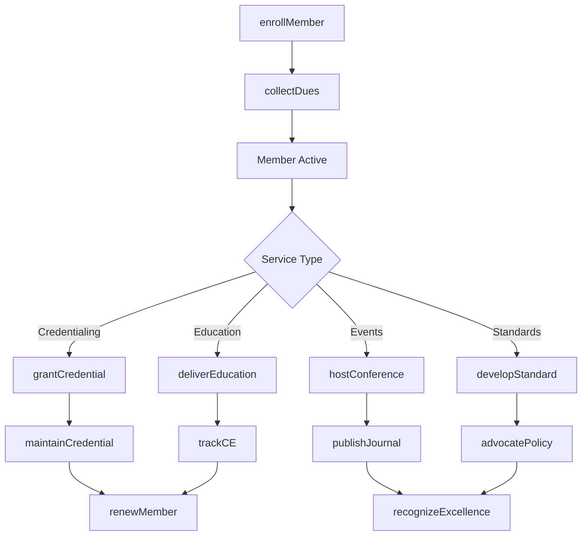
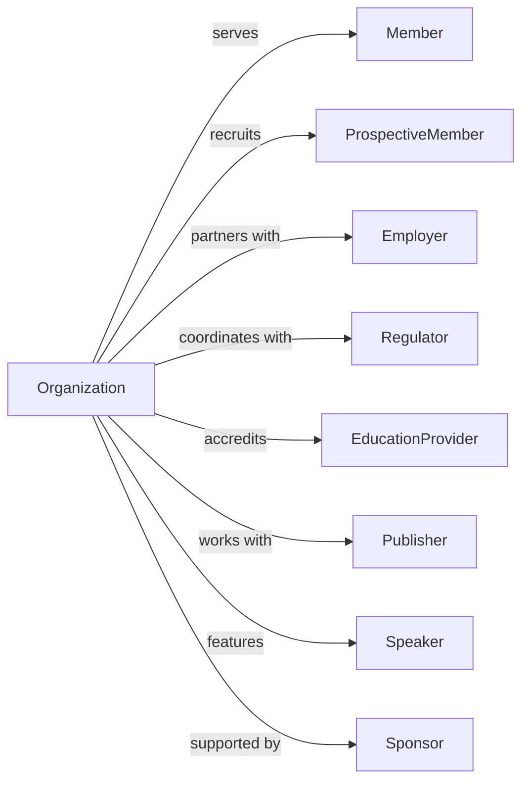

# Professional Organizations

> Business-as-Code definition for professional organization operations. Models bar associations, medical societies, engineering organizations, and learned societies promoting professional interests and standards.

## Overview

Professional organizations promote the interests of individual professionals and their professions through credentialing, continuing education, research, advocacy, and networking. This includes bar associations, medical societies, engineering associations, and academic societies. This definition exposes actions for professional development, events for credential and education tracking, and searches for membership and standards management.

## Actors

| Actor | Description |
|-------|-------------|
| Member | Professional belonging to organization |
| ProspectiveMember | Professional considering membership |
| Employer | Organization employing members |
| Regulator | Government licensing authority |
| EducationProvider | Accredited training institution |
| Publisher | Academic or trade publication |
| Speaker | Conference presenter |
| Sponsor | Event or program supporter |

## Roles

| Role | Description |
|------|-------------|
| ExecutiveDirector | Leads organization operations |
| MembershipDirector | Manages recruitment and retention |
| EducationDirector | Oversees continuing education |
| CertificationDirector | Manages credentialing programs |
| EthicsDirector | Enforces professional standards |
| ResearchDirector | Coordinates scholarly activities |
| GovernmentAffairsDirector | Handles advocacy |
| ConferenceManager | Coordinates annual meeting |

## Entities

| Entity | Description |
|--------|-------------|
| Member | Professional participant record |
| Credential | Certification or designation |
| Course | Continuing education offering |
| Conference | Annual meeting or symposium |
| Publication | Journal or newsletter |
| EthicsCase | Professional conduct matter |
| Standard | Practice guideline |
| Committee | Working group |
| Award | Professional recognition |
| Dues | Membership fee payment |
| Chapter | Regional or specialty section |
| Research | Scholarly study or survey |

## Actions

| Action | Description |
|--------|-------------|
| enrollMember | Register new professional |
| renewMember | Process membership continuation |
| grantCredential | Award certification |
| deliverEducation | Provide continuing learning |
| hostConference | Organize annual meeting |
| publishJournal | Release scholarly publication |
| enforceEthics | Investigate conduct matters |
| developStandard | Create practice guideline |
| recognizeExcellence | Honor professional achievement |
| advocatePolicy | Lobby for profession |
| coordinateResearch | Manage scholarly activities |
| accreditProgram | Approve educational provider |
| supportChapter | Assist regional section |
| collectDues | Receive membership payments |

## Events

| Event | Description |
|-------|-------------|
| memberEnrolled | Professional joined |
| memberRenewed | Continuation processed |
| credentialGranted | Certification awarded |
| educationDelivered | Learning completed |
| conferenceHosted | Annual meeting held |
| journalPublished | Publication released |
| ethicsEnforced | Conduct matter resolved |
| standardDeveloped | Guideline created |
| excellenceRecognized | Achievement honored |
| policyAdvocated | Lobbying effort made |
| researchCoordinated | Scholarly activity completed |
| programAccredited | Provider approved |
| chapterSupported | Section assisted |
| duesCollected | Payment received |
| credentialExpirationApproaching | Member credential renewal deadline nearing |

## Searches

| Search | Description |
|--------|-------------|
| findMembers | List professional participants |
| getCredentials | View certification holders |
| findCourses | List education offerings |
| getConferences | View scheduled meetings |
| findPublications | List journals and newsletters |
| getEthicsCases | View conduct matters |
| getStandards | Retrieve practice guidelines |
| getChapters | List regional sections |

## Workflow



## Actor Relationships



## Usage

### Calling Actions

```typescript
import { representProfessions } from '@headlessly/represent-professions'

const association = representProfessions()

// List professional participants
const findMembersResult = await association.findMembers({ status: 'active', joinedAfter: '2024-01-01' })

// View certification holders
const getCredentialsResult = await association.getCredentials({ status: 'active' })

// Enroll new member
const member = await association.enrollMember({
  name: 'Dr. Sarah Chen',
  credentials: ['MD', 'FACP'],
  specialty: 'internalMedicine',
  employer: 'Metro Health System',
  membershipType: 'fellow',
  licenseState: 'CA'
})

// Grant professional credential
await association.grantCredential({
  memberId: member.id,
  credential: 'BoardCertified',
  specialty: 'internalMedicine',
  examPassed: '2024-03-15',
  validThrough: '2034-03-15',
  maintenanceRequired: true
})

// Host annual conference
await association.hostConference({
  name: 'Annual Scientific Meeting 2024',
  dates: { start: '2024-10-20', end: '2024-10-23' },
  location: 'San Diego Convention Center',
  tracks: ['clinical', 'research', 'practice'],
  cmeCredits: 25,
  expectedAttendance: 5000
})
```

### Event-Driven Automation

```typescript
// Track continuing education requirements
association.educationDelivered(async ({ memberId, courseId, credits }) => {
  await association.updateCERecord({
    memberId,
    courseId,
    credits,
    completionDate: new Date()
  })

  const ceStatus = await association.checkCEStatus(memberId)

  if (ceStatus.complete) {
    await association.notifyMember({
      memberId,
      type: 'ceRequirementMet',
      cycle: ceStatus.cycle
    })
  }
})

// Credential renewal reminders
association.credentialExpirationApproaching(async ({ memberId, credentialId, expirationDate }) => {
  await association.notifyMember({
    memberId,
    type: 'credentialRenewal',
    credential: credentialId,
    expirationDate,
    renewalRequirements: await getRenewalRequirements(credentialId)
  })
})
```

## Related

- [Business Associations](./813910-BusinessAssociations.mdx)
- [Labor Unions and Similar Labor Organizations](./813930-LaborUnionsAndSimilarLaborOrganizations.mdx)
