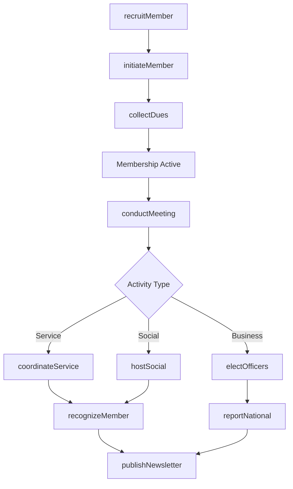
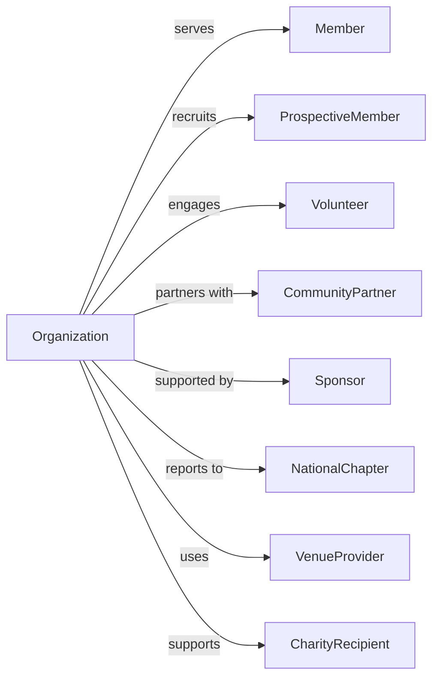

# Civic and Social Organizations

> Business-as-Code definition for civic and social organization operations. Models fraternal lodges, alumni associations, social clubs, scouting organizations, and community groups promoting civic and social interests.

## Overview

Civic and social organizations promote the civic and social interests of their members through fellowship, community service, and shared activities. This includes fraternal organizations, alumni associations, parent-teacher associations, scouting organizations, ethnic associations, and veterans groups. This definition exposes actions for membership management, events for program coordination, and searches for member engagement tracking.

## Actors

| Actor | Description |
|-------|-------------|
| Member | Individual belonging to organization |
| ProspectiveMember | Individual considering membership |
| Volunteer | Member providing unpaid service |
| CommunityPartner | Local organization for joint activities |
| Sponsor | Business supporting organization |
| NationalChapter | Parent or affiliate organization |
| VenueProvider | Facility hosting events |
| CharityRecipient | Organization receiving service |

## Roles

| Role | Description |
|------|-------------|
| President | Elected leader of organization |
| VicePresident | Supporting elected officer |
| Secretary | Handles correspondence and records |
| Treasurer | Manages financial affairs |
| MembershipChair | Recruits and retains members |
| ProgramChair | Coordinates activities and events |
| ServiceChair | Organizes community service |
| CommunicationsChair | Handles newsletters and publicity |

## Entities

| Entity | Description |
|--------|-------------|
| Member | Individual participant record |
| Meeting | Regular gathering of members |
| Event | Special activity or program |
| ServiceProject | Community outreach activity |
| Committee | Working group for specific purpose |
| Dues | Membership fee payment |
| Newsletter | Member communication |
| Award | Recognition for achievement |
| Scholarship | Educational grant for members |
| Chapter | Local unit of organization |
| Bylaws | Governing rules |
| Election | Officer selection process |

## Actions

| Action | Description |
|--------|-------------|
| recruitMember | Attract new participants |
| initiateMember | Formally admit to organization |
| collectDues | Receive membership payments |
| conductMeeting | Hold regular gathering |
| planEvent | Organize special activity |
| coordinateService | Arrange community project |
| electOfficers | Select leadership |
| recognizeMember | Honor achievement |
| awardScholarship | Grant educational funding |
| publishNewsletter | Distribute communication |
| chartChapter | Establish new local unit |
| amendBylaws | Update governing rules |
| hostSocial | Organize fellowship event |
| reportNational | Submit to parent organization |

## Events

| Event | Description |
|-------|-------------|
| memberRecruited | New participant attracted |
| memberInitiated | Formal admission completed |
| duesCollected | Payment received |
| meetingConducted | Gathering held |
| eventPlanned | Activity organized |
| serviceCoordinated | Project completed |
| officersElected | Leadership selected |
| memberRecognized | Achievement honored |
| scholarshipAwarded | Funding granted |
| newsletterPublished | Communication distributed |
| chapterChartered | New unit established |
| bylawsAmended | Rules updated |
| socialHosted | Fellowship event held |
| nationalReported | Report submitted |
| duesPeriodApproaching | Membership dues renewal period nearing |

## Searches

| Search | Description |
|--------|-------------|
| findMembers | List participants |
| getMeetings | View scheduled gatherings |
| findEvents | List activities and programs |
| getServiceProjects | View community outreach |
| findCommittees | List working groups |
| getDuesStatus | Check payment records |
| getScholarships | View educational grants |
| getChapters | List local units |

## Workflow



## Actor Relationships



## Usage

### Calling Actions

```typescript
import { organizeCommunities } from '@headlessly/organize-communities'

const civicOrg = organizeCommunities()

// List participants
const findMembersResult = await civicOrg.findMembers({ status: 'active', joinedAfter: '2024-01-01' })

// View scheduled gatherings
const getMeetingsResult = await civicOrg.getMeetings({ status: 'upcoming', month: '2024-07' })

// Recruit new member
const prospect = await civicOrg.recruitMember({
  name: 'Jennifer Adams',
  sponsoredBy: 'member-123',
  interests: ['communityService', 'networking'],
  source: 'memberReferral'
})

// Initiate member
await civicOrg.initiateMember({
  prospectId: prospect.id,
  ceremonyDate: '2024-05-15',
  membershipLevel: 'regular',
  committees: ['serviceCommittee']
})

// Plan community service project
await civicOrg.coordinateService({
  projectName: 'School Supply Drive',
  beneficiary: 'LocalElementarySchool',
  date: '2024-08-01',
  volunteersNeeded: 15,
  supplies: ['backpacks', 'notebooks', 'pencils'],
  budgetAmount: 2500
})
```

### Event-Driven Automation

```typescript
// Welcome new members
civicOrg.memberInitiated(async ({ memberId, name, ceremonyDate }) => {
  await civicOrg.publishNewsletter({
    section: 'newMembers',
    content: {
      name,
      initiationDate: ceremonyDate
    }
  })

  await civicOrg.assignMentor({
    newMemberId: memberId,
    mentorCriteria: ['experienced', 'sameInterests']
  })
})

// Send dues reminders
civicOrg.duesPeriodApproaching(async ({ period, dueDate }) => {
  const unpaidMembers = await civicOrg.findMembers({
    duesStatus: 'unpaid',
    period
  })

  for (const member of unpaidMembers) {
    await civicOrg.sendReminder({
      memberId: member.id,
      type: 'duesReminder',
      dueDate,
      amount: member.duesAmount
    })
  }
})
```

## Related

- [Religious Organizations](../8131-ReligiousOrganizations/813110-ReligiousOrganizations.mdx)
- [Business Associations](../8139-BusinessProfessionalLaborPoliticalAndSimilarOrganizations/813910-BusinessAssociations.mdx)
