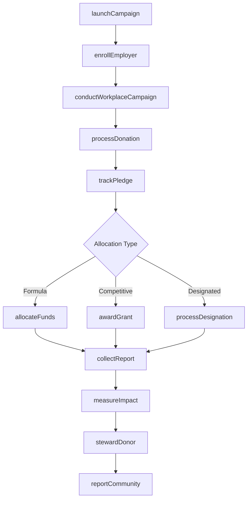
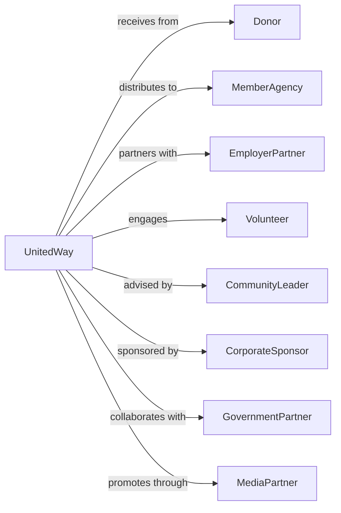

# Other Grantmaking and Giving Services

> Business-as-Code definition for federated giving and fundraising operations. Models united way organizations, community chests, and federated charities that raise and distribute funds across multiple causes.

## Overview

Other grantmaking and giving services raise funds for distribution to a wide range of charitable organizations including educational, scientific, cultural, and social welfare causes. This includes united way campaigns, community chests, federated charities, and workplace giving programs. This definition exposes actions for campaign management, events for fund distribution, and searches for donor and agency coordination.

## Actors

| Actor | Description |
|-------|-------------|
| Donor | Individual or organization contributing funds |
| MemberAgency | Nonprofit receiving allocated funds |
| EmployerPartner | Workplace hosting giving campaign |
| Volunteer | Campaign worker and board member |
| CommunityLeader | Advisor on fund allocation |
| CorporateSponsor | Business supporting campaign operations |
| GovernmentPartner | Public sector collaborator |
| MediaPartner | Organization promoting campaign |

## Roles

| Role | Description |
|------|-------------|
| ExecutiveDirector | Leads organization operations |
| CampaignDirector | Oversees fundraising efforts |
| CommunityInvestmentDirector | Manages fund allocation |
| WorkplaceCampaignManager | Coordinates employer programs |
| MarketingDirector | Leads communications |
| VolunteerManager | Organizes campaign workers |
| FinanceDirector | Oversees fund management |
| AgencyRelationsManager | Coordinates member organizations |

## Entities

| Entity | Description |
|--------|-------------|
| Donor | Contributor record |
| Donation | Gift of funds |
| Campaign | Annual fundraising effort |
| Pledge | Committed giving promise |
| MemberAgency | Recipient organization |
| Allocation | Fund distribution to agency |
| EmployerCampaign | Workplace giving program |
| Volunteer | Campaign helper record |
| DesignatedGift | Donor-directed contribution |
| ImpactArea | Focus area for funding |
| Grant | Competitive award to agency |
| Report | Agency outcome documentation |

## Actions

| Action | Description |
|--------|-------------|
| launchCampaign | Start annual fundraising |
| enrollEmployer | Sign up workplace partner |
| conductWorkplaceCampaign | Run employer giving program |
| processDonation | Accept and record gift |
| trackPledge | Monitor giving commitment |
| allocateFunds | Distribute to member agencies |
| awardGrant | Provide competitive funding |
| collectReport | Receive agency documentation |
| measureImpact | Assess community outcomes |
| stewardDonor | Maintain contributor relationship |
| recruitVolunteer | Enlist campaign worker |
| recognizeEmployer | Honor workplace partner |
| auditAgency | Review recipient organization |
| reportCommunity | Share campaign results |

## Events

| Event | Description |
|-------|-------------|
| campaignLaunched | Annual drive started |
| employerEnrolled | Workplace signed up |
| workplaceCampaignCompleted | Employer drive finished |
| donationProcessed | Gift recorded |
| pledgeReceived | Commitment made |
| fundsAllocated | Distribution completed |
| grantAwarded | Competitive funding given |
| reportCollected | Documentation received |
| impactMeasured | Outcomes assessed |
| donorStewarded | Relationship maintained |
| volunteerRecruited | Worker enlisted |
| employerRecognized | Partner honored |
| agencyAudited | Review completed |
| communityReported | Results shared |

## Searches

| Search | Description |
|--------|-------------|
| findDonors | List contributors |
| getCampaigns | View fundraising drives |
| findEmployers | List workplace partners |
| getMemberAgencies | View recipient organizations |
| getAllocations | Track fund distributions |
| findPledges | List giving commitments |
| getVolunteers | View campaign workers |
| getImpactMetrics | Retrieve community outcomes |

## Workflow



## Actor Relationships



## Usage

### Calling Actions

```typescript
import { grantDonations } from '@headlessly/grant-donations'

const unitedWay = grantDonations()

// List contributors
const findDonorsResult = await unitedWay.findDonors({ minGift: 1000, period: 'last-12-months' })

// View fundraising drives
const getCampaignsResult = await unitedWay.getCampaigns({ status: 'active', year: 2024 })

// Launch annual campaign
const campaign = await unitedWay.launchCampaign({
  year: 2024,
  goal: 25000000,
  theme: 'Together We Rise',
  startDate: '2024-09-01',
  endDate: '2024-12-15',
  pacesetter: 'corp-leader-123'
})

// Enroll employer partner
const employer = await unitedWay.enrollEmployer({
  companyId: 'acme-corp',
  employeeCount: 5000,
  campaignChair: 'employee-jane',
  goalAmount: 500000,
  kickoffDate: '2024-09-15',
  methods: ['payrollDeduction', 'oneTimeGift']
})

// Allocate funds to member agencies
await unitedWay.allocateFunds({
  campaignYear: 2024,
  totalAmount: 24500000,
  allocationMethod: 'impactArea',
  distributions: [
    { impactArea: 'education', percentage: 35 },
    { impactArea: 'health', percentage: 30 },
    { impactArea: 'financialStability', percentage: 35 }
  ]
})
```

### Event-Driven Automation

```typescript
// Process workplace campaign results
unitedWay.workplaceCampaignCompleted(async ({ employerId, totalRaised, participation }) => {
  await unitedWay.recognizeEmployer({
    employerId,
    level: getRecognitionLevel(totalRaised, participation),
    year: getCurrentCampaignYear()
  })

  await unitedWay.stewardDonor({
    type: 'employer',
    id: employerId,
    action: 'thankYouEvent',
    impactReport: await generateEmployerImpact(employerId)
  })
})

// Collect agency reports for accountability
unitedWay.fundsAllocated(async ({ agencyId, amount, impactArea }) => {
  await unitedWay.scheduleReporting({
    agencyId,
    reportType: 'quarterly',
    metrics: getImpactMetrics(impactArea),
    dueDates: ['2024-03-31', '2024-06-30', '2024-09-30', '2024-12-31']
  })

  await unitedWay.notifyAgency({
    agencyId,
    allocation: amount,
    reportingRequirements: true
  })
})
```

## Related

- [Grantmaking Foundations](./813211-GrantmakingFoundations.mdx)
- [Voluntary Health Organizations](./813212-VoluntaryHealthOrganizations.mdx)
