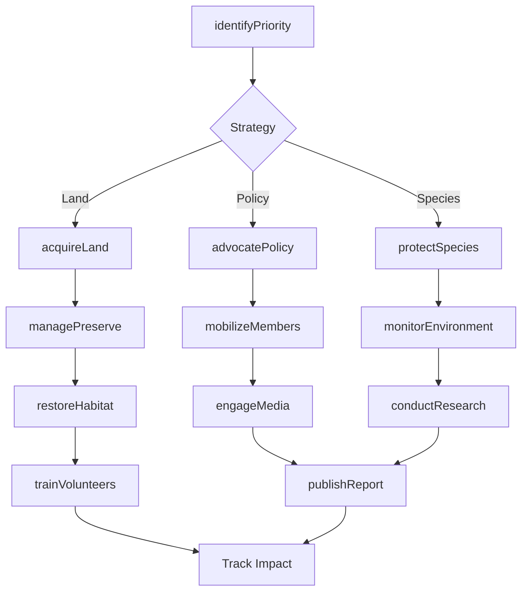
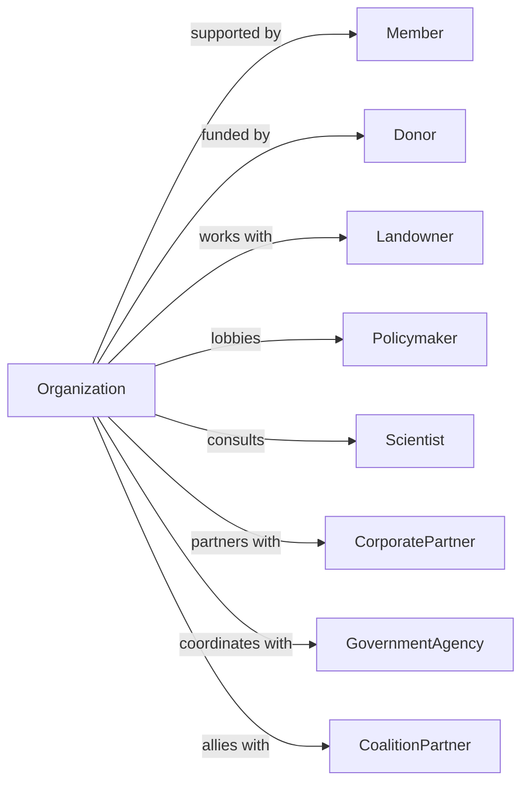

# Environment, Conservation and Wildlife Organizations

> Business-as-Code definition for environmental advocacy and conservation operations. Models organizations protecting natural resources, wildlife, and ecosystems through advocacy, education, and direct conservation action.

## Overview

Environmental organizations promote the preservation and protection of the environment, natural resources, and wildlife. Activities include policy advocacy, land conservation, species protection, climate action, and environmental education. This definition exposes actions for conservation campaigns, events for environmental monitoring, and searches for land, species, and policy tracking.

## Actors

| Actor | Description |
|-------|-------------|
| Member | Supporting individual or organization |
| Donor | Financial contributor |
| Landowner | Property owner for conservation |
| Policymaker | Legislator or regulator |
| Scientist | Researcher providing expertise |
| CorporatePartner | Business supporting sustainability |
| GovernmentAgency | EPA, Fish and Wildlife, Parks |
| CoalitionPartner | Allied environmental organization |

## Roles

| Role | Description |
|------|-------------|
| ExecutiveDirector | Leads organization operations |
| ConservationDirector | Oversees land and species programs |
| PolicyDirector | Manages advocacy and lobbying |
| ScienceDirector | Leads research and monitoring |
| CommunicationsDirector | Handles media and public education |
| DevelopmentDirector | Manages fundraising |
| FieldCoordinator | Conducts on-ground conservation |
| VolunteerManager | Organizes community stewards |
| WildlifeBiologist | Conducts species surveys and habitat assessments for conservation programs |

## Entities

| Entity | Description |
|--------|-------------|
| Member | Supporter record |
| Preserve | Protected land holding |
| Species | Wildlife population of concern |
| Campaign | Advocacy initiative |
| Policy | Environmental law or regulation |
| Easement | Land conservation agreement |
| Monitoring | Environmental data collection |
| Restoration | Habitat improvement project |
| Report | Research or advocacy document |
| Volunteer | Steward participation record |
| Grant | Conservation funding |
| Coalition | Partner alliance |

## Actions

| Action | Description |
|--------|-------------|
| acquireLand | Purchase or receive property |
| establishEasement | Create conservation restriction |
| protectSpecies | Implement wildlife conservation |
| restoreHabitat | Improve ecosystem health |
| monitorEnvironment | Collect ecological data |
| advocatePolicy | Promote environmental legislation |
| educatePublic | Inform about conservation |
| mobilizeMembers | Activate supporters |
| conductResearch | Study environmental issues |
| buildCoalition | Form advocacy partnerships |
| engageMedia | Promote environmental coverage |
| managePreserve | Steward protected land |
| trainVolunteers | Develop steward skills |
| publishReport | Release findings |

## Events

| Event | Description |
|-------|-------------|
| landAcquired | Property purchased |
| easementEstablished | Conservation agreement created |
| speciesProtected | Wildlife conservation implemented |
| habitatRestored | Ecosystem improved |
| environmentMonitored | Data collected |
| policyAdvocated | Legislative effort made |
| publicEducated | Information shared |
| membersMobilized | Supporters activated |
| researchCompleted | Study finished |
| coalitionFormed | Partnership established |
| mediaCoverageObtained | Issue publicized |
| preserveManaged | Stewardship completed |
| volunteersTrained | Skills developed |
| reportPublished | Findings released |
| threatDetected | Environmental or wildlife threat identified |

## Searches

| Search | Description |
|--------|-------------|
| findMembers | List supporters |
| getPreserves | View protected lands |
| findSpecies | List wildlife populations |
| getCampaigns | View advocacy initiatives |
| getEasements | List conservation agreements |
| findMonitoringData | Retrieve ecological records |
| getRestorationProjects | View habitat improvements |
| getImpactMetrics | Track conservation outcomes |

## Workflow



## Actor Relationships



## Usage

### Calling Actions

```typescript
import { advocateEnvironment } from '@headlessly/advocate-environment'

const conservancy = advocateEnvironment()

// Acquire conservation land
const preserve = await conservancy.acquireLand({
  name: 'Pine Ridge Preserve',
  acres: 2500,
  location: { county: 'Green County', state: 'WI' },
  ecosystems: ['mixedForest', 'wetland', 'prairie'],
  acquisitionType: 'purchase',
  fundingSource: 'conservationGrant'
})

// Protect endangered species
const protection = await conservancy.protectSpecies({
  species: 'Karner Blue Butterfly',
  status: 'federallyEndangered',
  preserveId: preserve.id,
  actions: ['habitatManagement', 'populationMonitoring', 'hostPlantRestoration'],
  partnerships: ['fws', 'stateNaturalResources']
})

// Launch climate advocacy campaign
await conservancy.advocatePolicy({
  name: 'Clean Energy Future',
  policyTarget: 'stateRenewableStandard',
  goal: '100percentCleanBy2040',
  tactics: ['lobbying', 'grassroots', 'corporateEngagement'],
  jurisdiction: 'state',
  timeline: '2-years'
})
```

### Event-Driven Automation

```typescript
// Monitor and respond to environmental threats
conservancy.threatDetected(async ({ preserveId, threatType, severity }) => {
  await conservancy.assessThreat({
    preserveId,
    type: threatType,
    severity
  })

  if (severity === 'critical') {
    await conservancy.mobilizeMembers({
      action: 'rapidResponse',
      preserve: preserveId,
      urgency: 'immediate'
    })

    await conservancy.engageMedia({
      type: 'pressAlert',
      issue: threatType,
      location: preserveId
    })
  }
})

// Celebrate conservation milestones
conservancy.landAcquired(async ({ preserveId, acres, ecosystems }) => {
  await conservancy.publishReport({
    type: 'conservationAnnouncement',
    preserve: preserveId,
    highlights: {
      acres,
      ecosystems,
      speciesProtected: await countSpecies(preserveId)
    }
  })

  await conservancy.notifyMembers({
    type: 'conservationVictory',
    preserve: preserveId,
    thankDonors: true
  })
})
```

## Related

- [Human Rights Organizations](./813311-HumanRightsOrganizations.mdx)
- [Other Social Advocacy Organizations](./813319-OtherSocialAdvocacyOrganizations.mdx)
