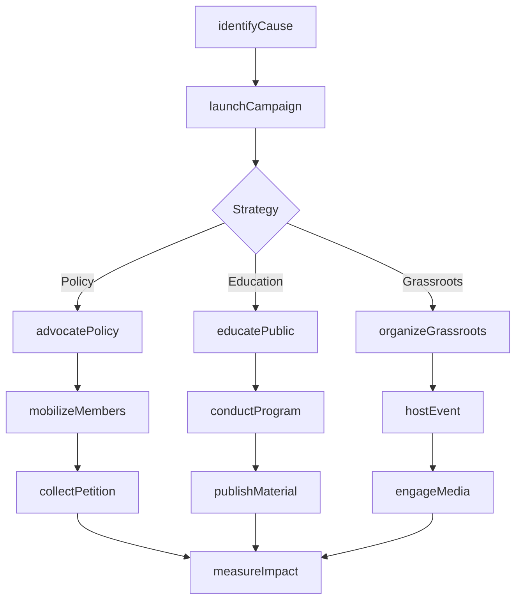
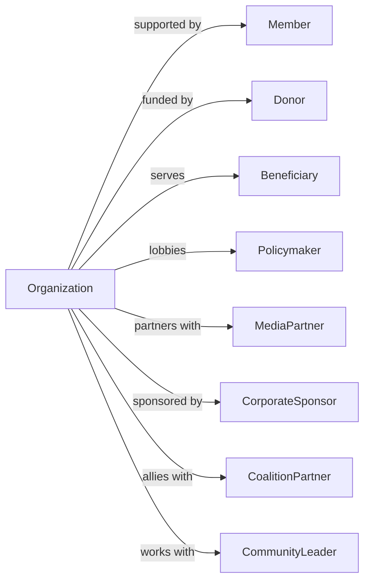

# Other Social Advocacy Organizations

> Business-as-Code definition for social advocacy operations. Models organizations promoting peace, community action, public safety, and social causes through education, organizing, and policy advocacy.

## Overview

Other social advocacy organizations promote causes beyond human rights and environmental protection, including peace and international understanding, community action, public safety, and social awareness campaigns (drunk driving prevention, drug abuse awareness, firearms safety). This definition exposes actions for advocacy campaigns, events for community mobilization, and searches for membership and impact tracking.

## Actors

| Actor | Description |
|-------|-------------|
| Member | Supporting individual or organization |
| Donor | Financial contributor |
| Beneficiary | Community or individuals served |
| Policymaker | Legislator or government official |
| MediaPartner | Organization amplifying message |
| CorporateSponsor | Business supporting cause |
| CoalitionPartner | Allied advocacy organization |
| CommunityLeader | Local champion for cause |

## Roles

| Role | Description |
|------|-------------|
| ExecutiveDirector | Leads organization operations |
| AdvocacyDirector | Oversees policy and campaigns |
| CommunityOrganizer | Mobilizes grassroots action |
| ProgramManager | Coordinates specific initiatives |
| CommunicationsDirector | Handles media and messaging |
| DevelopmentDirector | Manages fundraising |
| EducationCoordinator | Develops awareness programs |
| VolunteerManager | Organizes community activists |

## Entities

| Entity | Description |
|--------|-------------|
| Member | Supporter record |
| Campaign | Advocacy initiative |
| Program | Educational or service offering |
| Policy | Legislation or regulation target |
| Event | Rally, workshop, or gathering |
| Petition | Public action request |
| Coalition | Partner alliance |
| Donation | Financial contribution |
| Volunteer | Activist participant |
| Publication | Educational material |
| Chapter | Local affiliate organization |
| Impact | Measured outcome |

## Actions

| Action | Description |
|--------|-------------|
| launchCampaign | Start advocacy initiative |
| advocatePolicy | Promote legislative change |
| organizeGrassroots | Mobilize community action |
| educatePublic | Raise awareness about cause |
| buildCoalition | Form partner alliances |
| conductProgram | Deliver educational service |
| engageMedia | Promote coverage of cause |
| mobilizeMembers | Activate supporters |
| collectPetition | Gather public signatures |
| trainAdvocates | Develop activist skills |
| hostEvent | Organize gathering or rally |
| publishMaterial | Release educational content |
| supportChapter | Assist local affiliate |
| measureImpact | Assess advocacy outcomes |

## Events

| Event | Description |
|-------|-------------|
| campaignLaunched | Initiative started |
| policyAdvocated | Legislative effort made |
| grassrootsOrganized | Community mobilized |
| publicEducated | Awareness raised |
| coalitionFormed | Partnership established |
| programConducted | Service delivered |
| mediaCoverageObtained | Issue publicized |
| membersMobilized | Supporters activated |
| petitionSubmitted | Signatures delivered |
| advocatesTrained | Skills developed |
| eventHosted | Gathering completed |
| materialPublished | Content released |
| chapterSupported | Affiliate assisted |
| impactMeasured | Outcomes assessed |
| legislationFiled | New legislation relevant to advocacy cause introduced |
| milestoneReached | Advocacy campaign reached key milestone |

## Searches

| Search | Description |
|--------|-------------|
| findMembers | List supporters |
| getCampaigns | View advocacy initiatives |
| findPrograms | List educational offerings |
| getPolicies | View legislative targets |
| getEvents | Retrieve scheduled activities |
| findCoalitions | List partner alliances |
| getChapters | View local affiliates |
| getImpactMetrics | Track advocacy outcomes |

## Workflow



## Actor Relationships



## Usage

### Calling Actions

```typescript
import { advocateCauses } from '@headlessly/advocate-causes'

const advocacyOrg = advocateCauses()

// Launch safety awareness campaign
const campaign = await advocacyOrg.launchCampaign({
  name: 'Safe Roads Initiative',
  cause: 'impaireDrivingPrevention',
  goals: ['reduceFatalities', 'passLegislation', 'raiseAwareness'],
  tactics: ['education', 'lobbying', 'victimAdvocacy'],
  duration: '3-years',
  targetAudience: ['teens', 'parents', 'policymakers']
})

// Conduct educational program
const program = await advocacyOrg.conductProgram({
  type: 'schoolPresentation',
  name: 'Choices and Consequences',
  targetAudience: 'highSchoolStudents',
  topics: ['impactOfChoices', 'victimStories', 'alternatives'],
  schedule: '50-sessions-per-year'
})

// Organize grassroots action
await advocacyOrg.organizeGrassroots({
  campaignId: campaign.id,
  action: 'letterWriting',
  target: 'stateLegislators',
  issue: 'ignitionInterlockLaw',
  goal: 500,
  deadline: '2024-03-15'
})
```

### Event-Driven Automation

```typescript
// Respond to relevant policy developments
advocacyOrg.legislationFiled(async ({ billId, topic, jurisdiction }) => {
  if (isRelevantCause(topic)) {
    await advocacyOrg.analyzePolicy({
      billId,
      position: determinePosition(topic)
    })

    await advocacyOrg.mobilizeMembers({
      jurisdiction,
      action: 'contactLegislators',
      message: generateActionAlert(billId, topic)
    })
  }
})

// Share impact stories
advocacyOrg.milestoneReached(async ({ campaignId, milestone, metrics }) => {
  await advocacyOrg.publishMaterial({
    type: 'impactReport',
    campaign: campaignId,
    milestone,
    metrics,
    distribution: ['members', 'media', 'website']
  })

  await advocacyOrg.engageMedia({
    type: 'pressRelease',
    subject: `${milestone} Milestone Achieved`,
    data: metrics
  })
})
```

## Related

- [Human Rights Organizations](./813311-HumanRightsOrganizations.mdx)
- [Environment, Conservation and Wildlife Organizations](./813312-EnvironmentConservationAndWildlifeOrganizations.mdx)
