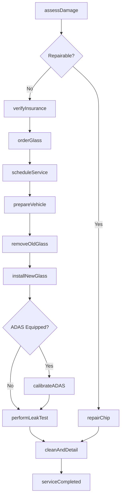
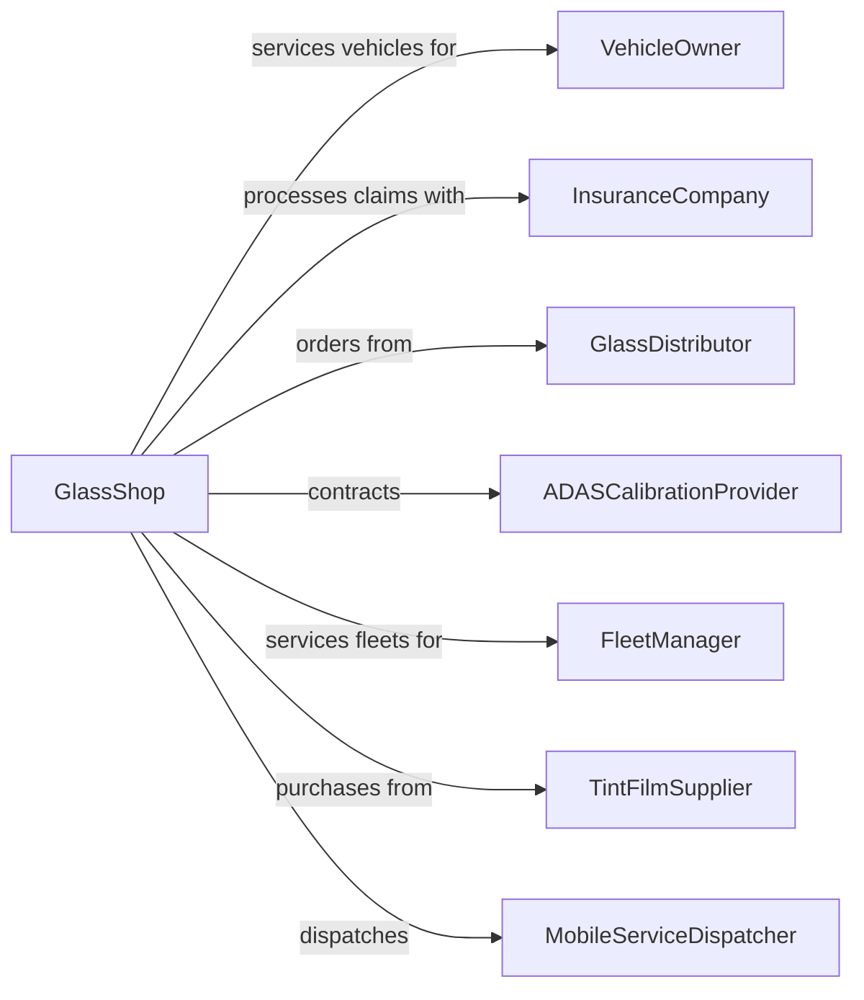

# Automotive Glass Replacement Shops

> Business-as-Code definition for automotive glass replacement operations. Models windshield and window repair and replacement services.

## Overview

Automotive glass shops specialize in replacing, repairing, and tinting vehicle glass including windshields, side windows, and rear glass. This definition exposes actions for damage assessment, glass replacement, chip repair, and tinting, with events for insurance processing and searches for glass specifications.

## Actors

| Actor | Description |
|-------|-------------|
| VehicleOwner | Individual or business needing glass services |
| InsuranceCompany | Covers glass replacement under comprehensive policies |
| GlassDistributor | Supplies OEM and aftermarket glass |
| ADASCalibrationProvider | Calibrates camera and sensor systems |
| FleetManager | Manages glass services for vehicle fleets |
| TintFilmSupplier | Provides window tinting materials |
| MobileServiceDispatcher | Coordinates on-site glass replacement |

## Roles

| Role | Description |
|------|-------------|
| ShopOwner | Owns and operates the glass business |
| GlassTechnician | Removes and installs automotive glass |
| MobileInstaller | Performs on-site glass replacement |
| TintSpecialist | Applies window tinting film |
| CustomerServiceRep | Schedules appointments and processes claims |
| ADASCalibratorTech | Recalibrates safety system cameras |

## Entities

| Entity | Description |
|--------|-------------|
| Vehicle | The car, truck, or van needing glass service |
| Windshield | Front glass with embedded sensors and features |
| SideGlass | Door windows and quarter panels |
| RearGlass | Back window often with defroster elements |
| ChipRepair | Resin injection to stop crack propagation |
| TintFilm | UV-blocking or privacy window film |
| ADASCamera | Forward-facing camera requiring calibration |
| InsuranceClaim | Documentation for covered glass replacement |
| GlassSpec | Part number and feature specifications |
| Urethane | Adhesive used to bond glass to frame |

## Actions

| Action | Description |
|--------|-------------|
| assessDamage | Evaluate glass damage and determine repair or replace |
| scheduleService | Book in-shop or mobile appointment |
| verifyInsurance | Confirm coverage and process claim |
| orderGlass | Source correct glass with required features |
| prepareVehicle | Protect interior and remove trim |
| removeOldGlass | Safely cut out and extract damaged glass |
| installNewGlass | Bond new glass with proper adhesive |
| repairChip | Inject resin to fill and seal minor damage |
| applyTint | Install window tinting film |
| calibrateADAS | Align and test forward-facing camera system |
| performLeakTest | Verify watertight seal |
| cleanAndDetail | Final cleanup of glass and surrounding areas |

## Events

| Event | Description |
|-------|-------------|
| damageAssessed | Glass inspection has been completed |
| serviceScheduled | Appointment has been booked |
| insuranceVerified | Coverage has been confirmed |
| glassOrdered | Replacement glass has been ordered |
| glassReceived | Ordered glass has arrived |
| oldGlassRemoved | Damaged glass has been extracted |
| newGlassInstalled | Replacement glass has been bonded |
| chipRepaired | Resin repair has been completed |
| tintApplied | Window film has been installed |
| adasCalibrated | Camera system has been aligned |
| leakTestPassed | Seal has been verified watertight |
| serviceCompleted | All work is finished and vehicle ready |

## Searches

| Search | Description |
|--------|-------------|
| findGlassSpec | Look up part number and features for vehicle |
| checkInventory | Search available glass in stock |
| getInsuranceRates | Retrieve coverage terms by carrier |
| findMobileTechAvailability | Check mobile installer schedules |
| getCalibrationRequirements | Determine ADAS calibration needs |
| searchTintOptions | Find available tint shades and materials |

## Workflow



## Actor Relationships



## Usage

### Calling Actions

```typescript
import { replaceGlass } from '@headlessly/replace-glass'

const shop = replaceGlass()

// Assess windshield damage
const assessment = await shop.assessDamage({
  vehicleId: 'veh-123',
  glassType: 'windshield',
  damageType: 'crack',
  damageSize: '14 inches',
  damageLocation: 'driver side',
  inLineOfSight: true
})

// Verify insurance coverage
const coverage = await shop.verifyInsurance({
  vehicleId: 'veh-123',
  insuranceProvider: 'Geico',
  policyNumber: 'G-123456',
  deductible: 0 // Full glass coverage
})

// Install new windshield
await shop.installNewGlass({
  vehicleId: 'veh-123',
  glassPartNumber: 'FW04567',
  features: ['rainSensor', 'heatedWiperZone', 'adasCamera'],
  adhesiveType: 'fastCureUrethane',
  safeAwayTime: '1 hour'
})
```

### Event-Driven Automation

```typescript
// Auto-schedule ADAS calibration when new glass installed
shop.newGlassInstalled(async ({ vehicleId, features }) => {
  if (features.includes('adasCamera')) {
    await shop.calibrateADAS({
      vehicleId,
      calibrationType: 'static',
      targetRequired: true
    })
  }
})

// Notify customer when mobile service complete
shop.serviceCompleted(async ({ vehicleId, serviceType, location }) => {
  if (location !== 'in-shop') {
    await shop.notifyCustomer({
      vehicleId,
      message: 'Your windshield has been replaced. Please wait 1 hour before driving.'
    })
  }
})
```
