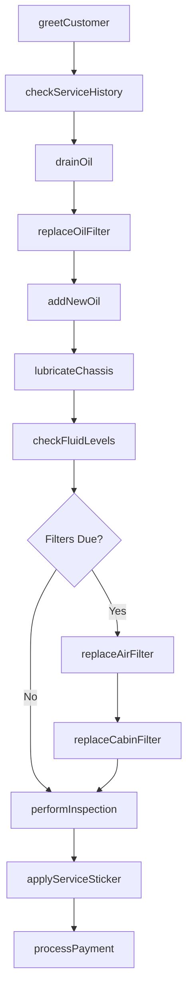
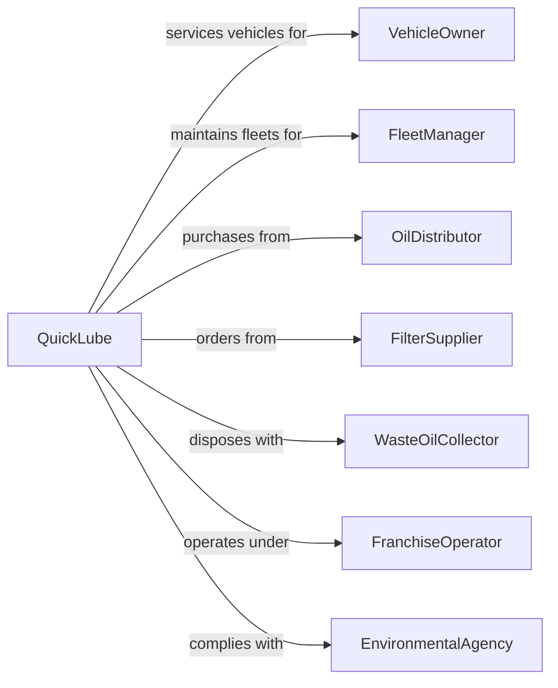

# Automotive Oil Change and Lubrication Shops

> Business-as-Code definition for quick lube operations. Models fast-service oil change and preventive maintenance services.

## Overview

Quick lube shops provide rapid oil changes and chassis lubrication for passenger cars, trucks, and vans. This definition exposes actions for fluid services, filter replacement, and multi-point inspections, with events for service reminders and searches for vehicle maintenance schedules.

## Actors

| Actor | Description |
|-------|-------------|
| VehicleOwner | Individual bringing vehicle for routine maintenance |
| FleetManager | Commercial customer with multiple vehicles |
| OilDistributor | Supplies motor oils and lubricants |
| FilterSupplier | Provides oil, air, and cabin filters |
| WasteOilCollector | Removes used oil for recycling |
| FranchiseOperator | Provides brand standards and support |
| EnvironmentalAgency | Regulates waste oil handling |

## Roles

| Role | Description |
|------|-------------|
| ShopManager | Oversees daily operations and staff |
| UpperBayTech | Greets customers and services under hood |
| LowerBayTech | Works in pit servicing underbody |
| ServiceWriter | Processes transactions and upsells services |
| QualityChecker | Verifies all services completed correctly |

## Entities

| Entity | Description |
|--------|-------------|
| Vehicle | The car, truck, or van being serviced |
| MotorOil | Engine lubricant in various grades and types |
| OilFilter | Filtration element for engine oil |
| AirFilter | Engine air intake filtration |
| CabinFilter | HVAC air filtration for interior |
| TransmissionFluid | Automatic transmission lubricant |
| Coolant | Engine cooling system fluid |
| ServiceRecord | Documentation of services performed |
| ServiceSticker | Reminder for next service date and mileage |
| WasteOil | Used oil collected for recycling |

## Actions

| Action | Description |
|--------|-------------|
| greetCustomer | Welcome driver and gather vehicle information |
| checkServiceHistory | Review previous services and intervals |
| drainOil | Remove used motor oil from engine |
| replaceOilFilter | Install new oil filtration element |
| addNewOil | Fill engine with correct grade and quantity |
| lubricateChassis | Grease fittings on suspension and steering |
| checkFluidLevels | Inspect and top off all vehicle fluids |
| replaceAirFilter | Install new engine air filter |
| replaceCabinFilter | Install new HVAC cabin filter |
| performInspection | Complete multi-point vehicle check |
| applyServiceSticker | Place reminder for next service |
| processPayment | Complete transaction and provide receipt |

## Events

| Event | Description |
|-------|-------------|
| customerGreeted | Vehicle has arrived and been logged |
| historyChecked | Previous service records have been reviewed |
| oilDrained | Used oil has been removed from engine |
| filterReplaced | New oil filter has been installed |
| oilAdded | Fresh oil has been added to engine |
| chassisLubricated | Grease points have been serviced |
| fluidsChecked | All fluid levels have been inspected |
| inspectionCompleted | Multi-point check is finished |
| serviceCompleted | All requested services are done |
| stickerApplied | Next service reminder has been placed |
| paymentProcessed | Transaction has been completed |

## Searches

| Search | Description |
|--------|-------------|
| findOilSpec | Look up recommended oil grade for vehicle |
| getServiceInterval | Retrieve manufacturer maintenance schedule |
| checkCustomerHistory | Find previous visits by customer |
| getFilterPartNumber | Look up correct filter for vehicle |
| findFluidCapacity | Get fluid quantities for vehicle |
| searchPromotions | Find active coupons and discounts |

## Workflow



## Actor Relationships



## Usage

### Calling Actions

```typescript
import { changeOil } from '@headlessly/change-oil'

const shop = changeOil()

// Greet customer and start service
const visit = await shop.greetCustomer({
  vehicleId: 'veh-123',
  mileage: 45230,
  customerRequest: 'fullSynthetic'
})

// Perform oil change
await shop.drainOil({ vehicleId: 'veh-123' })
await shop.replaceOilFilter({
  vehicleId: 'veh-123',
  filterPartNumber: 'PH10575'
})
await shop.addNewOil({
  vehicleId: 'veh-123',
  oilGrade: '5W-30',
  oilType: 'fullSynthetic',
  quantity: 5.5
})

// Complete inspection
const inspection = await shop.performInspection({
  vehicleId: 'veh-123',
  checkpoints: ['tires', 'brakes', 'belts', 'hoses', 'battery', 'lights']
})
```

### Event-Driven Automation

```typescript
// Auto-recommend filter replacement when due
shop.historyChecked(async ({ vehicleId, lastServices }) => {
  const airFilterAge = monthsSince(lastServices.airFilter)
  if (airFilterAge > 12) {
    await shop.recommendService({
      vehicleId,
      service: 'airFilter',
      reason: 'Last replaced over 12 months ago'
    })
  }
})

// Send service reminder when interval approaches
shop.stickerApplied(async ({ vehicleId, nextServiceMileage, nextServiceDate }) => {
  await shop.scheduleReminder({
    vehicleId,
    triggerMileage: nextServiceMileage - 500,
    triggerDate: addDays(nextServiceDate, -7),
    message: 'Your vehicle is due for an oil change soon.'
  })
})
```
