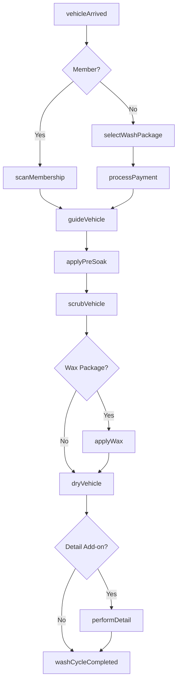
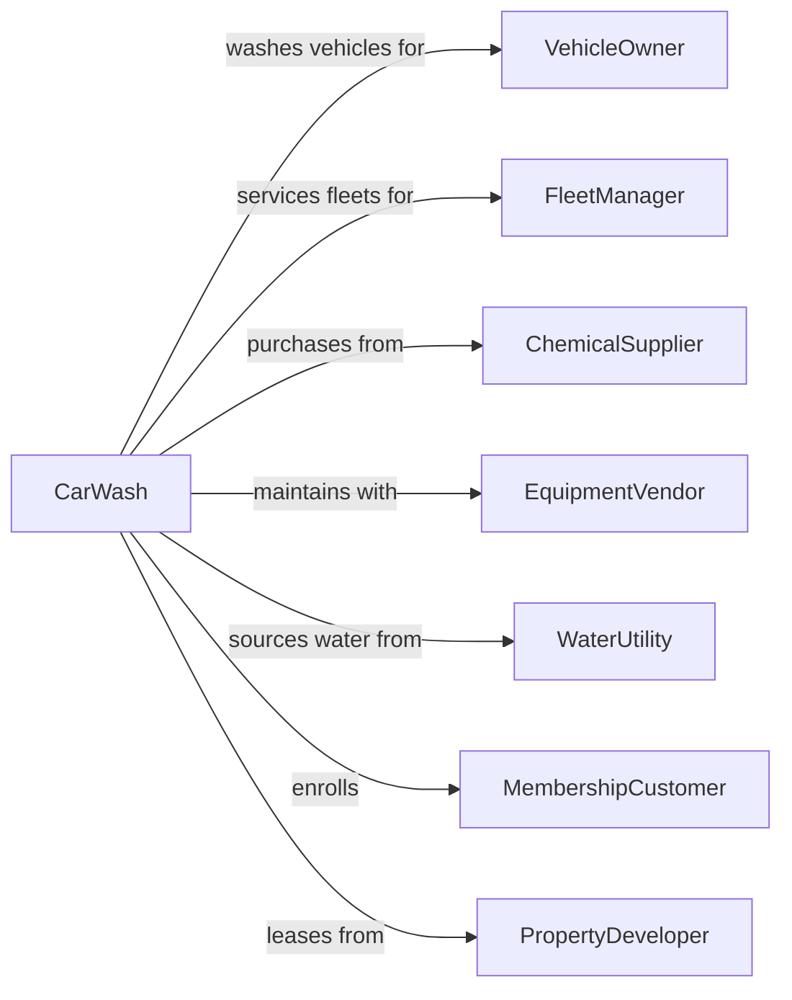

# Car Washes

> Business-as-Code definition for car wash operations. Models automated, self-service, and full-service vehicle cleaning businesses.

## Overview

Car washes provide vehicle cleaning, washing, waxing, and detailing services for passenger cars, trucks, vans, and trailers. This definition exposes actions for wash cycle management, membership programs, and detailing services, with events for equipment monitoring and searches for service analytics.

## Actors

| Actor | Description |
|-------|-------------|
| VehicleOwner | Individual bringing vehicle for cleaning |
| FleetManager | Commercial customer with multiple vehicles |
| ChemicalSupplier | Provides soaps, waxes, and cleaning solutions |
| EquipmentVendor | Supplies wash equipment and maintenance |
| WaterUtility | Provides water supply and manages reclaim |
| MembershipCustomer | Subscriber to unlimited wash plans |
| PropertyDeveloper | Provides land and facility development |

## Roles

| Role | Description |
|------|-------------|
| SiteManager | Oversees car wash operations and staff |
| Attendant | Guides vehicles and assists customers |
| DetailTechnician | Performs hand washing and interior cleaning |
| MaintenanceTech | Maintains and repairs wash equipment |
| Cashier | Processes payments and sells memberships |
| TunnelOperator | Monitors conveyor and chemical dispensing in the automated tunnel |

## Entities

| Entity | Description |
|--------|-------------|
| Vehicle | The car, truck, or van being washed |
| WashPackage | Service level with specific features |
| Membership | Subscription plan for unlimited washes |
| WashTunnel | Automated conveyor wash system |
| SelfServiceBay | Coin-operated manual wash station |
| DetailBay | Area for hand washing and interior work |
| ChemicalMix | Soap, wax, and treatment solutions |
| WaterReclaim | System for recycling wash water |
| Transaction | Record of wash purchase |
| Equipment | Brushes, dryers, and dispensing systems |

## Actions

| Action | Description |
|--------|-------------|
| selectWashPackage | Choose service level and add-ons |
| processPayment | Accept payment via kiosk, app, or attendant |
| scanMembership | Validate unlimited wash subscription |
| guideVehicle | Direct vehicle onto conveyor or into bay |
| startWashCycle | Initiate automated wash sequence |
| applyPreSoak | Spray initial cleaning solution |
| scrubVehicle | Clean exterior with brushes or touchless spray |
| applyWax | Add protective wax coating |
| dryVehicle | Remove water with blowers |
| performDetail | Hand wash and clean interior |
| sellMembership | Enroll customer in subscription plan |
| monitorEquipment | Track equipment status and performance |

## Events

| Event | Description |
|-------|-------------|
| vehicleArrived | Customer has entered the facility |
| paymentProcessed | Transaction has been completed |
| membershipScanned | Subscription has been validated |
| washCycleStarted | Automated wash has begun |
| washCycleCompleted | Vehicle has exited wash tunnel |
| detailCompleted | Hand wash and interior cleaning finished |
| membershipSold | New subscription has been enrolled |
| equipmentAlerted | Equipment issue has been detected |
| chemicalLow | Chemical supply needs replenishment |
| waterReclaimFull | Reclaim tank requires attention |

## Searches

| Search | Description |
|--------|-------------|
| getMembershipStatus | Check subscription validity and usage |
| getWashCount | Retrieve daily, weekly, or monthly volumes |
| checkEquipmentStatus | View equipment health and alerts |
| findMemberUsage | Track wash frequency by member |
| getRevenueReport | Retrieve sales data by period |
| searchChemicalLevels | Check supply tank levels |

## Workflow



## Actor Relationships



## Usage

### Calling Actions

```typescript
import { washVehicles } from '@headlessly/wash-vehicles'

const carwash = washVehicles()

// Check subscription validity and usage
const getMembershipStatusResult = await carwash.getMembershipStatus({ status: 'active' })

// Retrieve daily, weekly, or monthly volumes
const getWashCountResult = await carwash.getWashCount({ status: 'active' })

// Process a walk-up customer
const transaction = await carwash.selectWashPackage({
  packageId: 'premium',
  addOns: ['tireShine', 'rainRepellent'],
  vehicleSize: 'standard'
})

await carwash.processPayment({
  transactionId: transaction.id,
  method: 'credit',
  amount: transaction.total
})

// Scan membership for unlimited customer
const membership = await carwash.scanMembership({
  memberId: 'mem-456',
  vehicleLicensePlate: 'ABC123'
})

// Start wash cycle
await carwash.startWashCycle({
  bayId: 'tunnel-1',
  packageId: membership.packageId,
  vehicleSize: 'standard'
})
```

### Event-Driven Automation

```typescript
// Auto-reorder chemicals when low
carwash.chemicalLow(async ({ chemicalType, currentLevel }) => {
  if (currentLevel < 10) {
    await carwash.orderChemicals({
      type: chemicalType,
      quantity: 'standardOrder',
      priority: 'rush'
    })
  }
})

// Send thank you and upsell after wash
carwash.washCycleCompleted(async ({ vehicleId, customerId, isMember }) => {
  if (!isMember) {
    await carwash.sendPromotion({
      customerId,
      offer: 'firstMonthFree',
      message: 'Join our unlimited wash club and save!'
    })
  }
})
```
