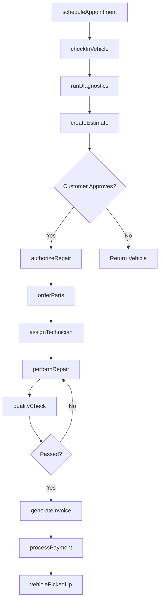
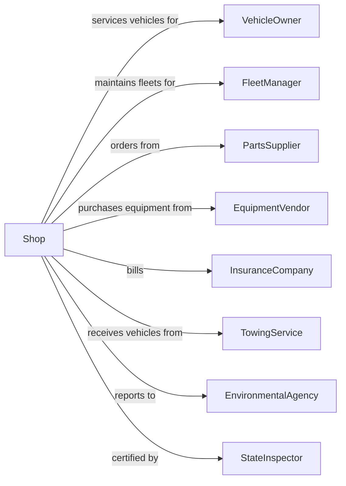

# General Automotive Repair

> Business-as-Code definition for general automotive repair operations. Models the complete vehicle service lifecycle from intake through delivery.

## Overview

General automotive repair shops provide comprehensive mechanical and electrical repair services for passenger cars, trucks, vans, and trailers. This definition exposes actions for diagnostics, repair work orders, parts management, and customer communication, with events for workflow automation and searches for service history retrieval.

## Actors

| Actor | Description |
|-------|-------------|
| VehicleOwner | Individual or business bringing vehicle for repair |
| FleetManager | Commercial customer managing multiple vehicles |
| PartsSupplier | Provides OEM and aftermarket replacement parts |
| EquipmentVendor | Supplies diagnostic tools and shop equipment |
| InsuranceCompany | Covers repair costs under warranty or policy |
| TowingService | Delivers disabled vehicles to the shop |
| EnvironmentalAgency | Regulates waste disposal and emissions |
| StateInspector | Certifies safety and emissions compliance |

## Roles

| Role | Description |
|------|-------------|
| ShopOwner | Owns the business and sets strategic direction |
| ServiceManager | Oversees daily operations and customer relations |
| LeadTechnician | ASE-certified master mechanic handling complex repairs |
| Technician | Performs diagnostics and repair work |
| ServiceAdvisor | Interfaces with customers and writes repair orders |
| PartsSpecialist | Sources and manages parts inventory |

## Entities

| Entity | Description |
|--------|-------------|
| Vehicle | The car, truck, or van being serviced |
| RepairOrder | Work order documenting services to be performed |
| Estimate | Quoted cost for proposed repairs |
| Part | Component needed for repair or replacement |
| DiagnosticReport | Results from electronic or visual inspection |
| Invoice | Final billing document for completed work |
| ServiceHistory | Record of all work performed on a vehicle |
| Warranty | Manufacturer or shop guarantee on parts or labor |
| Appointment | Scheduled time slot for vehicle drop-off |
| TechnicianCertification | ASE or manufacturer credentials |

## Actions

| Action | Description |
|--------|-------------|
| scheduleAppointment | Book a service slot for vehicle drop-off |
| checkInVehicle | Record vehicle arrival and customer concerns |
| runDiagnostics | Perform electronic scan and visual inspection |
| createEstimate | Generate cost estimate for required repairs |
| authorizeRepair | Get customer approval to proceed with work |
| orderParts | Source and procure needed replacement parts |
| assignTechnician | Allocate repair job to qualified mechanic |
| performRepair | Execute the mechanical or electrical repair |
| qualityCheck | Verify repair meets standards before release |
| updateServiceHistory | Record completed work in vehicle records |
| generateInvoice | Create final bill for services rendered |
| processPayment | Collect payment and close repair order |
| scheduleFollowUp | Book return visit for additional work |

## Events

| Event | Description |
|-------|-------------|
| appointmentScheduled | Service appointment has been booked |
| vehicleCheckedIn | Vehicle has arrived and been logged |
| diagnosticsCompleted | Inspection results are ready for review |
| estimateApproved | Customer has authorized the repair work |
| partsOrdered | Required parts have been ordered |
| partsReceived | Ordered parts have arrived at the shop |
| repairStarted | Technician has begun working on vehicle |
| repairCompleted | All repair work has been finished |
| qualityCheckPassed | Vehicle passed final inspection |
| invoiceGenerated | Final bill has been created |
| paymentReceived | Customer has paid for services |
| vehiclePickedUp | Customer has retrieved their vehicle |

## Searches

| Search | Description |
|--------|-------------|
| findVehicleHistory | Retrieve all service records for a vehicle |
| getOpenRepairOrders | List all in-progress repair orders |
| checkPartsAvailability | Search inventory for needed parts |
| findTechnicianSchedule | View technician availability and workload |
| getCustomerVehicles | List all vehicles owned by a customer |
| searchWarrantyCoverage | Check if repair is covered under warranty |
| getRevenueByPeriod | Retrieve sales data for reporting |

## Workflow



## Actor Relationships



## Usage

### Calling Actions

```typescript
import { repairVehicles } from '@headlessly/repair-vehicles'

const shop = repairVehicles()

// Schedule a new appointment
const appointment = await shop.scheduleAppointment({
  customerId: 'cust-123',
  vehicleId: 'veh-456',
  concerns: ['Check engine light', 'Strange noise when braking'],
  preferredDate: '2024-03-15',
  preferredTime: '09:00'
})

// Run diagnostics after check-in
const diagnostics = await shop.runDiagnostics({
  vehicleId: 'veh-456',
  scanTypes: ['OBD2', 'visual', 'roadTest'],
  technicianId: 'tech-789'
})

// Create repair estimate
const estimate = await shop.createEstimate({
  repairOrderId: 'ro-001',
  findings: diagnostics.findings,
  includeLabor: true,
  includeParts: true
})
```

### Event-Driven Automation

```typescript
// Auto-notify customer when parts arrive
shop.partsReceived(async ({ repairOrderId, parts }) => {
  const order = await shop.getRepairOrder(repairOrderId)
  await shop.notifyCustomer({
    customerId: order.customerId,
    message: `Parts arrived for your ${order.vehicleYear} ${order.vehicleMake}. We'll begin repairs shortly.`
  })
})

// Auto-schedule follow-up for recommended services
shop.vehiclePickedUp(async ({ vehicleId, recommendations }) => {
  if (recommendations.length > 0) {
    await shop.scheduleFollowUp({
      vehicleId,
      services: recommendations,
      reminderDays: 30
    })
  }
})
```
