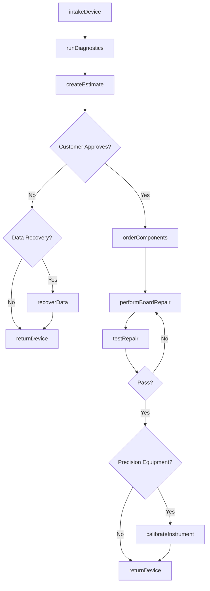
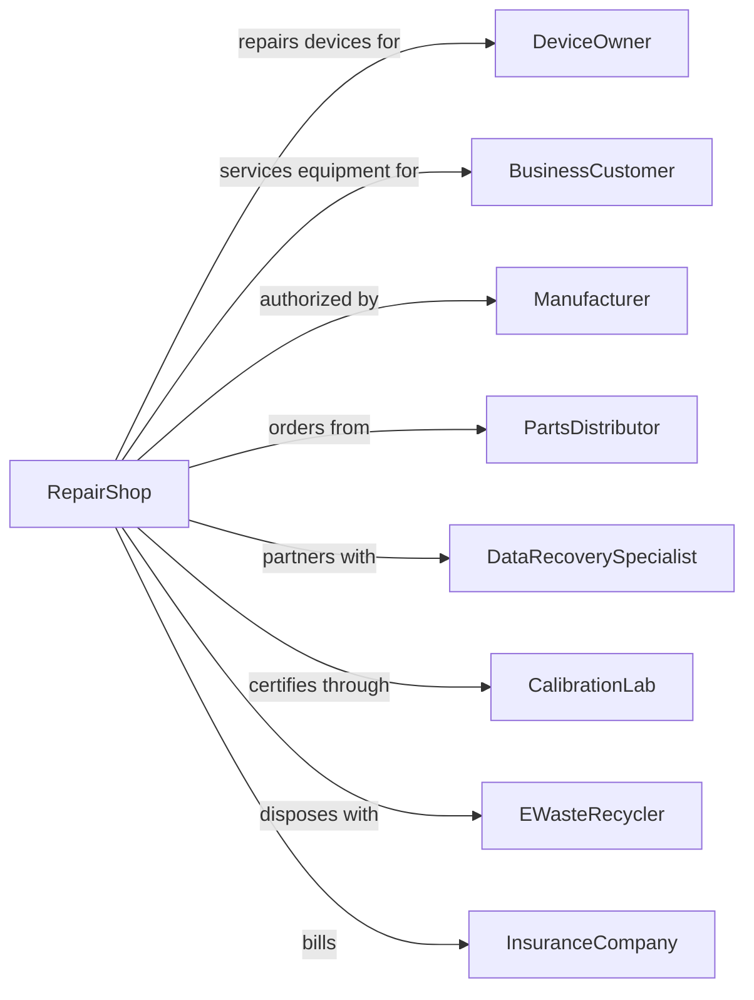

# Electronic and Precision Equipment Repair and Maintenance

> Business-as-Code definition for electronic and precision equipment repair operations. Models repair services for computers, consumer electronics, office machines, and precision instruments.

## Overview

Electronic repair establishments service consumer electronics, computers, office machines, communication equipment, and precision instruments. This definition exposes actions for diagnostics, component-level repair, calibration, and data recovery, with events for repair tracking and searches for parts and schematics.

## Actors

| Actor | Description |
|-------|-------------|
| DeviceOwner | Individual bringing personal electronics for repair |
| BusinessCustomer | Company with IT equipment needing service |
| Manufacturer | Provides warranty support and authorized parts |
| PartsDistributor | Supplies replacement components and boards |
| DataRecoverySpecialist | Partners for advanced data retrieval |
| CalibrationLab | Provides certified calibration services |
| EWasteRecycler | Handles disposal of unrepairable electronics |
| InsuranceCompany | Covers accidental damage repairs |

## Roles

| Role | Description |
|------|-------------|
| ShopOwner | Owns and operates the repair business |
| BenchTechnician | Performs component-level diagnostics and repair |
| IntakeTechnician | Receives devices and documents issues |
| CalibrationTech | Calibrates and certifies precision instruments |
| DataRecoveryTech | Retrieves data from damaged storage media |
| CustomerServiceRep | Communicates status and estimates to customers |

## Entities

| Entity | Description |
|--------|-------------|
| Device | The electronic equipment being repaired |
| Computer | Desktop, laptop, or server system |
| Smartphone | Mobile phone or tablet device |
| Printer | Office printing and copying equipment |
| PrecisionInstrument | Microscopes, measuring devices, scientific equipment |
| Component | Circuit boards, chips, and electronic parts |
| Diagnostic | Test results and fault identification |
| Firmware | Software embedded in device hardware |
| CalibrationCertificate | Documentation of calibration accuracy |
| RepairTicket | Work order tracking the repair process |

## Actions

| Action | Description |
|--------|-------------|
| intakeDevice | Receive device and document reported issues |
| runDiagnostics | Test device to identify faults |
| createEstimate | Generate repair cost quote |
| orderComponents | Source replacement parts |
| performBoardRepair | Replace or repair circuit board components |
| replaceScreen | Install new display panel |
| updateFirmware | Flash updated software to device |
| recoverData | Retrieve files from damaged storage |
| calibrateInstrument | Adjust and certify precision accuracy |
| testRepair | Verify device functions correctly |
| returnDevice | Complete repair and release to customer |
| recycleDevice | Dispose of unrepairable equipment properly |

## Events

| Event | Description |
|-------|-------------|
| deviceReceived | Equipment has been checked in |
| diagnosticsCompleted | Fault has been identified |
| estimateApproved | Customer has authorized repair |
| componentsOrdered | Replacement parts have been ordered |
| componentsReceived | Parts have arrived |
| repairCompleted | Device has been fixed |
| dataRecovered | Files have been retrieved |
| calibrationCertified | Instrument accuracy has been verified |
| testPassed | Device functions correctly |
| deviceReturned | Customer has picked up equipment |
| deviceRecycled | Equipment has been disposed of |

## Searches

| Search | Description |
|--------|-------------|
| findSchematic | Look up circuit diagrams for device |
| checkPartAvailability | Search for component stock |
| getRepairHistory | Retrieve previous repairs on device |
| findCalibrationStandards | Look up accuracy requirements |
| searchKnowledgeBase | Find solutions for common issues |
| getWarrantyStatus | Check if device is under warranty |

## Workflow



## Actor Relationships



## Usage

### Calling Actions

```typescript
import { repairElectronics } from '@headlessly/repair-electronics'

const shop = repairElectronics()

// Look up circuit diagrams for device
const findSchematicResult = await shop.findSchematic({ status: 'active' })

// Search for component stock
const checkPartAvailabilityResult = await shop.checkPartAvailability({ status: 'active' })

// Intake a laptop for repair
const ticket = await shop.intakeDevice({
  deviceType: 'laptop',
  make: 'Apple',
  model: 'MacBook Pro',
  serialNumber: 'C02X12345',
  reportedIssue: 'No power, liquid damage',
  customerId: 'cust-123'
})

// Run diagnostics
const diagnosis = await shop.runDiagnostics({
  ticketId: ticket.id,
  tests: ['powerSupply', 'logicBoard', 'liquidDamage'],
  documentFindings: true
})

// Perform board-level repair
await shop.performBoardRepair({
  ticketId: ticket.id,
  componentIds: ['U3100', 'C4520'],
  repairType: 'microsoldering',
  technicianId: 'tech-456'
})
```

### Event-Driven Automation

```typescript
// Auto-order common components when diagnosed
shop.diagnosticsCompleted(async ({ ticketId, faults }) => {
  const commonParts = faults.filter(f => f.partInStock === false && f.commonFailure)
  for (const fault of commonParts) {
    await shop.orderComponents({
      ticketId,
      partNumbers: fault.recommendedParts,
      priority: 'standard'
    })
  }
})

// Notify customer when repair complete
shop.testPassed(async ({ ticketId, deviceId }) => {
  const ticket = await shop.getTicket(ticketId)
  await shop.notifyCustomer({
    customerId: ticket.customerId,
    message: `Your ${ticket.deviceType} is ready for pickup. All tests passed.`
  })
})
```
