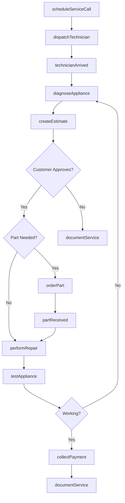
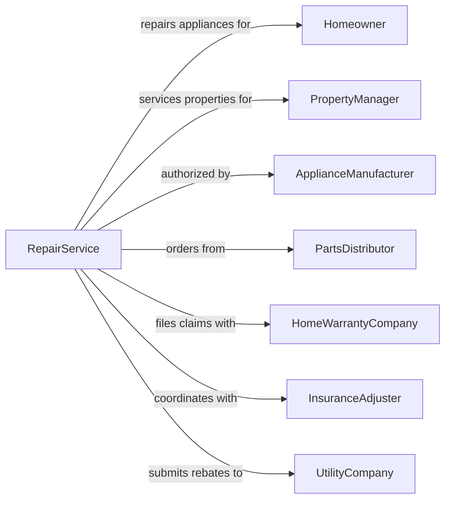

# Appliance Repair and Maintenance

> Business-as-Code definition for appliance repair operations. Models diagnostic and repair services for household appliances.

## Overview

Appliance repair establishments service household appliances including refrigerators, washing machines, dryers, dishwashers, ovens, and room air conditioners. This definition exposes actions for in-home diagnostics, parts ordering, and repair execution, with events for service scheduling and searches for technical specifications.

## Actors

| Actor | Description |
|-------|-------------|
| Homeowner | Individual with appliance needing repair |
| PropertyManager | Manages rental properties with multiple units |
| ApplianceManufacturer | Provides warranty support and OEM parts |
| PartsDistributor | Supplies replacement components |
| HomeWarrantyCompany | Covers repairs under service contracts |
| InsuranceAdjuster | Handles damage claims involving appliances |
| UtilityCompany | Provides rebates for energy-efficient repairs |

## Roles

| Role | Description |
|------|-------------|
| BusinessOwner | Owns and operates the repair service |
| FieldTechnician | Performs in-home diagnostics and repairs |
| Dispatcher | Schedules appointments and routes technicians |
| PartsManager | Maintains inventory and orders components |
| CustomerServiceRep | Handles calls and customer communication |

## Entities

| Entity | Description |
|--------|-------------|
| Appliance | The household device being repaired |
| Refrigerator | Cooling appliance for food storage |
| WashingMachine | Laundry cleaning appliance |
| Dryer | Laundry drying appliance |
| Dishwasher | Dish cleaning appliance |
| Oven | Cooking appliance |
| ServiceCall | Scheduled appointment for repair |
| DiagnosticResult | Findings from appliance testing |
| Part | Replacement component for repair |
| WarrantyClaim | Documentation for covered repairs |

## Actions

| Action | Description |
|--------|-------------|
| scheduleServiceCall | Book appointment for appliance repair |
| dispatchTechnician | Assign and route tech to customer location |
| diagnoseAppliance | Test and identify malfunction |
| createEstimate | Generate repair cost quote |
| orderPart | Source replacement component |
| performRepair | Execute repair work |
| testAppliance | Verify appliance functions correctly |
| submitWarrantyClaim | File claim with manufacturer or warranty company |
| collectPayment | Process payment for services |
| scheduleFollowUp | Book return visit if needed |
| documentService | Record work performed for records |
| provideMaintenance Tips | Educate customer on appliance care |

## Events

| Event | Description |
|-------|-------------|
| serviceCallScheduled | Appointment has been booked |
| technicianDispatched | Technician is en route to customer |
| technicianArrived | Technician has reached location |
| diagnosisCompleted | Appliance issue has been identified |
| estimateApproved | Customer has authorized repair |
| partOrdered | Replacement component has been ordered |
| partReceived | Ordered part has arrived |
| repairCompleted | Appliance has been fixed |
| applianceTested | Functionality has been verified |
| paymentCollected | Customer has paid for service |
| warrantyClaimSubmitted | Claim has been filed |

## Searches

| Search | Description |
|--------|-------------|
| findPartNumber | Look up correct replacement part |
| getApplianceSpecs | Retrieve model specifications |
| checkWarrantyStatus | Verify coverage for appliance |
| findTechnicianAvailability | View technician schedules |
| getServiceHistory | Retrieve previous repairs for customer |
| searchTroubleshootingGuide | Find solutions for common issues |

## Workflow



## Actor Relationships



## Usage

### Calling Actions

```typescript
import { repairAppliances } from '@headlessly/repair-appliances'

const service = repairAppliances()

// Look up correct replacement part
const findPartNumberResult = await service.findPartNumber({ status: 'active' })

// Retrieve model specifications
const getApplianceSpecsResult = await service.getApplianceSpecs({ status: 'active' })

// Schedule a service call
const serviceCall = await service.scheduleServiceCall({
  customerId: 'cust-123',
  applianceType: 'refrigerator',
  make: 'Samsung',
  model: 'RF28R7551SR',
  issue: 'Not cooling properly',
  preferredDate: '2024-03-15',
  preferredWindow: 'morning'
})

// Diagnose the appliance
const diagnosis = await service.diagnoseAppliance({
  serviceCallId: serviceCall.id,
  tests: ['compressor', 'thermostat', 'evaporatorFan'],
  technicianId: 'tech-456'
})

// Order required part
await service.orderPart({
  serviceCallId: serviceCall.id,
  partNumber: 'DA97-12540A',
  partDescription: 'Evaporator fan motor',
  priority: 'rush'
})
```

### Event-Driven Automation

```typescript
// Auto-dispatch closest available technician
service.serviceCallScheduled(async ({ serviceCallId, location, timeWindow }) => {
  const availableTechs = await service.findTechnicianAvailability({
    date: timeWindow.date,
    window: timeWindow.slot
  })
  const closest = findClosestTech(availableTechs, location)
  await service.dispatchTechnician({
    serviceCallId,
    technicianId: closest.id
  })
})

// Notify customer when tech is on the way
service.technicianDispatched(async ({ serviceCallId, technicianId, eta }) => {
  const call = await service.getServiceCall(serviceCallId)
  await service.notifyCustomer({
    customerId: call.customerId,
    message: `Your technician is on the way. ETA: ${eta}`
  })
})
```
