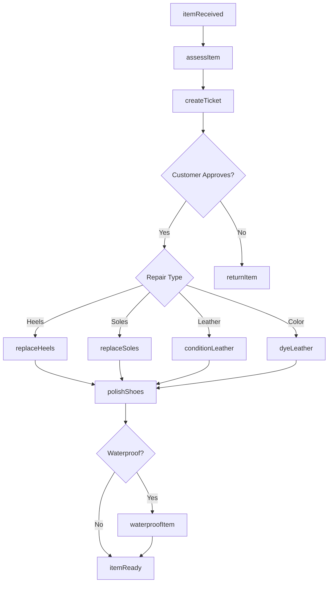
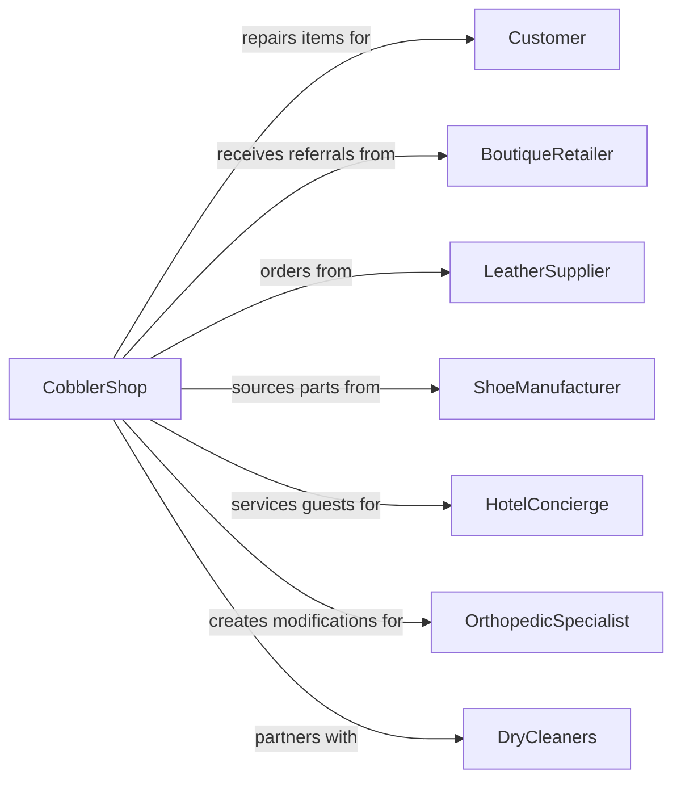

# Footwear and Leather Goods Repair

> Business-as-Code definition for shoe repair and leather goods restoration. Models cobbler services for footwear, bags, and leather accessories.

## Overview

Footwear and leather goods repair establishments provide cobbler services including heel replacement, sole repair, leather conditioning, and restoration of handbags, belts, and briefcases. This definition exposes actions for repair assessment, material matching, and craftsmanship services, with events for order tracking and searches for supplies.

## Actors

| Actor | Description |
|-------|-------------|
| Customer | Individual with footwear or leather goods needing repair |
| BoutiqueRetailer | High-end store referring customers for repairs |
| LeatherSupplier | Provides leather, soles, and repair materials |
| ShoeManufacturer | Provides brand-specific replacement components |
| HotelConcierge | Refers guests needing quick repairs |
| OrthopedicSpecialist | Prescribes custom modifications |
| DryCleaners | Partners for drop-off and pickup convenience |

## Roles

| Role | Description |
|------|-------------|
| MasterCobbler | Performs expert shoe repair and restoration |
| LeatherCraftsman | Repairs handbags and leather accessories |
| ShineSpecialist | Cleans and polishes footwear |
| CounterStaff | Receives orders and handles customer service |
| KeyCuttingTech | Provides key duplication services |
| Patinator | Restores vintage leather color and finish through dyeing and conditioning |

## Entities

| Entity | Description |
|--------|-------------|
| Shoe | Footwear item being repaired |
| Handbag | Leather bag being restored |
| Belt | Leather accessory needing service |
| Briefcase | Professional leather bag |
| Sole | Bottom of shoe requiring replacement |
| Heel | Shoe heel needing repair or replacement |
| Leather | Material used for repairs |
| Dye | Color applied to leather |
| RepairTicket | Work order for service |
| Orthotic | Custom insert or modification |

## Actions

| Action | Description |
|--------|-------------|
| assessItem | Evaluate condition and repair options |
| createTicket | Document repair request and estimate |
| replaceHeels | Install new heel caps or heels |
| replaceSoles | Attach new sole to shoe |
| repairStitching | Re-sew separated seams |
| conditionLeather | Clean and moisturize leather |
| dyeLeather | Color or re-color leather surfaces |
| replaceZipper | Install new zipper on bag or boot |
| stretchShoes | Expand shoes for better fit |
| addOrthotic | Install custom support or lift |
| polishShoes | Clean and shine footwear |
| waterproofItem | Apply protective coating |

## Events

| Event | Description |
|-------|-------------|
| itemReceived | Goods have been checked in |
| assessmentCompleted | Repair needs have been evaluated |
| repairApproved | Customer has authorized the work |
| materialsSourced | Required supplies have been located |
| heelsReplaced | New heels have been installed |
| solesReplaced | New soles have been attached |
| leatherConditioned | Leather has been treated |
| dyeApplied | Color has been applied |
| repairCompleted | All work has been finished |
| itemReady | Goods are ready for pickup |

## Searches

| Search | Description |
|--------|-------------|
| findSoleMatch | Look up compatible sole replacement |
| getLeatherType | Identify leather for proper treatment |
| findDyeColor | Match existing leather color |
| checkMaterialInventory | Search supplies in stock |
| getRepairHistory | Retrieve previous services for customer |
| searchBrandParts | Find manufacturer-specific components |

## Workflow



## Actor Relationships



## Usage

### Calling Actions

```typescript
import { repairShoes } from '@headlessly/repair-shoes'

const cobbler = repairShoes()

// Look up compatible sole replacement
const findSoleMatchResult = await cobbler.findSoleMatch({ status: 'active' })

// Identify leather for proper treatment
const getLeatherTypeResult = await cobbler.getLeatherType({ status: 'active' })

// Assess shoes for repair
const assessment = await cobbler.assessItem({
  itemType: 'dressShoes',
  brand: 'Allen Edmonds',
  issues: ['wornHeels', 'scuffedToe', 'looseStitching'],
  customerId: 'cust-123'
})

// Replace heels and soles
await cobbler.replaceHeels({
  ticketId: assessment.ticketId,
  heelType: 'rubber',
  color: 'black'
})

await cobbler.replaceSoles({
  ticketId: assessment.ticketId,
  soleType: 'leather',
  brand: 'Vibram',
  welt: 'goodyear'
})

// Condition and polish
await cobbler.conditionLeather({
  ticketId: assessment.ticketId,
  conditioner: 'premium',
  colorRestoration: true
})
```

### Event-Driven Automation

```typescript
// Auto-notify when repair complete
cobbler.repairCompleted(async ({ ticketId }) => {
  const ticket = await cobbler.getTicket(ticketId)
  await cobbler.notifyCustomer({
    customerId: ticket.customerId,
    message: `Your ${ticket.itemType} is ready for pickup.`
  })
})

// Suggest waterproofing for seasonal repairs
cobbler.itemReady(async ({ ticketId, itemType, season }) => {
  if (season === 'fall' && itemType === 'boots') {
    const ticket = await cobbler.getTicket(ticketId)
    await cobbler.recommendService({
      customerId: ticket.customerId,
      service: 'waterproofing',
      reason: 'Protect your boots for the wet season'
    })
  }
})
```
