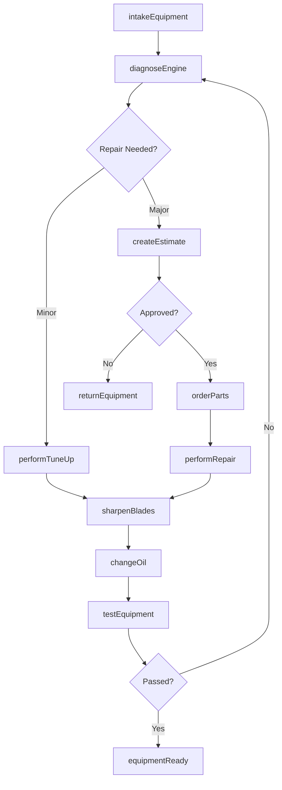
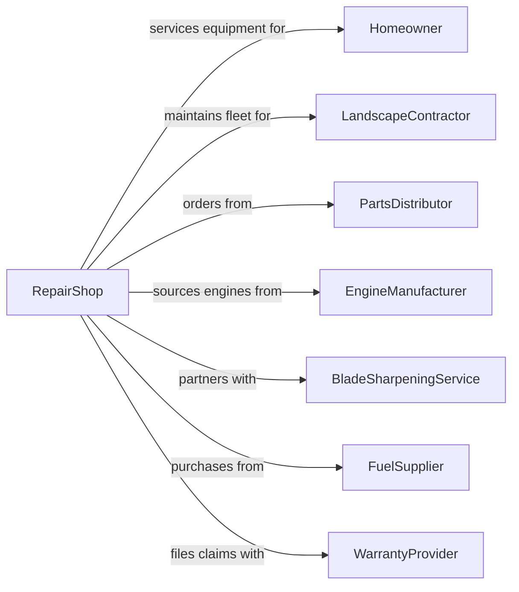

# Home and Garden Equipment Repair and Maintenance

> Business-as-Code definition for home and garden equipment repair operations. Models repair services for lawn mowers, power tools, and outdoor equipment.

## Overview

Home and garden equipment repair establishments service lawn mowers, snow blowers, leaf blowers, chainsaws, trimmers, and handheld power tools. This definition exposes actions for seasonal tune-ups, blade sharpening, and engine repair, with events for service completion and searches for parts and specifications.

## Actors

| Actor | Description |
|-------|-------------|
| Homeowner | Individual with residential equipment needing service |
| LandscapeContractor | Professional with commercial equipment |
| PartsDistributor | Supplies replacement parts and components |
| EngineManufacturer | Provides small engine parts and support |
| BladeSharpeningService | Partners for professional blade work |
| FuelSupplier | Provides fuel stabilizers and treatments |
| WarrantyProvider | Covers equipment under extended warranty |

## Roles

| Role | Description |
|------|-------------|
| ShopOwner | Owns and operates the repair business |
| SmallEngineMechanic | Repairs and tunes small engines |
| ServiceWriter | Processes intake and customer communication |
| PickupDeliveryDriver | Transports equipment to and from customers |
| SharpeningTech | Sharpens blades and cutting implements |

## Entities

| Entity | Description |
|--------|-------------|
| Equipment | The home or garden tool being repaired |
| LawnMower | Push, self-propelled, or riding mower |
| SnowBlower | Winter snow removal equipment |
| Chainsaw | Portable power cutting tool |
| Trimmer | String or blade trimmer for edging |
| LeafBlower | Powered yard debris clearing tool |
| SmallEngine | Gasoline engine powering equipment |
| Blade | Cutting surface requiring sharpening |
| Carburetor | Fuel delivery system component |
| SparkPlug | Ignition system component |

## Actions

| Action | Description |
|--------|-------------|
| intakeEquipment | Receive equipment and document issues |
| diagnoseEngine | Test and identify engine problems |
| performTuneUp | Clean, adjust, and service engine |
| replaceSparkPlug | Install new ignition components |
| cleanCarburetor | Service fuel delivery system |
| sharpenBlades | Restore cutting edges to specification |
| replaceBlades | Install new cutting components |
| changeoil | Drain and refill engine oil |
| replaceBelts | Install new drive or cutting belts |
| winterize | Prepare equipment for off-season storage |
| serviceTransmission | Repair drive system on riding mowers |
| testEquipment | Verify repairs and proper operation |

## Events

| Event | Description |
|-------|-------------|
| equipmentReceived | Item has been checked in |
| diagnosisCompleted | Engine issues have been identified |
| tuneUpCompleted | Seasonal service has been performed |
| sparkPlugReplaced | Ignition component has been installed |
| carburetorCleaned | Fuel system has been serviced |
| bladesSharpened | Cutting edges have been restored |
| bladesReplaced | New cutting components have been installed |
| oilChanged | Fresh oil has been added |
| equipmentWinterized | Item is prepared for storage |
| repairCompleted | All work has been finished |
| equipmentReady | Item is ready for customer pickup |

## Searches

| Search | Description |
|--------|-------------|
| findPartNumber | Look up correct replacement part |
| getServiceManual | Retrieve repair documentation |
| checkSeasonalDemand | View repair volume trends |
| findEquipmentSpecs | Look up manufacturer specifications |
| getCustomerHistory | Retrieve previous repairs for customer |
| searchBladeInventory | Check blade stock availability |

## Workflow



## Actor Relationships



## Usage

### Calling Actions

```typescript
import { repairEquipment } from '@headlessly/repair-equipment'

const shop = repairEquipment()

// Look up correct replacement part
const findPartNumberResult = await shop.findPartNumber({ status: 'active' })

// Retrieve repair documentation
const getServiceManualResult = await shop.getServiceManual({ status: 'active' })

// Intake lawn mower for service
const ticket = await shop.intakeEquipment({
  equipmentType: 'lawnMower',
  make: 'Honda',
  model: 'HRX217',
  serialNumber: 'MZCG-1234567',
  reportedIssue: 'Engine won\'t start',
  customerId: 'cust-123'
})

// Perform seasonal tune-up
await shop.performTuneUp({
  ticketId: ticket.id,
  services: ['sparkPlug', 'airFilter', 'oilChange', 'bladeSharpening'],
  fuelStabilizer: true
})

// Sharpen mower blade
await shop.sharpenBlades({
  ticketId: ticket.id,
  bladeType: 'mulching',
  balanceAfterSharpening: true
})
```

### Event-Driven Automation

```typescript
// Send seasonal tune-up reminders
shop.repairCompleted(async ({ ticketId, equipmentType }) => {
  const ticket = await shop.getTicket(ticketId)
  if (equipmentType === 'lawnMower') {
    await shop.scheduleReminder({
      customerId: ticket.customerId,
      triggerMonth: 'March',
      message: 'Spring is coming! Schedule your lawn mower tune-up.'
    })
  }
})

// Auto-notify for winterization service
shop.equipmentReady(async ({ ticketId, season }) => {
  if (season === 'fall') {
    const ticket = await shop.getTicket(ticketId)
    await shop.recommendService({
      customerId: ticket.customerId,
      service: 'winterization',
      reason: 'Protect your equipment during off-season storage'
    })
  }
})
```
