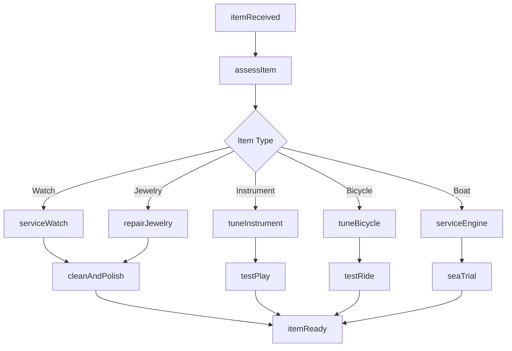
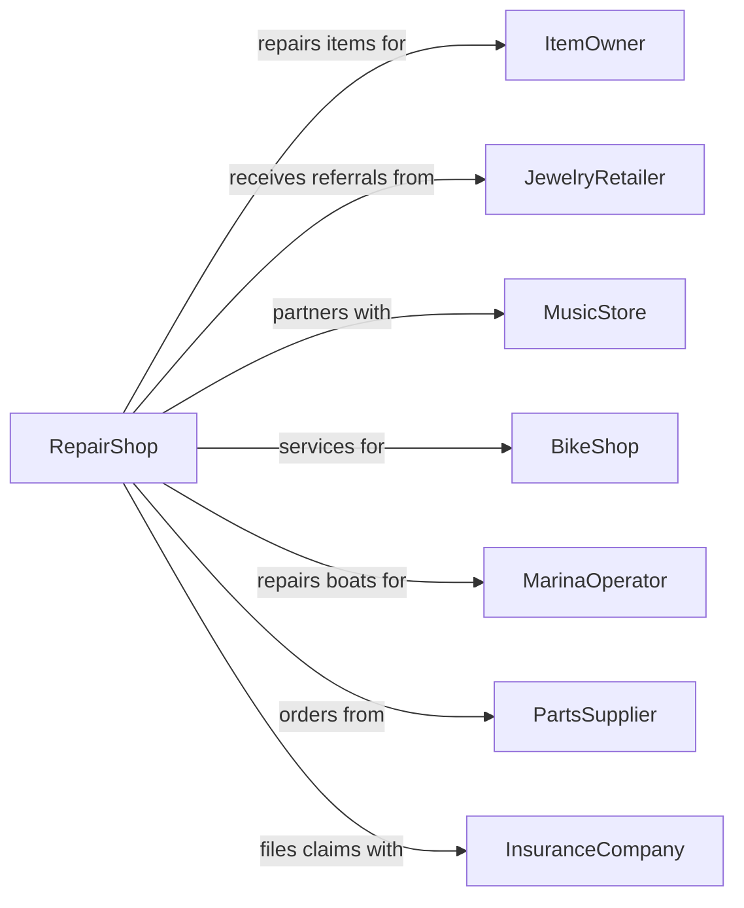

# Other Personal and Household Goods Repair and Maintenance

> Business-as-Code definition for miscellaneous personal goods repair. Models repair services for jewelry, watches, musical instruments, bicycles, and recreational equipment.

## Overview

This industry covers repair services for personal goods including watches, jewelry, musical instruments, bicycles, motorcycles, and recreational boats. This definition exposes actions for specialized repairs, restoration, and maintenance across diverse product categories, with events for service tracking and searches for parts and specifications.

## Actors

| Actor | Description |
|-------|-------------|
| ItemOwner | Individual with personal goods needing repair |
| JewelryRetailer | Refers customers for watch and jewelry repair |
| MusicStore | Partners for instrument repair referrals |
| BikeShop | Bicycle retailer with repair services |
| MarinaOperator | Boat storage facility needing repair services |
| PartsSupplier | Provides specialized replacement components |
| InsuranceCompany | Covers valuable item repairs |

## Roles

| Role | Description |
|------|-------------|
| ShopOwner | Owns and operates the repair business |
| Watchmaker | Repairs and services timepieces |
| Jeweler | Repairs and restores jewelry |
| LuthierTech | Repairs stringed instruments |
| BicycleMechanic | Services and repairs bikes |
| MarineTechnician | Repairs boats and marine equipment |

## Entities

| Entity | Description |
|--------|-------------|
| Watch | Timepiece requiring service |
| Jewelry | Precious metal and stone items |
| MusicalInstrument | Instruments needing repair |
| Bicycle | Human-powered vehicle |
| Motorcycle | Motorized two-wheel vehicle |
| Boat | Watercraft requiring service |
| Movement | Watch internal mechanism |
| Setting | Jewelry stone mounting |
| Tuning | Instrument calibration |
| ServiceRecord | Documentation of repairs |

## Actions

| Action | Description |
|--------|-------------|
| assessItem | Evaluate condition and repair needs |
| serviceWatch | Clean, oil, and regulate timepiece |
| repairJewelry | Fix settings, chains, or clasps |
| resizeRing | Adjust ring diameter |
| restrInstrument | Replace strings on stringed instrument |
| tuneInstrument | Adjust pitch and intonation |
| tuneBicycle | Adjust gears, brakes, and components |
| rebuildWheel | Rebuild bicycle wheel with new spokes |
| serviceEngine | Repair boat or motorcycle engine |
| replaceComponents | Swap out worn or broken parts |
| cleanAndPolish | Restore finish and appearance |
| appraise | Value item for insurance purposes |

## Events

| Event | Description |
|-------|-------------|
| itemReceived | Goods have been checked in |
| assessmentCompleted | Repair needs have been identified |
| repairApproved | Customer has authorized work |
| partsOrdered | Required components have been ordered |
| partsReceived | Components have arrived |
| watchServiced | Timepiece has been cleaned and regulated |
| jewelryRepaired | Jewelry has been fixed |
| instrumentTuned | Musical instrument is in tune |
| bicycleServiced | Bike has been tuned and adjusted |
| repairCompleted | All work has been finished |
| itemReady | Goods are ready for pickup |

## Searches

| Search | Description |
|--------|-------------|
| findPartNumber | Look up correct replacement component |
| getWatchMovement | Identify movement type for service |
| findGemstoneMatch | Match replacement stones |
| getInstrumentSpecs | Retrieve instrument specifications |
| checkComponentInventory | Search parts in stock |
| getServiceHistory | Retrieve previous repairs |

## Workflow



## Actor Relationships



## Usage

### Calling Actions

```typescript
import { repairGoods } from '@headlessly/repair-goods'

const shop = repairGoods()

// Service a watch
const watchTicket = await shop.assessItem({
  itemType: 'watch',
  brand: 'Rolex',
  model: 'Submariner',
  issues: ['runningFast', 'scratchedCrystal'],
  customerId: 'cust-123'
})

await shop.serviceWatch({
  ticketId: watchTicket.ticketId,
  services: ['movement', 'crystal', 'gaskets'],
  waterTestRequired: true
})

// Tune a bicycle
const bikeTicket = await shop.assessItem({
  itemType: 'bicycle',
  brand: 'Trek',
  model: 'Domane',
  issues: ['gearSkipping', 'brakeSqueal'],
  customerId: 'cust-456'
})

await shop.tuneBicycle({
  ticketId: bikeTicket.ticketId,
  services: ['derailleurAdjustment', 'brakeAdjustment', 'wheelTrue'],
  lubricate: true
})
```

### Event-Driven Automation

```typescript
// Auto-schedule annual service for watches
shop.watchServiced(async ({ ticketId, itemType }) => {
  const ticket = await shop.getTicket(ticketId)
  await shop.scheduleReminder({
    customerId: ticket.customerId,
    itemId: ticket.itemId,
    triggerDate: addYears(new Date(), 3),
    message: 'Your watch is due for its recommended 3-year service.'
  })
})

// Notify for seasonal bicycle tune-up
shop.bicycleServiced(async ({ ticketId }) => {
  const ticket = await shop.getTicket(ticketId)
  await shop.scheduleReminder({
    customerId: ticket.customerId,
    triggerMonth: 'April',
    message: 'Spring is here! Time to tune up your bicycle.'
  })
})
```
