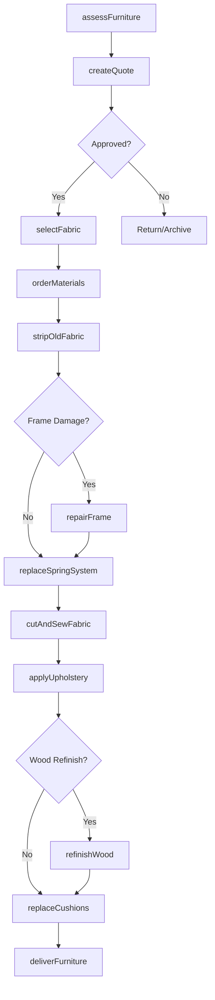
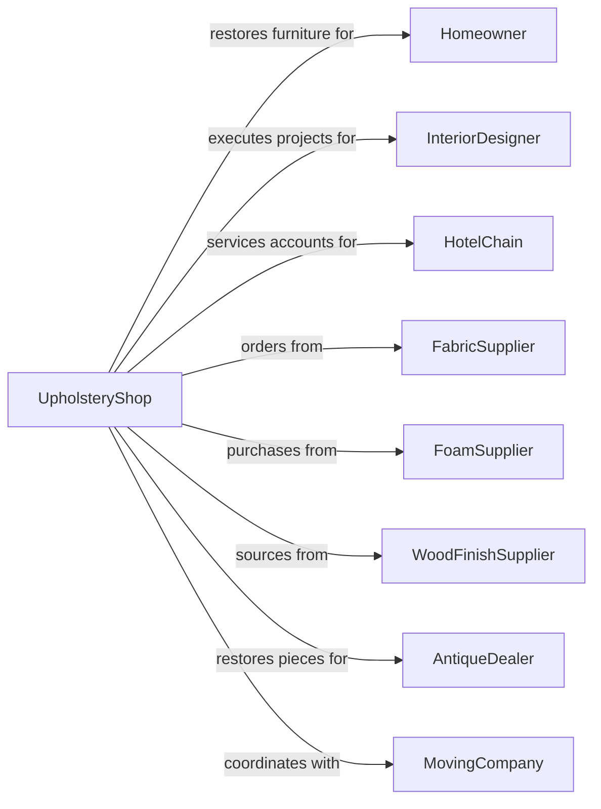

# Reupholstery and Furniture Repair

> Business-as-Code definition for furniture reupholstery and repair operations. Models restoration services for upholstered furniture and wood pieces.

## Overview

Furniture repair and reupholstery establishments restore, refinish, and reupholster residential and commercial furniture. This definition exposes actions for fabric selection, frame repair, cushion replacement, and wood refinishing, with events for project tracking and searches for materials and specifications.

## Actors

| Actor | Description |
|-------|-------------|
| Homeowner | Individual with furniture needing restoration |
| InteriorDesigner | Specifies custom reupholstery for clients |
| HotelChain | Commercial customer with bulk furniture needs |
| FabricSupplier | Provides upholstery fabrics and materials |
| FoamSupplier | Supplies cushion foam and padding |
| WoodFinishSupplier | Provides stains, lacquers, and finishes |
| AntiqueDealer | Sources and sells restored antique pieces |
| MovingCompany | Transports furniture to and from shop |

## Roles

| Role | Description |
|------|-------------|
| ShopOwner | Owns and operates the upholstery business |
| MasterUpholsterer | Performs expert reupholstery work |
| WoodFinisher | Refinishes and repairs wood frames |
| Seamstress | Creates custom cushion covers and trim |
| PickupDriver | Collects and delivers furniture |
| Estimator | Assesses projects and quotes pricing |

## Entities

| Entity | Description |
|--------|-------------|
| Furniture | The piece being restored or reupholstered |
| Sofa | Multi-seat upholstered seating |
| Chair | Single-seat furniture piece |
| Fabric | Upholstery material for covering |
| Foam | Cushion padding material |
| Frame | Structural wood or metal skeleton |
| SpringSystem | Support system for seating |
| Finish | Stain, paint, or lacquer for wood |
| Project | Work order for restoration job |
| Sample | Fabric or finish swatch for approval |

## Actions

| Action | Description |
|--------|-------------|
| assessFurniture | Evaluate condition and restoration needs |
| createQuote | Generate cost estimate for project |
| selectFabric | Choose upholstery material with customer |
| orderMaterials | Source fabric, foam, and supplies |
| stripOldFabric | Remove existing upholstery |
| repairFrame | Fix or reinforce structural components |
| replaceSpringSystem | Install new springs or webbing |
| cutAndSewFabric | Create custom covers and panels |
| applyUpholstery | Attach new fabric to frame |
| refinishWood | Strip, stain, and seal wood surfaces |
| replaceCushions | Install new foam and cushion covers |
| deliverFurniture | Return completed piece to customer |

## Events

| Event | Description |
|-------|-------------|
| furnitureAssessed | Initial evaluation has been completed |
| quoteApproved | Customer has authorized the project |
| fabricSelected | Upholstery material has been chosen |
| materialsOrdered | Supplies have been ordered |
| materialsReceived | Supplies have arrived |
| frameRepaired | Structural work is complete |
| upholsteryApplied | New fabric has been attached |
| woodRefinished | Wood surfaces have been restored |
| projectCompleted | All work has been finished |
| furnitureDelivered | Piece has been returned to customer |

## Searches

| Search | Description |
|--------|-------------|
| findFabricOptions | Search available upholstery materials |
| getFoamDensity | Look up appropriate cushion firmness |
| getProjectHistory | Retrieve customer previous projects |
| findFinishMatch | Match existing wood stain color |
| checkMaterialInventory | Search supplies in stock |
| searchStyleGuide | Find period-appropriate restoration details |

## Workflow



## Actor Relationships



## Usage

### Calling Actions

```typescript
import { repairFurniture } from '@headlessly/repair-furniture'

const shop = repairFurniture()

// Assess furniture for reupholstery
const assessment = await shop.assessFurniture({
  furnitureType: 'sofa',
  style: 'midCenturyModern',
  condition: {
    frame: 'good',
    springs: 'sagging',
    fabric: 'worn',
    cushions: 'compressed'
  },
  customerId: 'cust-123'
})

// Select fabric with customer
const fabricSelection = await shop.selectFabric({
  projectId: assessment.projectId,
  fabricId: 'fab-456',
  colorway: 'navyBlue',
  yardageRequired: 12,
  customerApproved: true
})

// Apply new upholstery
await shop.applyUpholstery({
  projectId: assessment.projectId,
  sections: ['seatBack', 'seatCushions', 'arms', 'skirt'],
  weltingColor: 'contrast',
  tufting: true
})
```

### Event-Driven Automation

```typescript
// Auto-order materials when fabric selected
shop.fabricSelected(async ({ projectId, fabricId, yardage }) => {
  const project = await shop.getProject(projectId)
  await shop.orderMaterials({
    projectId,
    materials: [
      { type: 'fabric', id: fabricId, quantity: yardage },
      { type: 'foam', density: project.foamDensity, quantity: project.cushionCount },
      { type: 'batting', quantity: yardage * 0.5 }
    ]
  })
})

// Schedule delivery when project complete
shop.projectCompleted(async ({ projectId }) => {
  const project = await shop.getProject(projectId)
  await shop.deliverFurniture({
    projectId,
    customerId: project.customerId,
    scheduleWindow: 'nextAvailable'
  })
})
```
