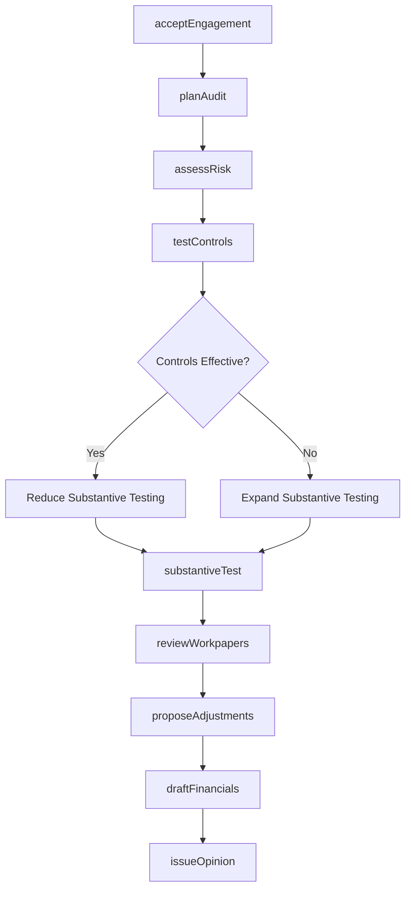
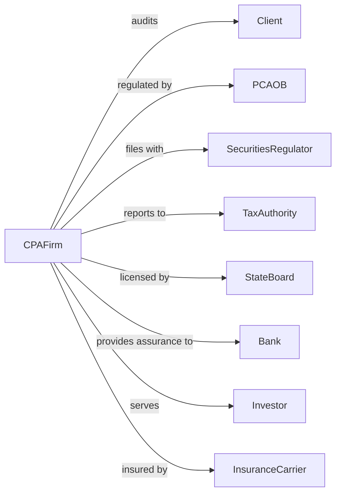

# Offices of Certified Public Accountants

> Business-as-Code definition for CPA firm operations. Models the complete audit, tax, and advisory service lifecycle from engagement through report issuance.

## Overview

CPA firms provide auditing, attestation, tax planning, and advisory services for businesses and individuals. This definition exposes actions for engagement management, audit procedures, financial statement preparation, and regulatory compliance, with events for deadline tracking and quality control workflows.

## Actors

| Actor | Description |
|-------|-------------|
| Client | Business or individual receiving accounting services |
| PCAOB | Public Company Accounting Oversight Board regulating audits |
| SecuritiesRegulator | Securities and Exchange Commission requiring filings |
| TaxAuthority | Internal Revenue Service administering tax law |
| StateBoard | State licensing authority for CPA certification |
| Bank | Financial institution relying on audited statements |
| Investor | Stakeholder using financial information for decisions |
| InsuranceCarrier | Provider of professional liability coverage |

## Roles

| Role | Description |
|------|-------------|
| ManagingPartner | Senior CPA overseeing firm operations and client relationships |
| AuditPartner | Licensed CPA with final responsibility for audit opinion |
| SeniorAuditor | Experienced CPA leading audit fieldwork teams |
| StaffAccountant | Entry-level professional performing audit procedures |
| TaxManager | CPA specializing in tax planning and compliance |
| AdminManager | Oversees billing, scheduling, and firm administration |

## Entities

| Entity | Description |
|--------|-------------|
| Engagement | Contract defining scope, fees, and deliverables |
| WorkPaper | Documentation supporting audit conclusions |
| FinancialStatement | Balance sheet, income statement, and cash flows |
| AuditOpinion | CPA conclusion on fair presentation of financials |
| TaxReturn | Filing reporting income and calculating tax liability |
| Materiality | Threshold for significance in audit testing |
| InternalControl | Client procedures for financial accuracy and compliance |
| AdjustingEntry | Correction to client records proposed by auditor |
| ManagementLetter | Communication of control deficiencies to client |
| EngagementLetter | Written agreement defining professional services |

## Actions

| Action | Description |
|--------|-------------|
| acceptEngagement | Evaluate and agree to provide services to new client |
| planAudit | Develop audit strategy, timeline, and resource allocation |
| assessRisk | Identify areas of material misstatement risk |
| testControls | Evaluate effectiveness of client internal controls |
| substantiveTest | Perform detailed testing of account balances |
| reviewWorkpapers | Quality review of audit documentation |
| proposeAdjustments | Communicate proposed corrections to client |
| draftFinancials | Prepare financial statements in proper format |
| issueOpinion | Release audit report with professional conclusion |
| prepareTaxReturn | Complete tax filings based on financial data |
| provideConsulting | Deliver advisory services on business matters |
| conductPeerReview | External quality review of firm audit practice |

## Events

| Event | Description |
|-------|-------------|
| engagementAccepted | New client engagement agreement signed |
| auditPlanned | Audit strategy and timeline established |
| riskAssessed | Material misstatement risks identified |
| controlsTested | Internal control evaluation completed |
| fieldworkCompleted | Substantive testing finished |
| adjustmentsProposed | Corrections communicated to management |
| financialsDrafted | Statements prepared for review |
| opinionIssued | Audit report released to client |
| taxReturnFiled | Tax filing submitted to authorities |
| deadlineNeared | Filing or delivery date within warning threshold |
| peerReviewCompleted | External quality review finished |
| materialWeaknessFound | Significant control deficiency identified |

## Searches

| Search | Description |
|--------|-------------|
| findEngagements | List client engagements by status, type, or partner |
| getDeadlines | Retrieve upcoming filing and delivery deadlines |
| searchWorkpapers | Find audit documentation by client or procedure |
| getTimeAndBilling | Retrieve hours and fees by engagement |
| findTaxReturns | List tax filings by client, type, or status |
| getAuditFindings | Retrieve adjustments and control issues by engagement |
| checkClientStatus | Verify current engagement status and fees |

## Workflow



## Actor Relationships



## Usage

### Calling Actions

```typescript
import { auditFinances } from '@headlessly/audit-finances'

const cpa = auditFinances()

// Check upcoming filing deadlines
const deadlines = await cpa.getDeadlines({ type: 'audit-report', daysAhead: 30 })

// Find active engagements by status
const engagements = await cpa.findEngagements({ status: 'fieldwork', clientType: 'public' })

// Accept new audit engagement
const engagement = await cpa.acceptEngagement({
  clientName: 'Acme Manufacturing Inc.',
  engagementType: 'financialStatementAudit',
  fiscalYearEnd: '2024-12-31',
  estimatedFees: 85000,
  partner: 'partner-456',
  industry: 'manufacturing'
})

// Plan audit with risk assessment
const plan = await cpa.planAudit({
  engagementId: engagement.id,
  materiality: 50000,
  plannedHours: 400,
  teamMembers: ['senior-123', 'staff-456', 'staff-789'],
  keyAreas: ['revenue', 'inventory', 'accounts-receivable']
})

// Issue audit opinion
await cpa.issueOpinion({
  engagementId: engagement.id,
  opinionType: 'unqualified',
  reportDate: new Date(),
  signedBy: 'partner-456'
})
```

### Event-Driven Automation

```typescript
// Alert when deadline approaching
cpa.deadlineNeared(async ({ engagementId, deadline, daysRemaining }) => {
  if (daysRemaining <= 7) {
    await cpa.notifyTeam({
      engagementId,
      message: `Filing deadline in ${daysRemaining} days`,
      priority: 'high'
    })
  }
})

// Auto-escalate material weakness findings
cpa.materialWeaknessFound(async ({ engagementId, finding, severity }) => {
  await cpa.escalateToPartner({
    engagementId,
    finding,
    requiresManagementLetter: true
  })
})
```
