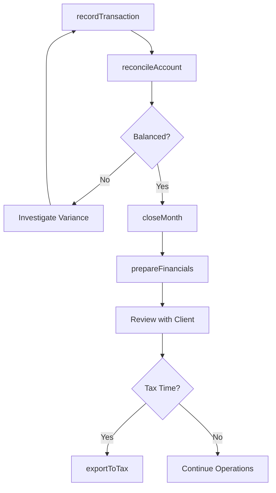
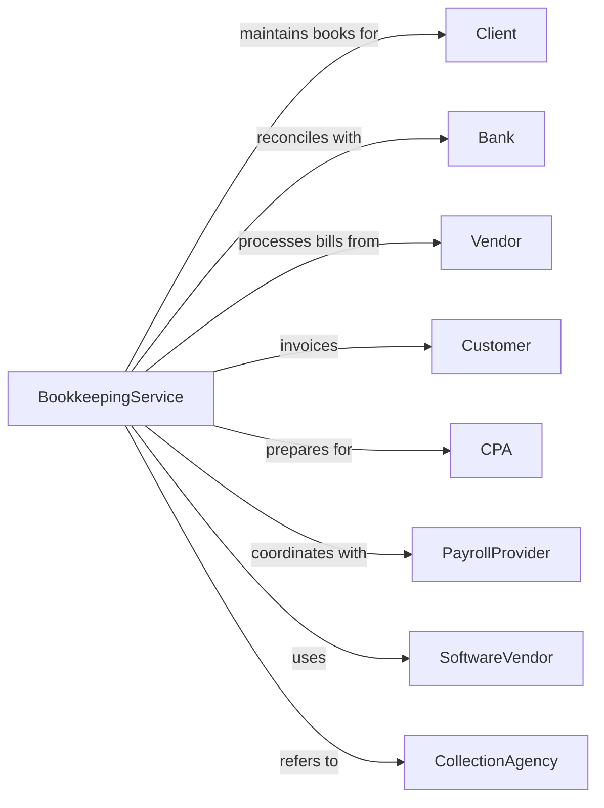

# Other Accounting Services

> Business-as-Code definition for bookkeeping and billing operations. Models the complete financial recordkeeping lifecycle from transaction entry through reporting.

## Overview

Other accounting services provide bookkeeping, billing, and general accounting support for businesses. This definition exposes actions for transaction recording, account reconciliation, financial reporting, and billing services, with events for deadline tracking and financial health monitoring.

## Actors

| Actor | Description |
|-------|-------------|
| Client | Business outsourcing bookkeeping or billing functions |
| Bank | Financial institution providing account statements |
| Vendor | Supplier sending invoices requiring payment |
| Customer | Client's customer with receivable balance |
| CPA | Accountant receiving prepared books for tax or audit |
| PayrollProvider | Service processing client employee wages |
| SoftwareVendor | Provider of accounting software and support |
| CollectionAgency | Service recovering delinquent receivables |

## Roles

| Role | Description |
|------|-------------|
| Bookkeeper | Records transactions and maintains general ledger |
| BillingClerk | Prepares and sends invoices to customers |
| AccountsPayable | Processes vendor invoices and payments |
| AccountsReceivable | Tracks customer payments and collections |
| Controller | Oversees accounting operations and reporting |
| DataEntry | Inputs transactions and source documents |

## Entities

| Entity | Description |
|--------|-------------|
| GeneralLedger | Master record of all financial transactions |
| JournalEntry | Individual transaction recorded in books |
| Invoice | Bill sent to customer for goods or services |
| BankStatement | Monthly record of account activity from bank |
| Reconciliation | Matching of book and bank balances |
| FinancialReport | Income statement, balance sheet, or cash flow |
| ChartOfAccounts | List of accounts used to categorize transactions |
| VendorBill | Invoice received from supplier for payment |
| PaymentRemittance | Record of payment sent to vendor |
| AgingReport | Summary of receivables or payables by age |

## Actions

| Action | Description |
|--------|-------------|
| recordTransaction | Enter journal entry into general ledger |
| reconcileAccount | Match book balance to bank or vendor statement |
| generateInvoice | Create and send customer billing |
| processPayable | Record and schedule vendor payment |
| postPayment | Apply customer payment to open invoice |
| closeMonth | Complete month-end procedures and adjustments |
| prepareFinancials | Generate financial statements from books |
| manageCashFlow | Track and forecast cash position |
| collectReceivable | Follow up on overdue customer balances |
| setupClient | Configure chart of accounts and opening balances |
| exportToTax | Prepare books for CPA tax preparation |
| auditReadiness | Organize records for external audit |

## Events

| Event | Description |
|-------|-------------|
| transactionRecorded | Journal entry posted to general ledger |
| accountReconciled | Book and bank balances matched |
| invoiceGenerated | Customer bill created and sent |
| payableProcessed | Vendor bill recorded for payment |
| paymentReceived | Customer payment applied to account |
| monthClosed | Month-end closing completed |
| financialsPrepared | Financial statements generated |
| receivableOverdue | Customer payment past due date |
| cashFlowAlert | Cash position below threshold |
| deadlineApproaching | Reporting or payment deadline nearing |
| reconciliationVariance | Difference found between book and bank |

## Searches

| Search | Description |
|--------|-------------|
| findTransactions | List journal entries by date, account, or amount |
| getTrialBalance | Retrieve account balances for reporting |
| searchInvoices | Find customer invoices by status or date |
| getAgingReport | Retrieve receivables or payables aging |
| findReconciliations | List bank reconciliations by account or period |
| getCashPosition | Get current bank balances and pending items |
| getFinancials | Retrieve financial statements by period |

## Workflow



## Actor Relationships



## Usage

### Calling Actions

```typescript
import { maintainLedgers } from '@headlessly/maintain-ledgers'

const books = maintainLedgers()

// Record daily transactions
// Pull current trial balance
const trialBalance = await books.getTrialBalance({ clientId: 'client-123', asOfDate: '2024-01-15' })

// Find unreconciled transactions
const unreconciled = await books.findTransactions({ clientId: 'client-123', status: 'unreconciled' })

// Record daily transactions
await books.recordTransaction({
  clientId: 'client-123',
  date: '2024-01-15',
  entries: [
    { account: '1000-cash', debit: 5000 },
    { account: '4000-revenue', credit: 5000 }
  ],
  description: 'Payment received from Customer ABC',
  reference: 'INV-2024-001'
})

// Reconcile bank account
const recon = await books.reconcileAccount({
  clientId: 'client-123',
  accountId: '1000-cash',
  statementDate: '2024-01-31',
  statementBalance: 45678.90,
  outstandingDeposits: [{ date: '2024-01-30', amount: 2500 }],
  outstandingChecks: [{ number: '1234', amount: 1200 }]
})

// Generate monthly financials
const financials = await books.prepareFinancials({
  clientId: 'client-123',
  period: '2024-01',
  statements: ['incomeStatement', 'balanceSheet', 'cashFlow'],
  comparative: true
})
```

### Event-Driven Automation

```typescript
// Alert on overdue receivables
books.receivableOverdue(async ({ clientId, customerId, invoiceId, amount, daysOverdue }) => {
  if (daysOverdue >= 30) {
    await books.sendCollectionReminder({
      clientId,
      customerId,
      invoiceId,
      template: daysOverdue >= 60 ? 'finalNotice' : 'reminder'
    })
  }
})

// Auto-alert on cash flow issues
books.cashFlowAlert(async ({ clientId, currentBalance, projectedShortfall }) => {
  await books.notifyClient({
    clientId,
    message: `Cash balance $${currentBalance}. Projected shortfall: $${projectedShortfall}`,
    priority: 'urgent'
  })
})
```
