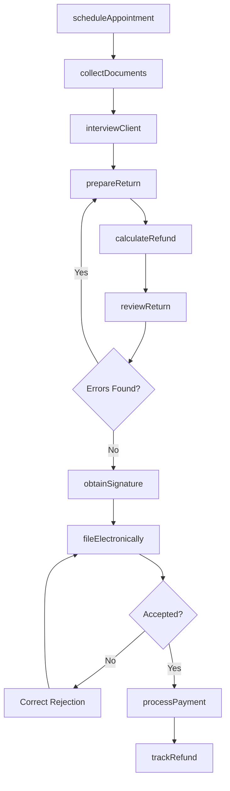
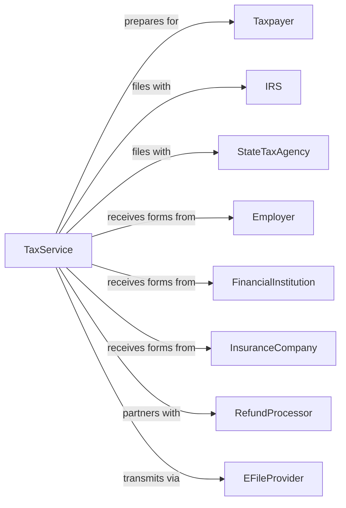

# Tax Preparation Services

> Business-as-Code definition for tax preparation operations. Models the complete client intake through filing and refund lifecycle.

## Overview

Tax preparation services assist individuals and small businesses with completing and filing federal, state, and local tax returns. This definition exposes actions for client intake, document collection, return preparation, and electronic filing, with events for deadline tracking and refund status monitoring.

## Actors

| Actor | Description |
|-------|-------------|
| Taxpayer | Individual or business requiring tax return preparation |
| IRS | Internal Revenue Service processing federal returns |
| StateTaxAgency | State department of revenue processing state returns |
| Employer | Entity providing W-2 and income documentation |
| FinancialInstitution | Bank providing 1099-INT and other income forms |
| InsuranceCompany | Provider of 1095 health coverage documentation |
| RefundProcessor | Service providing refund advances or transfers |
| EFileProvider | Authorized electronic filing transmitter |

## Roles

| Role | Description |
|------|-------------|
| TaxPreparer | Professional completing tax returns for clients |
| OfficeManager | Oversees operations, scheduling, and staff |
| Receptionist | Handles client intake and appointment scheduling |
| QualityReviewer | Reviews returns for accuracy before filing |
| ERO | Electronic Return Originator authorized to e-file |

## Entities

| Entity | Description |
|--------|-------------|
| TaxReturn | Filed document reporting income and calculating tax |
| W2 | Employer wage and tax withholding statement |
| Form1099 | Information return for non-wage income |
| Schedule | Supporting form for specific income or deductions |
| Deduction | Expense reducing taxable income |
| Credit | Direct reduction of tax liability |
| Refund | Overpayment returned to taxpayer |
| Extension | Request for additional time to file return |
| Amendment | Correction to previously filed return |
| Appointment | Scheduled meeting for tax preparation |

## Actions

| Action | Description |
|--------|-------------|
| scheduleAppointment | Book client meeting for tax preparation |
| collectDocuments | Gather W-2s, 1099s, and supporting documentation |
| interviewClient | Review tax situation and identify deductions |
| prepareReturn | Complete federal and state tax returns |
| calculateRefund | Determine tax due or refund amount |
| reviewReturn | Quality check return for accuracy and completeness |
| obtainSignature | Get client approval and signature on return |
| fileElectronically | Transmit return to IRS and state agencies |
| processPayment | Collect preparation fees from client |
| trackRefund | Monitor status of client refund |
| fileExtension | Submit request for additional filing time |
| amendReturn | Correct previously filed return |

## Events

| Event | Description |
|-------|-------------|
| appointmentScheduled | Client meeting booked for preparation |
| documentsCollected | Tax documents received from client |
| clientInterviewed | Tax situation reviewed with client |
| returnPrepared | Tax return completed and ready for review |
| refundCalculated | Tax due or refund amount determined |
| returnReviewed | Quality check completed |
| signatureObtained | Client approved and signed return |
| returnFiled | Tax return transmitted electronically |
| returnAccepted | IRS acknowledged receipt of return |
| returnRejected | Filing error requiring correction |
| refundIssued | Taxpayer received refund |
| deadlineApproaching | Filing deadline within warning threshold |

## Searches

| Search | Description |
|--------|-------------|
| findAppointments | List scheduled appointments by date or preparer |
| getClientReturns | Retrieve tax returns by client and year |
| checkFilingStatus | Verify return acceptance and refund status |
| findPendingReturns | List returns awaiting signature or filing |
| getDeadlines | Retrieve upcoming filing deadlines |
| searchDeductions | Find common deductions by category |
| getYearOverYear | Compare current and prior year return data |

## Workflow



## Actor Relationships



## Usage

### Calling Actions

```typescript
import { prepareTaxReturns } from '@headlessly/prepare-tax-returns'

const tax = prepareTaxReturns()

// Schedule new client appointment
const appointment = await tax.scheduleAppointment({
  clientName: 'John Smith',
  clientPhone: '555-123-4567',
  appointmentDate: '2024-02-15',
  appointmentTime: '10:00',
  returnType: 'individual',
  preparer: 'preparer-123'
})

// Prepare return after document collection
const taxReturn = await tax.prepareReturn({
  clientId: appointment.clientId,
  taxYear: 2023,
  filingStatus: 'marriedFilingJointly',
  income: {
    w2: [{ employer: 'Acme Corp', wages: 75000, fedWithheld: 12000 }],
    form1099Int: [{ payer: 'First Bank', interest: 500 }]
  },
  deductions: { mortgage: 12000, propertyTax: 4000, charitable: 2000 }
})

// File electronically after review
await tax.fileElectronically({
  returnId: taxReturn.id,
  pin: '12345',
  bankAccount: { routing: '123456789', account: '987654321' },
  refundMethod: 'directDeposit'
})
```

### Event-Driven Automation

```typescript
// Alert when filing deadline approaching
tax.deadlineApproaching(async ({ clientId, deadline, daysRemaining }) => {
  if (daysRemaining <= 7) {
    await tax.sendReminder({
      clientId,
      message: `Tax filing deadline in ${daysRemaining} days`,
      offerExtension: daysRemaining <= 3
    })
  }
})

// Auto-notify client when refund issued
tax.refundIssued(async ({ clientId, amount, depositDate }) => {
  await tax.notifyClient({
    clientId,
    message: `Your refund of $${amount} was deposited on ${depositDate}`,
    channel: 'sms'
  })
})
```
