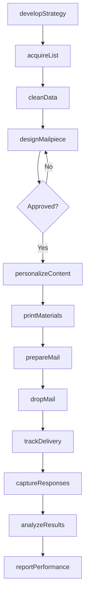
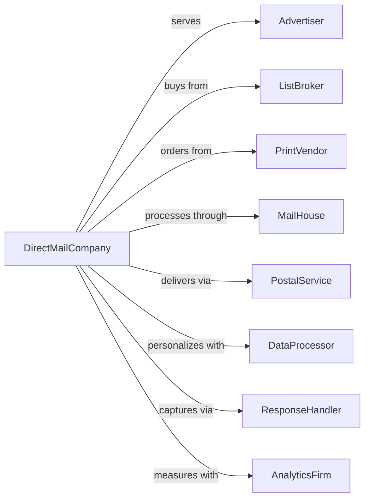

# Direct Mail Advertising

> Business-as-Code definition for direct mail advertising operations. Models campaign design, list management, and mail production services.

## Overview

Direct mail advertising creates and distributes advertising materials through postal mail, including designing campaigns, preparing mailpieces, and managing mailing lists. This definition exposes actions for list acquisition, creative production, and mail delivery, with events for campaign tracking and response measurement.

## Actors

| Actor | Description |
|-------|-------------|
| Advertiser | Brand commissioning direct mail campaigns |
| ListBroker | Provider of mailing list data |
| PrintVendor | Company producing printed materials |
| MailHouse | Facility preparing and sorting mail |
| PostalService | Carrier delivering mailpieces |
| DataProcessor | Service handling personalization and merge |
| ResponseHandler | Service capturing and processing replies |
| AnalyticsFirm | Provider of campaign measurement and attribution |

## Roles

| Role | Description |
|------|-------------|
| AccountDirector | Senior leader managing client relationships |
| CampaignManager | Coordinates campaign planning and execution |
| CreativeDirector | Leads design and copywriting |
| DataAnalyst | Manages list selection and targeting |
| ProductionManager | Oversees printing and mail preparation |
| ResponseAnalyst | Tracks and analyzes campaign results |

## Entities

| Entity | Description |
|--------|-------------|
| Campaign | Direct mail initiative with objectives and schedule |
| MailingList | Database of recipient names and addresses |
| Mailpiece | Designed advertising item for mailing |
| PrintRun | Production batch of mailpieces |
| MailDrop | Scheduled delivery of mail to postal service |
| Response | Reply or action from recipient |
| DataFile | Personalization data for variable printing |
| Postage | Payment for postal delivery services |
| SeedList | Control addresses for delivery verification |
| MatchbackReport | Analysis linking responses to mailed recipients |

## Actions

| Action | Description |
|--------|-------------|
| developStrategy | Create targeting and messaging approach |
| acquireList | Purchase or rent recipient mailing data |
| cleanData | Process and validate mailing addresses |
| designMailpiece | Create artwork and copy for mailpiece |
| personalizeContent | Merge variable data into creative |
| printMaterials | Produce physical mailpieces |
| prepareMail | Sort, label, and bundle for delivery |
| dropMail | Deliver to postal service for distribution |
| trackDelivery | Monitor postal processing and arrival |
| captureResponses | Collect and process recipient replies |
| analyzeResults | Measure campaign performance and ROI |
| reportPerformance | Share metrics and insights with client |

## Events

| Event | Description |
|-------|-------------|
| strategyApproved | Campaign approach accepted by client |
| listAcquired | Mailing data obtained |
| dataCleaned | Addresses validated and processed |
| mailpieceDesigned | Creative completed and approved |
| contentPersonalized | Variable data merged into creative |
| materialsPrinted | Mailpieces produced |
| mailPrepared | Items sorted and bundled |
| mailDropped | Delivered to postal service |
| deliveryTracked | Postal processing monitored |
| responsesCaptured | Recipient replies collected |
| resultsAnalyzed | Performance measured |
| performanceReported | Metrics shared with client |

## Searches

| Search | Description |
|--------|-------------|
| findCampaigns | List projects by client, status, or date |
| getLists | Retrieve mailing data by source or criteria |
| searchMailpieces | Find creative by campaign or format |
| getDropSchedule | Check mail delivery timeline |
| findResponses | List replies by campaign or type |
| getPerformance | Access campaign metrics and ROI |
| getPostageRates | Check current postal pricing |

## Workflow



## Actor Relationships



## Usage

### Calling Actions

```typescript
import { advertiseMail } from '@headlessly/advertise-mail'

const directMail = advertiseMail()

// Browse available mailing lists
const lists = await directMail.getLists({ demographic: 'homeowners', region: 'northeast', minSize: 50000 })

// Review active direct mail campaigns
const campaigns = await directMail.findCampaigns({ status: 'in-production', clientId: 'client-abc' })

// Develop campaign strategy
const strategy = await directMail.developStrategy({
  clientId: 'client-123',
  campaignName: 'Q4 Acquisition Campaign',
  objective: 'new-customer-acquisition',
  targetAudience: 'homeowners-45-65-income-100k+',
  offer: 'limited-time-discount',
  expectedResponseRate: 0.02
})

// Acquire and clean mailing list
const list = await directMail.acquireList({
  campaignId: strategy.campaignId,
  sources: ['compiled-homeowner', 'modeled-propensity'],
  criteria: {
    geography: ['northeast', 'midwest'],
    homeValue: { min: 300000 },
    creditScore: { min: 680 }
  },
  quantity: 250000,
  suppressAgainst: ['house-file', 'do-not-mail']
})

// Print and drop mail
await directMail.dropMail({
  campaignId: strategy.campaignId,
  mailpieceId: 'design-final',
  listId: list.id,
  dropDate: '2024-10-15',
  postageClass: 'marketing-mail',
  sortLevel: 'carrier-route'
})
```

### Event-Driven Automation

```typescript
// Capture and match responses
directMail.mailDropped(async ({ campaignId, dropDate, quantity }) => {
  await directMail.scheduleResponseCapture({
    campaignId,
    startDate: addDays(dropDate, 5),
    duration: 45, // days
    channels: ['reply-card', 'phone', 'web-landing-page']
  })
})

// Generate performance reports
directMail.responsesCaptured(async ({ campaignId, responses }) => {
  if (responses.total > 100) {
    await directMail.generateMatchbackReport({
      campaignId,
      responses,
      calculateCostPerAcquisition: true,
      segmentByList: true
    })
  }
})
```
