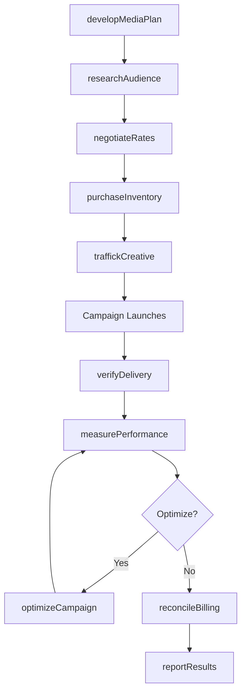
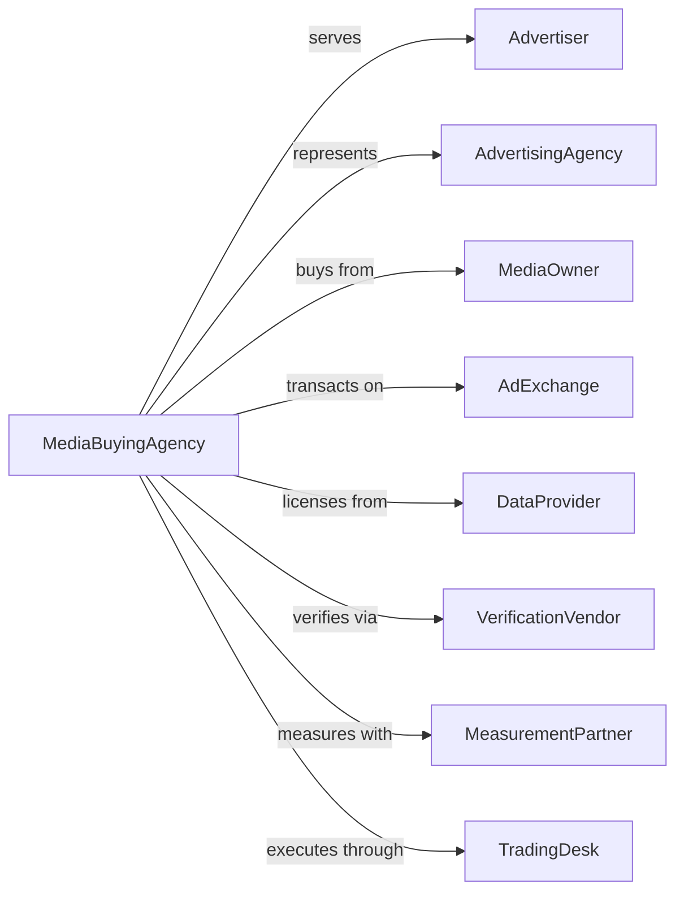

# Media Buying Agencies

> Business-as-Code definition for media buying agency operations. Models media planning, purchasing, and optimization services.

## Overview

Media buying agencies purchase advertising time and space from media outlets for resale to advertisers or their agencies. This definition exposes actions for media planning, rate negotiation, and campaign optimization, with events for inventory tracking and performance reporting.

## Actors

| Actor | Description |
|-------|-------------|
| Advertiser | Brand or company purchasing media placements |
| AdvertisingAgency | Creative agency placing media on client behalf |
| MediaOwner | Publisher or broadcaster selling inventory |
| AdExchange | Marketplace for programmatic buying |
| DataProvider | Source of audience targeting information |
| VerificationVendor | Service confirming ad delivery and viewability |
| MeasurementPartner | Provider of audience ratings and metrics |
| TradingDesk | Technology platform for programmatic execution |

## Roles

| Role | Description |
|------|-------------|
| MediaDirector | Senior leader overseeing buying strategy |
| MediaPlanner | Develops channel strategy and allocation |
| MediaBuyer | Negotiates and executes media purchases |
| ProgrammaticTrader | Manages automated bidding and optimization |
| AnalyticsManager | Analyzes campaign performance and ROI |
| AccountManager | Maintains client relationships and communication |

## Entities

| Entity | Description |
|--------|-------------|
| MediaPlan | Strategy document with channel allocation |
| Insertion | Scheduled advertisement placement |
| Inventory | Available advertising time or space |
| Rate | Pricing for media placement |
| Audience | Target demographic for campaign |
| Impression | Single ad exposure to viewer |
| Campaign | Advertising initiative across media |
| Verification | Confirmation of ad delivery |
| Attribution | Measurement of conversion credit |
| Invoice | Billing for media purchased |

## Actions

| Action | Description |
|--------|-------------|
| developMediaPlan | Create channel strategy and budget allocation |
| researchAudience | Analyze target demographics and behavior |
| negotiateRates | Secure favorable pricing from media owners |
| purchaseInventory | Buy advertising time or space |
| traffickCreative | Deliver ad assets to media placements |
| optimizeCampaign | Adjust buys based on performance data |
| verifyDelivery | Confirm ads ran as scheduled |
| measurePerformance | Track reach, frequency, and conversions |
| reconcileBilling | Verify charges match contracted rates |
| reportResults | Share campaign metrics with clients |
| forecastInventory | Project availability and pricing |
| manageProgrammatic | Execute automated bidding strategies |

## Events

| Event | Description |
|-------|-------------|
| mediaPlanApproved | Strategy accepted by client |
| ratesNegotiated | Pricing finalized with media owners |
| inventoryPurchased | Ad time or space secured |
| creativeTrafficked | Assets delivered to placements |
| campaignLaunched | Ads began running |
| deliveryVerified | Placement confirmed by verification |
| performanceMeasured | Metrics collected and analyzed |
| campaignOptimized | Adjustments made based on data |
| billingReconciled | Invoices verified against contracts |
| resultsReported | Campaign metrics shared with client |
| inventoryForecasted | Availability projections completed |
| budgetExhausted | Campaign spend limit reached |

## Searches

| Search | Description |
|--------|-------------|
| findCampaigns | List campaigns by client, status, or date |
| getInventory | Check available media by outlet or format |
| searchRates | Find pricing by media type or audience |
| getPerformance | Retrieve campaign metrics and KPIs |
| findInsertions | List placements by campaign or outlet |
| getBillingStatus | Check invoice and payment status |
| getAudienceData | Access targeting and demographic information |

## Workflow



## Actor Relationships



## Usage

### Calling Actions

```typescript
import { advertiseMedia } from '@headlessly/advertise-media'

const mediaBuying = advertiseMedia()

// Check available media inventory
const inventory = await mediaBuying.getInventory({ medium: 'digital', market: 'new-york', dateRange: ['2024-Q3'] })

// Find active campaigns for budget tracking
const campaigns = await mediaBuying.findCampaigns({ clientId: 'client-123', status: 'running' })

// Develop media plan
const plan = await mediaBuying.developMediaPlan({
  clientId: 'client-123',
  campaignName: 'Q4 Brand Campaign',
  budget: 5000000,
  objectives: ['reach', 'frequency', 'brand-lift'],
  channels: ['linear-tv', 'connected-tv', 'digital-video', 'audio'],
  targetAudience: 'adults-25-54-hhi-75k+',
  flightDates: { start: '2024-10-01', end: '2024-12-31' }
})

// Negotiate rates with media owners
const rates = await mediaBuying.negotiateRates({
  mediaPlanId: plan.id,
  mediaOwners: plan.recommendedOutlets,
  targetCPM: 15.00,
  volumeCommitment: plan.totalImpressions,
  addedValue: ['bonus-spots', 'sponsorship-mentions']
})

// Purchase inventory
await mediaBuying.purchaseInventory({
  mediaPlanId: plan.id,
  insertions: rates.confirmedPlacements,
  paymentTerms: 'net-60',
  cancellationPolicy: '14-days-notice'
})
```

### Event-Driven Automation

```typescript
// Optimize underperforming placements
mediaBuying.performanceMeasured(async ({ campaignId, metrics }) => {
  const underperformers = metrics.placements.filter(
    p => p.viewabilityRate < 0.60 || p.completionRate < 0.70
  )

  if (underperformers.length > 0) {
    await mediaBuying.optimizeCampaign({
      campaignId,
      actions: underperformers.map(p => ({
        insertionId: p.id,
        action: 'reallocate',
        reason: p.viewabilityRate < 0.60 ? 'low-viewability' : 'low-completion'
      }))
    })
  }
})

// Alert on budget pacing
mediaBuying.deliveryVerified(async ({ campaignId, pacing }) => {
  if (pacing.percentSpent > pacing.percentTime * 1.15) {
    await mediaBuying.alertOverpacing({
      campaignId,
      currentPace: pacing.percentSpent / pacing.percentTime,
      recommendedAction: 'reduce-daily-cap'
    })
  }
})
```
