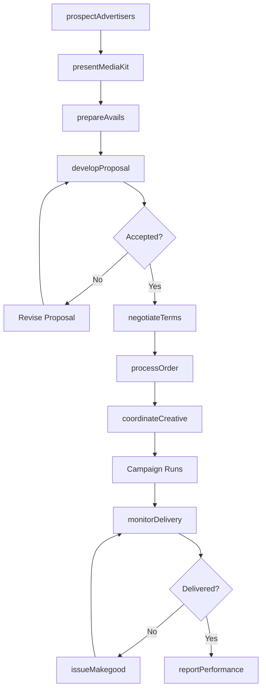
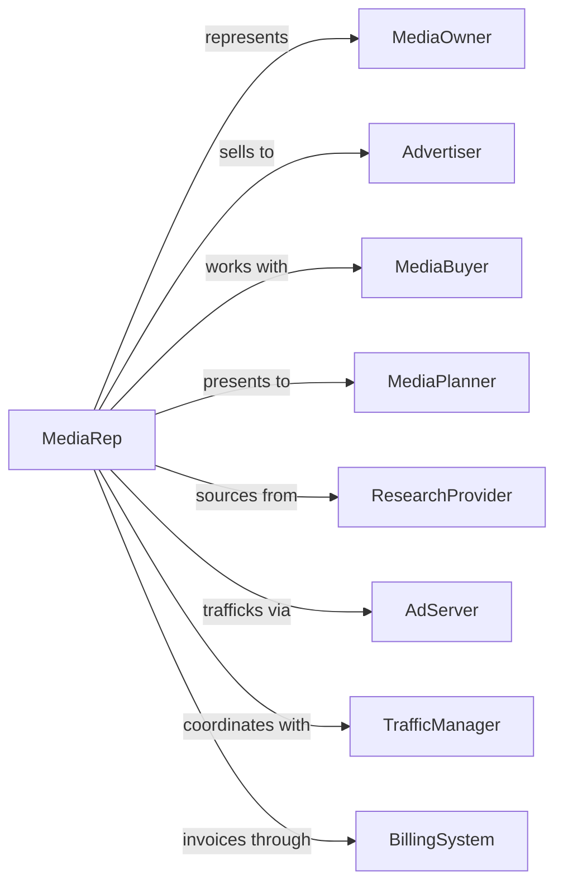

# Media Representatives

> Business-as-Code definition for media representative operations. Models the selling of advertising time and space on behalf of media owners.

## Overview

Media representatives sell advertising inventory on behalf of publishers, broadcasters, and digital media owners to advertisers and agencies. This definition exposes actions for inventory management, sales outreach, and revenue optimization, with events for deal tracking and performance reporting.

## Actors

| Actor | Description |
|-------|-------------|
| MediaOwner | Publisher or broadcaster represented by the firm |
| Advertiser | Brand purchasing advertising inventory |
| MediaBuyer | Agency professional placing media buys |
| MediaPlanner | Agency strategist selecting media channels |
| ResearchProvider | Source of audience and market data |
| AdServer | Technology delivering and tracking ads |
| TrafficManager | Coordinates creative delivery and scheduling |
| BillingSystem | Platform processing invoices and payments |

## Roles

| Role | Description |
|------|-------------|
| SalesDirector | Senior leader overseeing revenue generation |
| AccountExecutive | Sells inventory to advertisers and agencies |
| PlannerLiaison | Works with media planners on proposals |
| InventoryManager | Manages available advertising slots |
| ResearchAnalyst | Provides audience data and competitive insights |
| ClientServicesRep | Supports post-sale execution and optimization |

## Entities

| Entity | Description |
|--------|-------------|
| Inventory | Available advertising time or space |
| Proposal | Custom package offered to advertiser |
| InsertionOrder | Confirmed advertising purchase agreement |
| Rate | Pricing for advertising placement |
| Audience | Viewership or readership demographic data |
| Avails | Report of available inventory |
| Campaign | Advertiser initiative running on represented media |
| Makegoood | Compensation for underdelivered impressions |
| Commission | Revenue share earned on sales |
| MediaKit | Marketing materials describing outlet value |

## Actions

| Action | Description |
|--------|-------------|
| prospectAdvertisers | Identify potential buyers for inventory |
| presentMediaKit | Share outlet value proposition with buyers |
| prepareAvails | Generate report of available inventory |
| developProposal | Create custom advertising package |
| negotiateTerms | Finalize pricing and placement details |
| processOrder | Convert proposal to confirmed insertion |
| coordinateCreative | Ensure ad materials meet specifications |
| monitorDelivery | Track campaign performance against guarantee |
| issueMakegood | Provide compensation for underdelivery |
| reportPerformance | Share campaign results with advertiser |
| forecastRevenue | Project sales pipeline and bookings |
| reconcileCommission | Calculate and verify earned compensation |

## Events

| Event | Description |
|-------|-------------|
| advertiserProspected | Potential buyer identified and contacted |
| mediaKitPresented | Outlet value shared with buyer |
| availsPrepared | Inventory report generated |
| proposalDeveloped | Custom package created |
| termsNegotiated | Pricing and placement finalized |
| orderProcessed | Insertion confirmed and scheduled |
| creativeReceived | Ad materials delivered and approved |
| deliveryMonitored | Performance tracked against guarantee |
| makegoodIssued | Underdelivery compensation provided |
| performanceReported | Campaign results shared |
| revenueForecasted | Sales projections completed |
| commissionReconciled | Earnings calculated and verified |

## Searches

| Search | Description |
|--------|-------------|
| findAdvertisers | List accounts by spend, category, or status |
| getInventory | Check available slots by outlet or date |
| searchProposals | Find packages by advertiser or value |
| getInsertionOrders | Retrieve confirmed placements |
| findCampaigns | List active advertising by advertiser |
| getPerformance | Access delivery and engagement metrics |
| getRevenuePipeline | View forecasted and booked sales |

## Workflow



## Actor Relationships



## Usage

### Calling Actions

```typescript
import { advertiseAds } from '@headlessly/advertise-ads'

const mediaRep = advertiseAds()

// Check available ad inventory for the quarter
const inventory = await mediaRep.getInventory({ medium: 'broadcast-tv', quarter: 'Q4-2024', market: 'chicago' })

// Find active advertisers on represented properties
const advertisers = await mediaRep.findAdvertisers({ status: 'active', medium: 'broadcast-tv' })

// Prepare avails report
const avails = await mediaRep.prepareAvails({
  mediaOwnerId: 'outlet-123',
  dateRange: { start: '2024-Q4', end: '2024-Q4' },
  dayparts: ['primetime', 'late-night', 'daytime'],
  formats: ['30-second', '15-second', 'sponsored-segment'],
  excludeCommitted: true
})

// Develop custom proposal
const proposal = await mediaRep.developProposal({
  advertiserId: 'adv-456',
  avails: avails.id,
  targetCPM: 18.50,
  totalBudget: 750000,
  placements: [
    { daypart: 'primetime', weight: 0.60 },
    { daypart: 'late-night', weight: 0.25 },
    { daypart: 'daytime', weight: 0.15 }
  ],
  addedValue: ['category-exclusivity', 'host-mentions']
})

// Process confirmed order
await mediaRep.processOrder({
  proposalId: proposal.id,
  advertiserId: 'adv-456',
  flightDates: { start: '2024-10-01', end: '2024-12-15' },
  paymentTerms: 'net-30',
  guaranteedDelivery: proposal.totalImpressions
})
```

### Event-Driven Automation

```typescript
// Alert on underdelivery
mediaRep.deliveryMonitored(async ({ campaignId, delivery }) => {
  const pacingRatio = delivery.delivered / delivery.guaranteed
  const timeRatio = delivery.elapsedDays / delivery.totalDays

  if (pacingRatio < timeRatio * 0.85) {
    await mediaRep.flagUnderdelivery({
      campaignId,
      currentPacing: pacingRatio,
      requiredPacing: timeRatio,
      recommendMakegood: true
    })
  }
})

// Notify on large order
mediaRep.orderProcessed(async ({ orderId, advertiser, totalValue }) => {
  if (totalValue > 500000) {
    await mediaRep.notifySalesLeadership({
      orderId,
      advertiser,
      value: totalValue,
      celebrateWin: true
    })
  }
})
```
