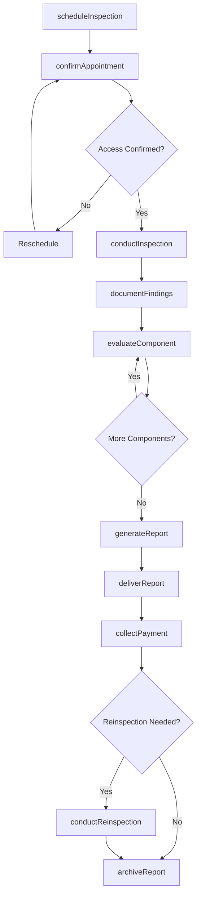
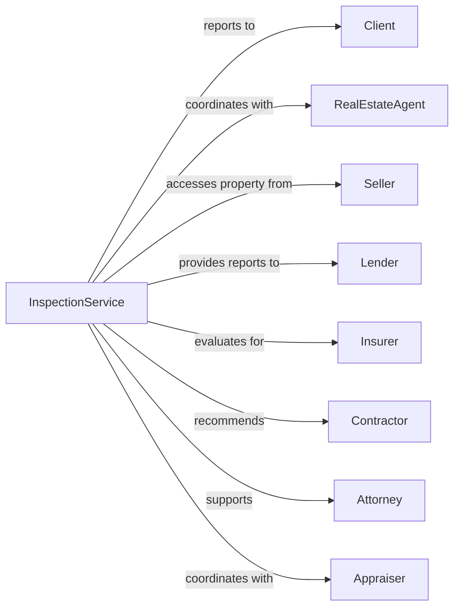

# Building Inspection Services

> Business-as-Code definition for building inspection operations. Models the complete property evaluation lifecycle from scheduling through report delivery.

## Overview

Building inspection services evaluate the physical condition of residential and commercial properties for real estate transactions, insurance, and maintenance purposes. This definition exposes actions for inspection scheduling, on-site evaluation, defect documentation, and report generation, with events for appointment coordination and follow-up tracking.

## Actors

| Actor | Description |
|-------|-------------|
| Client | Buyer, seller, or owner requesting inspection services |
| RealEstateAgent | Agent representing buyer or seller in transaction |
| Seller | Property owner providing access for inspection |
| Lender | Financial institution requiring inspection for mortgage |
| Insurer | Insurance company requiring property condition assessment |
| Contractor | Builder or tradesperson for repair recommendations |
| Attorney | Legal counsel for transaction or dispute |
| Appraiser | Professional determining property value |

## Roles

| Role | Description |
|------|-------------|
| HomeInspector | Licensed professional conducting property evaluations |
| OfficeManager | Oversees scheduling, billing, and administration |
| ReportWriter | Staff preparing inspection documentation |
| FieldTechnician | Assistant supporting on-site inspections |
| Scheduler | Handles appointment booking and coordination |

## Entities

| Entity | Description |
|--------|-------------|
| Inspection | Scheduled property evaluation appointment |
| Property | Real estate being inspected with address and details |
| Report | Written documentation of inspection findings |
| Defect | Identified issue with building component or system |
| Photo | Image documenting property condition |
| Component | Building system or element being evaluated |
| Rating | Condition assessment for inspected component |
| Recommendation | Suggested action for identified defect |
| Invoice | Bill for inspection services rendered |
| Agreement | Pre-inspection contract with scope and limitations |

## Actions

| Action | Description |
|--------|-------------|
| scheduleInspection | Book appointment with access and attendance details |
| confirmAppointment | Verify access, utilities, and attendance |
| conductInspection | Perform on-site evaluation of property systems |
| documentFindings | Record defects with photos and notes |
| evaluateComponent | Assess condition of specific building system |
| generateReport | Compile findings into formal inspection report |
| deliverReport | Send completed report to client |
| answerQuestions | Respond to client inquiries about findings |
| recommendContractor | Suggest qualified professionals for repairs |
| conductReinspection | Verify repairs completed for previous defects |
| archiveReport | Store inspection documentation for records |
| collectPayment | Process payment for inspection services |

## Events

| Event | Description |
|-------|-------------|
| inspectionScheduled | Appointment booked with property access confirmed |
| appointmentConfirmed | Attendance and access verified before inspection |
| inspectionStarted | On-site evaluation commenced |
| defectIdentified | Issue found requiring documentation |
| componentEvaluated | Building system assessment completed |
| inspectionCompleted | On-site evaluation finished |
| reportGenerated | Inspection documentation compiled |
| reportDelivered | Findings sent to client |
| questionsReceived | Client inquiry about inspection findings |
| reinspectionScheduled | Follow-up visit booked for repair verification |
| paymentReceived | Payment collected for services |
| appointmentCanceled | Scheduled inspection canceled |

## Searches

| Search | Description |
|--------|-------------|
| findInspections | List inspections by date, status, or inspector |
| getPropertyHistory | Retrieve previous inspections for address |
| searchDefects | Find defects by type, severity, or component |
| getUpcomingSchedule | List scheduled inspections for date range |
| findReports | Retrieve reports by client, address, or date |
| getComponentRatings | List condition assessments by component type |
| checkAvailability | Find open appointment slots by inspector |

## Workflow



## Actor Relationships



## Usage

### Calling Actions

```typescript
import { inspectBuildings } from '@headlessly/inspect-buildings'

const inspection = inspectBuildings()

// Check property inspection history
const history = await inspection.getPropertyHistory({ address: '456 Elm Street', type: 'residential' })

// Find scheduled inspections for this week
const scheduled = await inspection.findInspections({ status: 'scheduled', week: 'current' })

// Schedule new home inspection
const appt = await inspection.scheduleInspection({
  propertyAddress: '123 Oak Street, Denver, CO 80202',
  propertyType: 'singleFamily',
  squareFootage: 2400,
  yearBuilt: 1985,
  clientName: 'John Smith',
  clientEmail: 'john@example.com',
  date: '2024-03-15',
  time: '09:00',
  accessMethod: 'lockbox'
})

// Document findings during inspection
await inspection.documentFindings({
  inspectionId: appt.id,
  component: 'roofing',
  finding: 'Missing shingles on north slope',
  severity: 'moderate',
  photos: ['roof-001.jpg', 'roof-002.jpg'],
  recommendation: 'Repair by licensed roofer within 6 months'
})

// Generate and deliver report
const report = await inspection.generateReport({
  inspectionId: appt.id,
  format: 'pdf',
  includePhotos: true,
  summaryLevel: 'detailed'
})
```

### Event-Driven Automation

```typescript
// Auto-send confirmation reminder
inspection.inspectionScheduled(async ({ inspectionId, date, clientEmail }) => {
  await inspection.sendReminder({
    inspectionId,
    clientEmail,
    reminderDate: subtractDays(date, 1),
    template: 'appointmentReminder'
  })
})

// Auto-deliver report when generated
inspection.reportGenerated(async ({ inspectionId, reportUrl, clientEmail }) => {
  await inspection.deliverReport({
    inspectionId,
    recipientEmail: clientEmail,
    reportUrl,
    includeInvoice: true
  })
})
```
