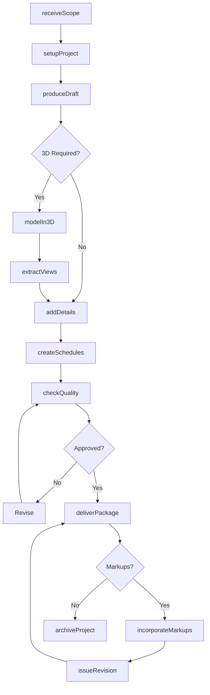
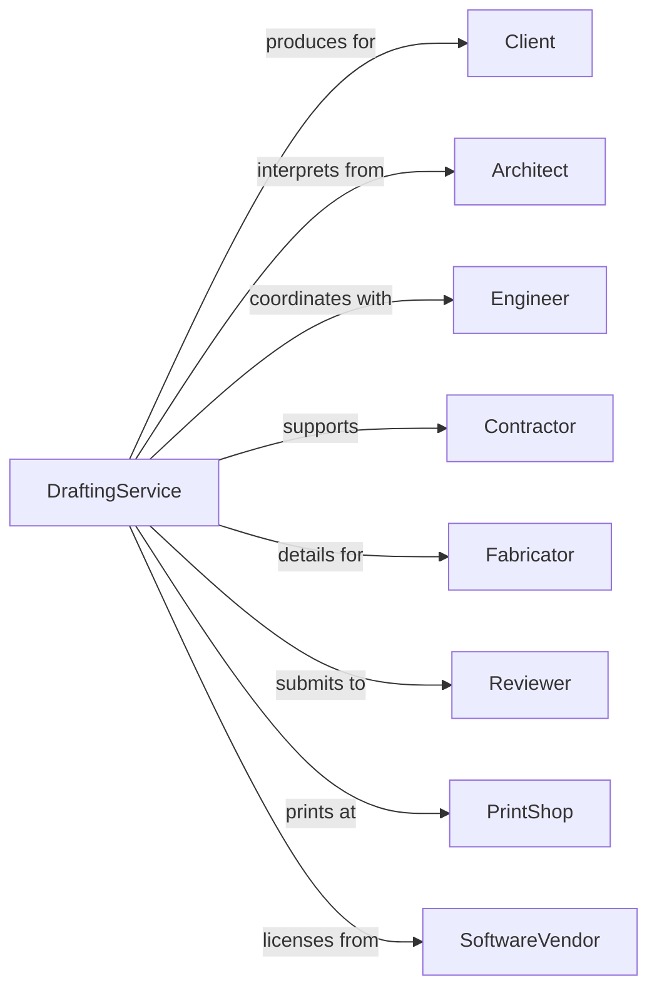

# Drafting Services

> Business-as-Code definition for technical drafting operations. Models the complete drawing production lifecycle from specifications through delivery.

## Overview

Drafting services produce detailed technical drawings, plans, and illustrations from engineering and architectural specifications. This definition exposes actions for CAD production, 3D modeling, drawing coordination, and revision management, with events for project tracking and quality control.

## Actors

| Actor | Description |
|-------|-------------|
| Client | Architect, engineer, or manufacturer commissioning drawings |
| Architect | Design professional providing sketches and direction |
| Engineer | Technical professional providing calculations and specs |
| Contractor | Builder using drawings for construction |
| Fabricator | Manufacturer using drawings for production |
| Reviewer | Professional checking drawings for accuracy |
| PrintShop | Service producing physical copies of drawings |
| SoftwareVendor | Provider of CAD and BIM software tools |

## Roles

| Role | Description |
|------|-------------|
| DraftingManager | Oversees production staff and project assignments |
| SeniorDrafter | Experienced technician handling complex drawings |
| CADTechnician | Staff producing 2D technical drawings |
| BIMModeler | Specialist creating 3D building information models |
| Detailer | Technician producing fabrication and shop drawings |
| QualityChecker | Staff reviewing drawings for accuracy and standards |

## Entities

| Entity | Description |
|--------|-------------|
| Project | Drafting engagement with scope and deliverables |
| Drawing | Technical illustration with dimensions and notes |
| Model | 3D digital representation of design |
| Sheet | Individual page in drawing set |
| Detail | Enlarged view showing construction specifics |
| Schedule | Tabular listing of components or specifications |
| Revision | Updated version of drawing with tracked changes |
| Standard | Template or block library for consistent production |
| Markup | Redline or annotation requiring drawing update |
| Submittal | Drawing package delivered to client |

## Actions

| Action | Description |
|--------|-------------|
| receiveScope | Accept project requirements and specifications |
| setupProject | Create file structure, templates, and standards |
| produceDraft | Create initial drawing from sketches or specs |
| modelIn3D | Build three-dimensional digital model |
| extractViews | Generate 2D drawings from 3D model |
| addDetails | Create enlarged views and sections |
| createSchedules | Produce tabular component listings |
| checkQuality | Review drawing for accuracy and compliance |
| incorporateMarkups | Update drawings based on redline comments |
| issueRevision | Release updated drawing with revision tracking |
| deliverPackage | Submit completed drawing set to client |
| archiveProject | Store final drawings and project files |

## Events

| Event | Description |
|-------|-------------|
| scopeReceived | Project requirements and specs received |
| projectSetUp | File structure and templates established |
| draftProduced | Initial drawing created |
| modelCompleted | 3D model built and verified |
| viewsExtracted | 2D drawings generated from model |
| detailsAdded | Enlarged views and sections created |
| qualityChecked | Drawing reviewed and approved |
| markupsReceived | Client comments requiring updates |
| markupsIncorporated | Drawings updated per comments |
| revisionIssued | Updated drawing released with tracking |
| packageDelivered | Completed drawings submitted to client |
| projectArchived | Final files stored for retention |

## Searches

| Search | Description |
|--------|-------------|
| findProjects | List projects by status, client, or discipline |
| getDrawings | Retrieve drawings by project, type, or status |
| searchSheets | Find sheets by number, title, or revision |
| getRevisionHistory | Track changes across drawing versions |
| findMarkups | List pending markups requiring incorporation |
| getModelElements | Query 3D model for component data |
| checkStandards | Verify drawing compliance with standards |

## Workflow



## Actor Relationships



## Usage

### Calling Actions

```typescript
import { designPlans } from '@headlessly/design-plans'

const drafting = designPlans()

// Find active projects needing drafting work
const activeProjects = await drafting.findProjects({ status: 'in-progress', discipline: 'mechanical' })

// Check quality review status on recent deliverables
const quality = await drafting.checkQuality({ projectId: 'project-100', status: 'pending-review' })

// Setup new drafting project
const project = await drafting.setupProject({
  clientId: 'arch-firm-123',
  projectName: 'Office Building CD Set',
  discipline: 'architectural',
  sheetSize: 'ARCH-D',
  standards: 'NCS-6.0',
  deliveryFormat: ['dwg', 'pdf']
})

// Produce floor plan drawings
await drafting.produceDraft({
  projectId: project.id,
  sheetType: 'floorPlan',
  source: 'sketch-001.pdf',
  scale: '1/8" = 1\'-0"',
  sheets: ['A101', 'A102', 'A103']
})

// Create 3D model for coordination
const model = await drafting.modelIn3D({
  projectId: project.id,
  software: 'Revit',
  elements: ['walls', 'doors', 'windows', 'ceilings'],
  lod: 300
})
```

### Event-Driven Automation

```typescript
// Auto-notify when markups received
drafting.markupsReceived(async ({ projectId, sheetNumbers, source }) => {
  await drafting.assignMarkups({
    projectId,
    sheetNumbers,
    drafter: getAssignedDrafter(projectId),
    dueDate: addBusinessDays(new Date(), 2)
  })
})

// Auto-archive after final delivery
drafting.packageDelivered(async ({ projectId, deliveryId, isFinal }) => {
  if (isFinal) {
    await drafting.archiveProject({
      projectId,
      retentionYears: 7,
      format: 'dwg-and-pdf'
    })
  }
})
```
