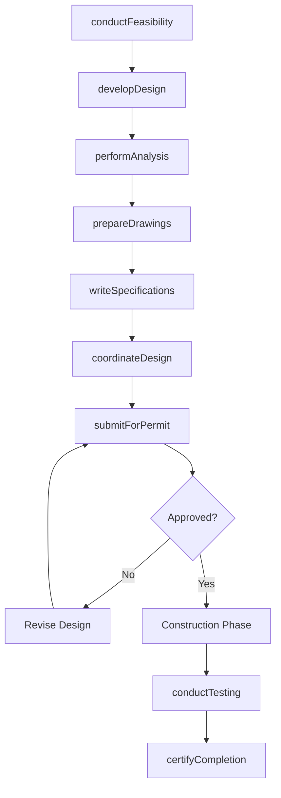
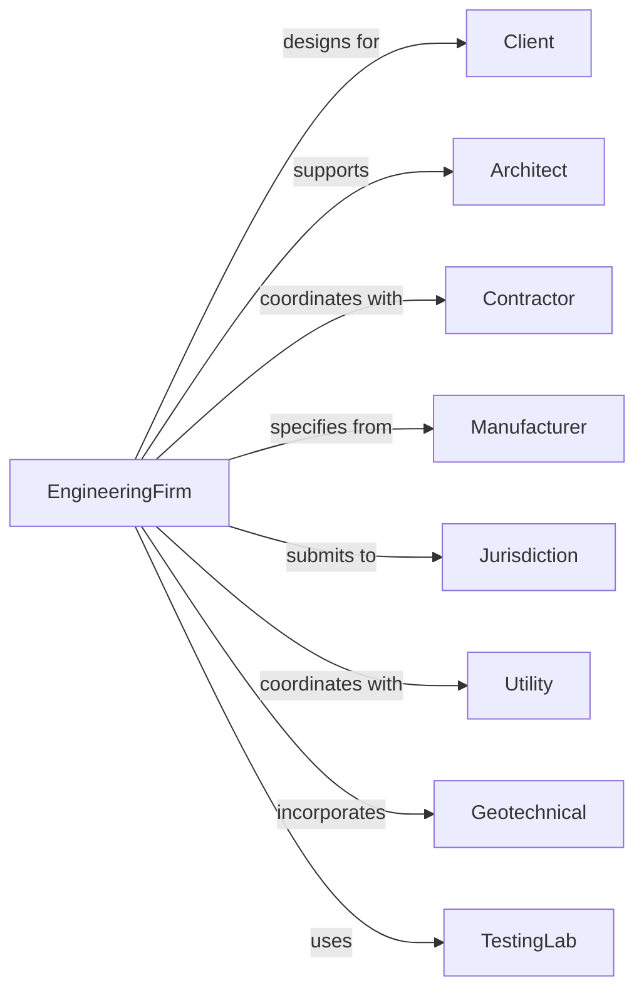

# Engineering Services

> Business-as-Code definition for engineering consulting operations. Models the complete project lifecycle from feasibility through construction support.

## Overview

Engineering services firms apply physical laws and engineering principles to design machines, structures, systems, and processes. This definition exposes actions for feasibility studies, design development, technical specifications, and construction support across civil, structural, mechanical, electrical, and other engineering disciplines.

## Actors

| Actor | Description |
|-------|-------------|
| Client | Entity commissioning engineering design services |
| Architect | Building designer requiring engineering support |
| Contractor | Builder constructing engineered systems |
| Manufacturer | Equipment and component supplier |
| Jurisdiction | Regulatory authority reviewing and approving designs |
| Utility | Provider of electrical, gas, water, or telecommunications |
| Geotechnical | Specialist providing soil and foundation analysis |
| TestingLab | Facility performing material and system testing |

## Roles

| Role | Description |
|------|-------------|
| PrincipalEngineer | Licensed PE leading technical work and client relationships |
| ProjectEngineer | Licensed professional managing project delivery |
| DesignEngineer | Staff engineer developing technical solutions |
| Drafter | Technical staff producing engineering drawings |
| Analyst | Engineer performing calculations and simulations |
| FieldEngineer | Staff providing construction observation and support |

## Entities

| Entity | Description |
|--------|-------------|
| Project | Engineering engagement with scope and deliverables |
| FeasibilityStudy | Analysis of project viability and alternatives |
| Calculation | Mathematical analysis supporting design decisions |
| Drawing | Technical illustration of engineered systems |
| Specification | Written requirements for materials and workmanship |
| Report | Technical documentation of analysis or findings |
| Submittal | Contractor documentation for engineer review |
| RFI | Request for information during construction |
| ChangeOrder | Modification to engineered design scope |
| Permit | Regulatory approval for engineered work |

## Actions

| Action | Description |
|--------|-------------|
| conductFeasibility | Analyze project viability and develop alternatives |
| developDesign | Create engineering solutions meeting requirements |
| performAnalysis | Execute calculations, simulations, and modeling |
| prepareDrawings | Produce technical drawings showing engineered systems |
| writeSpecifications | Document material and performance requirements |
| coordinateDesign | Integrate with other design disciplines |
| submitForPermit | File engineered designs for regulatory approval |
| reviewSubmittals | Evaluate contractor materials and shop drawings |
| respondToRFI | Answer contractor questions during construction |
| observeConstruction | Monitor installation for compliance with design |
| conductTesting | Oversee commissioning and performance testing |
| certifyCompletion | Provide professional certification of work |

## Events

| Event | Description |
|-------|-------------|
| feasibilityCompleted | Project viability analysis finished |
| designDeveloped | Engineering solution created and documented |
| analysisCompleted | Calculations and modeling finished |
| drawingsCompleted | Technical drawings ready for review |
| specificationsWritten | Material requirements documented |
| permitSubmitted | Designs filed with jurisdiction |
| permitApproved | Regulatory approval received |
| submittalReceived | Contractor documentation received for review |
| rfiReceived | Contractor question requiring response |
| constructionObserved | Site visit completed with findings |
| testingCompleted | Commissioning and performance verification done |
| certificationIssued | Professional stamp applied to documents |

## Searches

| Search | Description |
|--------|-------------|
| findProjects | List projects by status, discipline, or client |
| getCalculations | Retrieve analysis files by project or system |
| searchDrawings | Find drawings by project, discipline, or revision |
| getSubmittals | List submittals by status or specification section |
| findRFIs | Retrieve RFIs by project or response status |
| getFieldReports | List construction observation reports |
| checkPermitStatus | Verify regulatory review status |

## Workflow



## Actor Relationships



## Usage

### Calling Actions

```typescript
import { designSystems } from '@headlessly/design-systems'

const eng = designSystems()

// Find open submittals needing review
const submittals = await eng.getSubmittals({ status: 'pending-review', discipline: 'structural' })

// Search drawings for latest revisions
const drawings = await eng.searchDrawings({ projectId: 'project-789', discipline: 'structural', latestOnly: true })

// Conduct structural feasibility study
const feasibility = await eng.conductFeasibility({
  projectId: 'project-789',
  discipline: 'structural',
  scope: 'seismic retrofit of existing building',
  alternatives: ['steel-braces', 'concrete-shearwalls', 'base-isolation'],
  criteria: ['cost', 'disruption', 'performance']
})

// Develop structural design
const design = await eng.developDesign({
  projectId: 'project-789',
  selectedAlternative: 'steel-braces',
  designCriteria: {
    seismicCategory: 'D',
    riskCategory: 'III',
    windSpeed: 110
  },
  buildingCodes: ['IBC-2021', 'ASCE7-22']
})

// Perform structural analysis
await eng.performAnalysis({
  projectId: 'project-789',
  analysisType: 'linear-dynamic',
  software: 'ETABS',
  loadCombinations: ['gravity', 'seismic-x', 'seismic-y', 'wind'],
  outputResults: ['memberForces', 'drifts', 'baseShear']
})
```

### Event-Driven Automation

```typescript
// Auto-assign RFI when received
eng.rfiReceived(async ({ projectId, rfiNumber, discipline, question }) => {
  await eng.assignRFI({
    projectId,
    rfiNumber,
    assignee: getEngineerByDiscipline(discipline),
    dueDate: addBusinessDays(new Date(), 3),
    priority: assessUrgency(question)
  })
})

// Notify when permit approved
eng.permitApproved(async ({ projectId, permitNumber, discipline }) => {
  await eng.notifyTeam({
    projectId,
    message: `${discipline} permit ${permitNumber} approved`,
    updateStatus: 'construction-ready'
  })
})
```
