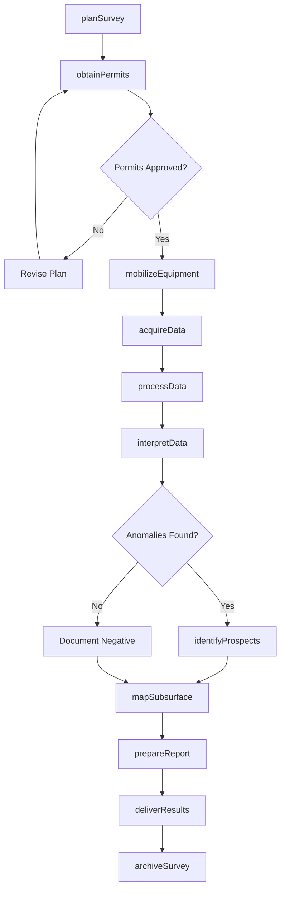
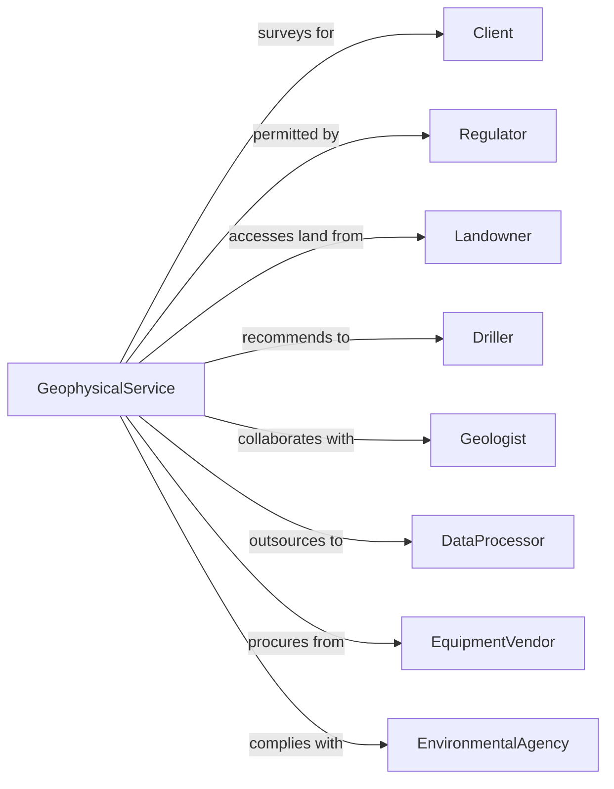

# Geophysical Surveying and Mapping Services

> Business-as-Code definition for geophysical survey operations. Models the complete subsurface exploration lifecycle from planning through data interpretation.

## Overview

Geophysical surveying services gather, interpret, and map subsurface data using magnetic, gravity, seismic, and electrical methods. This definition exposes actions for survey planning, field data acquisition, processing, and interpretation, with events for project tracking and resource discovery reporting.

## Actors

| Actor | Description |
|-------|-------------|
| Client | Oil company, mining firm, or engineering company commissioning surveys |
| Regulator | Government agency overseeing exploration permits |
| Landowner | Property owner providing access for surveys |
| Driller | Contractor performing confirmation drilling |
| Geologist | Specialist interpreting geological context |
| DataProcessor | Service performing advanced data processing |
| EquipmentVendor | Supplier of geophysical instruments |
| EnvironmentalAgency | Authority overseeing environmental compliance |

## Roles

| Role | Description |
|------|-------------|
| ProjectGeophysicist | Licensed professional leading survey design and interpretation |
| FieldSupervisor | Oversees on-site data acquisition operations |
| SurveyTechnician | Operates geophysical instruments in field |
| DataAnalyst | Processes and interprets geophysical data |
| PartyChief | Manages field crew and equipment logistics |
| SafetyOfficer | Ensures field operations comply with safety protocols |

## Entities

| Entity | Description |
|--------|-------------|
| Survey | Geophysical data acquisition project with defined area |
| SurveyLine | Individual traverse for data collection |
| SeismicData | Recorded acoustic wave measurements |
| GravityData | Measurements of gravitational field variations |
| MagneticData | Recordings of magnetic field anomalies |
| Interpretation | Analysis and conclusions from processed data |
| Map | Visual representation of subsurface features |
| Prospect | Identified target for potential resources |
| Permit | Authorization for survey activities |
| Report | Technical documentation of survey findings |

## Actions

| Action | Description |
|--------|-------------|
| planSurvey | Design survey parameters, lines, and methodology |
| obtainPermits | Secure access and regulatory approvals |
| mobilizeEquipment | Deploy instruments and crew to survey area |
| acquireData | Collect geophysical measurements in field |
| processData | Apply corrections and enhance raw data |
| interpretData | Analyze processed data to identify features |
| mapSubsurface | Create visual representations of findings |
| identifyProspects | Locate potential resource targets |
| prepareReport | Document methodology, data, and conclusions |
| deliverResults | Submit findings to client |
| recommendDrilling | Advise on confirmation drilling locations |
| archiveSurvey | Store data and documentation for future reference |

## Events

| Event | Description |
|-------|-------------|
| surveyPlanned | Survey design completed and approved |
| permitsObtained | Access and regulatory approvals secured |
| equipmentMobilized | Instruments and crew deployed to field |
| dataAcquired | Field measurements collected |
| dataProcessed | Raw data enhanced and corrected |
| dataInterpreted | Analysis completed with conclusions |
| subsurfaceMapped | Visual representations created |
| prospectIdentified | Potential resource target located |
| reportPrepared | Technical documentation completed |
| resultsDelivered | Findings submitted to client |
| anomalyDetected | Significant subsurface feature discovered |
| surveyCompleted | All field and office work finished |

## Searches

| Search | Description |
|--------|-------------|
| findSurveys | List surveys by status, location, or client |
| getSurveyLines | Retrieve line data for specific survey |
| searchAnomalies | Find detected subsurface features |
| getProspects | List identified resource targets |
| findDatasets | Retrieve raw or processed data by survey |
| getMaps | List generated maps by survey or type |
| checkPermitStatus | Verify access and regulatory approvals |

## Workflow



## Actor Relationships



## Usage

### Calling Actions

```typescript
import { designTerrain } from '@headlessly/design-terrain'

const geo = designTerrain()

// Plan seismic survey
const survey = await geo.planSurvey({
  clientId: 'oil-company-123',
  projectName: 'Basin Exploration Phase 1',
  surveyType: 'seismic-2D',
  location: { lat: 35.5, lon: -105.2, area: 500 },
  methodology: 'vibroseis',
  lineSpacing: 1000,
  targetDepth: 5000
})

// Acquire field data
await geo.acquireData({
  surveyId: survey.id,
  lines: ['L001', 'L002', 'L003'],
  sourceType: 'vibroseis',
  receiverSpacing: 25,
  shotSpacing: 50,
  recordLength: 6
})

// Interpret processed data
const interpretation = await geo.interpretData({
  surveyId: survey.id,
  processedData: 'processed-001',
  horizons: ['top-reservoir', 'base-seal'],
  faults: true,
  attributes: ['amplitude', 'frequency']
})
```

### Event-Driven Automation

```typescript
// Alert when anomaly detected
geo.anomalyDetected(async ({ surveyId, anomalyType, location, magnitude }) => {
  await geo.notifyClient({
    surveyId,
    message: `${anomalyType} anomaly detected at ${location}`,
    priority: magnitude > threshold ? 'high' : 'normal'
  })
})

// Auto-archive on survey completion
geo.surveyCompleted(async ({ surveyId, dataVolume }) => {
  await geo.archiveSurvey({
    surveyId,
    retentionYears: 10,
    format: 'SEG-Y',
    backup: 'offsite'
  })
})
```
