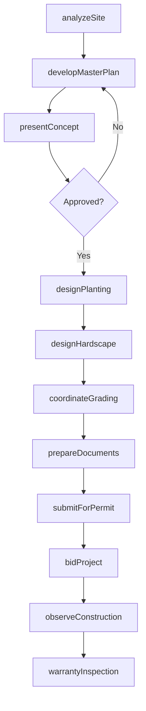
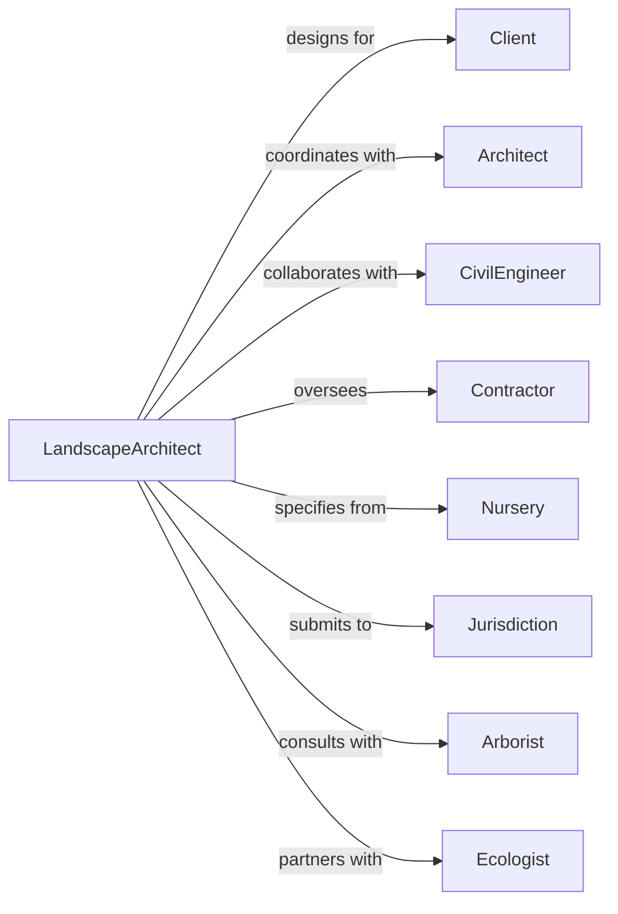

# Landscape Architectural Services

> Business-as-Code definition for landscape architecture operations. Models the complete site design lifecycle from analysis through construction observation.

## Overview

Landscape architectural services plan and design outdoor spaces including parks, campuses, residential developments, and commercial sites. This definition exposes actions for site analysis, master planning, hardscape and planting design, and construction documentation, with events for project tracking and environmental compliance.

## Actors

| Actor | Description |
|-------|-------------|
| Client | Property owner or developer commissioning landscape design |
| Architect | Building architect coordinating site with structures |
| CivilEngineer | Engineer designing grading, drainage, and utilities |
| Contractor | Landscape contractor installing designed improvements |
| Nursery | Plant supplier providing specified plant material |
| Jurisdiction | Planning and building department reviewing designs |
| Arborist | Tree specialist consulting on preservation and care |
| Ecologist | Environmental specialist for habitat and sustainability |

## Roles

| Role | Description |
|------|-------------|
| PrincipalLandscapeArchitect | Licensed LA leading design and client relationships |
| ProjectManager | Coordinator handling project scope, schedule, and budget |
| Designer | Staff developing design concepts and planting plans |
| Drafter | Technical staff producing construction documents |
| Horticulturist | Plant specialist selecting and specifying plant material |
| FieldObserver | Staff monitoring construction quality and compliance |

## Entities

| Entity | Description |
|--------|-------------|
| Project | Landscape design engagement with scope and deliverables |
| SiteAnalysis | Documentation of existing conditions and constraints |
| MasterPlan | Overall vision and phasing for site development |
| PlantingPlan | Drawing showing plant locations, species, and sizes |
| HardscapePlan | Drawing showing paving, walls, and structures |
| GradingPlan | Drawing showing earthwork and drainage design |
| IrrigationPlan | Drawing showing irrigation system layout |
| PlantSchedule | List of plants with species, size, and quantities |
| Specification | Written requirements for materials and installation |
| Permit | Approval from jurisdiction for site work |

## Actions

| Action | Description |
|--------|-------------|
| analyzeSite | Document existing conditions, topography, and vegetation |
| developMasterPlan | Create overall site design vision and phasing |
| presentConcept | Review design options with client for direction |
| designPlanting | Select and locate plant material for project |
| designHardscape | Layout paving, walls, water features, and structures |
| coordinateGrading | Work with civil engineer on site grading and drainage |
| prepareDocuments | Produce construction drawings and specifications |
| submitForPermit | File plans with jurisdiction for approval |
| bidProject | Issue documents for contractor pricing |
| observeConstruction | Monitor installation for quality and compliance |
| inspectPlanting | Verify plant material meets specifications |
| warrantyInspection | Review landscape establishment after warranty period |

## Events

| Event | Description |
|-------|-------------|
| siteAnalyzed | Existing conditions documented and mapped |
| masterPlanApproved | Overall design vision accepted by client |
| conceptApproved | Design direction confirmed for development |
| plantingDesigned | Plant selections and locations completed |
| hardscapeDesigned | Paving and structure layouts finalized |
| documentsCompleted | Construction drawings and specs finished |
| permitApproved | Jurisdiction approved site work plans |
| contractAwarded | Landscape contractor selected |
| constructionStarted | Site work commenced |
| plantingInstalled | Plant material installed per plans |
| substantialCompletion | Landscape ready for use |
| warrantyExpired | Maintenance period concluded |

## Searches

| Search | Description |
|--------|-------------|
| findProjects | List projects by status, client, or project type |
| getProjectSchedule | Retrieve milestones and deadlines |
| searchPlantPalette | Find plants by characteristics or growing conditions |
| getPlantSchedule | List plant material quantities and sizes |
| findDrawings | Retrieve drawings by project, type, or revision |
| getFieldReports | List construction observation reports |
| checkPermitStatus | Verify permit review status |

## Workflow



## Actor Relationships



## Usage

### Calling Actions

```typescript
import { designLandscapes } from '@headlessly/design-landscapes'

const la = designLandscapes()

// Find active projects nearing milestone deadlines
const upcoming = await la.getProjectSchedule({ milestoneDue: 'next-30-days' })

// Review similar completed projects
const references = await la.findProjects({ projectType: 'urban-park', status: 'completed' })

// Analyze site conditions
const analysis = await la.analyzeSite({
  projectId: 'project-456',
  siteAddress: '500 Park Avenue, Portland, OR',
  surveyData: 'survey-2024-001',
  existingTrees: await la.inventoryTrees({ siteId: 'site-456' }),
  soilReport: 'geotech-2024-001',
  climateZone: '8b'
})

// Develop master plan
const masterPlan = await la.developMasterPlan({
  projectId: 'project-456',
  siteAnalysis: analysis.id,
  programElements: ['plaza', 'garden', 'playground', 'stormwater'],
  sustainabilityGoals: ['native-plants', 'water-conservation', 'habitat']
})

// Design planting plan
await la.designPlanting({
  projectId: 'project-456',
  zones: [
    { name: 'entry-garden', style: 'formal', plants: ['ornamental-trees', 'perennials'] },
    { name: 'native-meadow', style: 'naturalistic', plants: ['native-grasses', 'wildflowers'] }
  ],
  irrigationType: 'drip'
})
```

### Event-Driven Automation

```typescript
// Alert when planting installed for inspection
la.plantingInstalled(async ({ projectId, contractor, area }) => {
  await la.scheduleInspection({
    projectId,
    type: 'plantingVerification',
    area,
    inspector: getFieldObserver(projectId)
  })
})

// Schedule warranty inspection
la.substantialCompletion(async ({ projectId, completionDate }) => {
  await la.scheduleInspection({
    projectId,
    type: 'warrantyInspection',
    date: addMonths(completionDate, 12),
    notify: ['client', 'contractor']
  })
})
```
