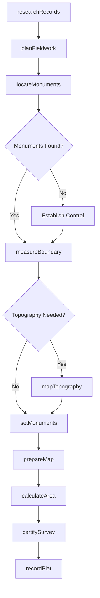
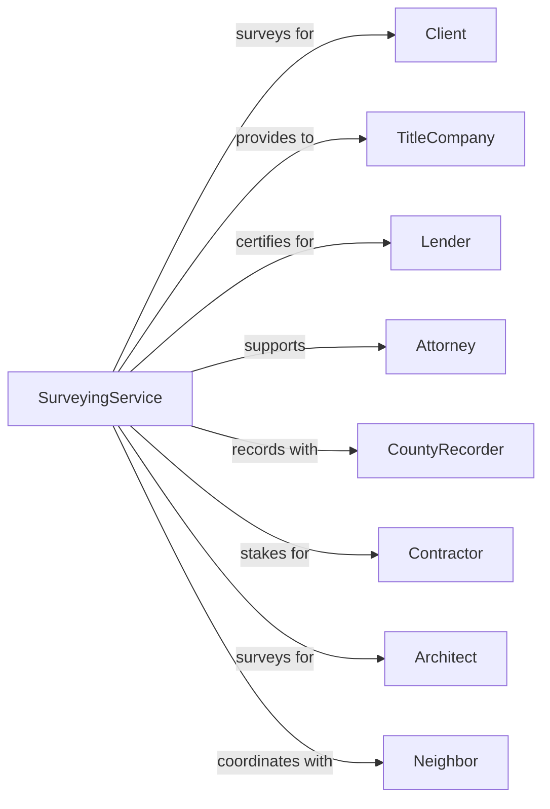

# Surveying and Mapping (except Geophysical) Services

> Business-as-Code definition for land surveying operations. Models the complete survey lifecycle from research through map delivery.

## Overview

Surveying services perform surface measurements to establish property boundaries, map topography, and support construction projects. This definition exposes actions for research, field surveys, boundary determination, and map preparation, with events for project tracking and regulatory compliance.

## Actors

| Actor | Description |
|-------|-------------|
| Client | Property owner, developer, or government agency commissioning survey |
| TitleCompany | Firm requiring survey for real estate transaction |
| Lender | Financial institution requiring survey for mortgage |
| Attorney | Legal counsel for boundary disputes or transactions |
| CountyRecorder | Government office recording survey documents |
| Contractor | Builder requiring construction staking |
| Architect | Designer requiring topographic information |
| Neighbor | Adjacent property owner affected by boundaries |

## Roles

| Role | Description |
|------|-------------|
| ProfessionalSurveyor | Licensed PLS responsible for survey certification |
| FieldCrew | Technicians performing on-site measurements |
| DraftingTechnician | Staff preparing survey maps and plats |
| ResearchSpecialist | Personnel researching deed and record information |
| PartyChief | Lead field technician managing survey crew |
| ProjectManager | Coordinator handling schedules and client communications |

## Entities

| Entity | Description |
|--------|-------------|
| Survey | Property measurement engagement with scope and deliverables |
| Plat | Recorded map showing property boundaries and dimensions |
| BoundaryLine | Legal line separating adjacent properties |
| Monument | Physical marker establishing survey point |
| Deed | Legal document describing property boundaries |
| TopographicMap | Map showing ground elevations and features |
| LegalDescription | Written description of property boundaries |
| Easement | Right of way or access across property |
| Encroachment | Improvement extending beyond property line |
| ALTA | Detailed survey meeting American Land Title Association standards |

## Actions

| Action | Description |
|--------|-------------|
| researchRecords | Review deeds, plats, and prior surveys |
| planFieldwork | Design survey approach and control network |
| locateMonuments | Find and verify existing survey markers |
| measureBoundary | Establish property lines with precision instruments |
| mapTopography | Survey ground elevations and surface features |
| setMonuments | Install permanent markers at boundary corners |
| prepareMap | Draft survey plat or map from field data |
| calculateArea | Compute property acreage and dimensions |
| writeLegalDescription | Prepare written boundary description |
| certifySurvey | Sign and seal survey as licensed professional |
| recordPlat | File survey map with county recorder |
| stakeConstruction | Mark building and improvement locations |

## Events

| Event | Description |
|-------|-------------|
| recordsResearched | Deed and prior survey review completed |
| fieldworkPlanned | Survey approach and schedule established |
| monumentsLocated | Existing markers found and verified |
| boundaryMeasured | Property lines established with measurements |
| topographyMapped | Ground elevations and features surveyed |
| monumentsSet | New boundary markers installed |
| mapPrepared | Survey plat drafted and checked |
| areaCalculated | Property dimensions and acreage computed |
| surveyCertified | Licensed surveyor signed and sealed survey |
| platRecorded | Survey map filed with county |
| encroachmentFound | Improvement discovered across boundary |
| stakingCompleted | Construction marks placed in field |

## Searches

| Search | Description |
|--------|-------------|
| findSurveys | List surveys by status, client, or location |
| getPropertyHistory | Retrieve prior surveys for parcel |
| searchDeeds | Find recorded deeds for property |
| getMonuments | List survey markers for area |
| findEncroachments | Identify improvements crossing boundaries |
| getTopographyData | Retrieve elevation data for property |
| checkRecordingStatus | Verify plat recording with county |

## Workflow



## Actor Relationships



## Usage

### Calling Actions

```typescript
import { surveyLand } from '@headlessly/survey-land'

const survey = surveyLand()

// Check property history and prior survey records
const history = await survey.getPropertyHistory({ parcel: 'lot-42-block-7', county: 'king' })

// Find active survey projects
const projects = await survey.findSurveys({ status: 'in-progress', type: 'boundary' })

// Research property records
const research = await survey.researchRecords({
  parcelId: '123-456-789',
  county: 'Denver',
  state: 'CO',
  searchItems: ['deeds', 'plats', 'easements', 'priorSurveys'],
  yearsBack: 50
})

// Conduct boundary survey
const boundary = await survey.measureBoundary({
  projectId: 'project-123',
  parcelId: '123-456-789',
  surveyType: 'ALTA',
  accuracy: 'Class-A',
  locateImprovements: true,
  identifyEncroachments: true
})

// Prepare and certify survey
await survey.certifySurvey({
  projectId: 'project-123',
  surveyType: 'boundaryPlat',
  surveyor: 'pls-12345',
  sealDate: new Date(),
  sheetCount: 2
})
```

### Event-Driven Automation

```typescript
// Alert when encroachment found
survey.encroachmentFound(async ({ projectId, encroachmentType, location, severity }) => {
  await survey.notifyClient({
    projectId,
    message: `Encroachment detected: ${encroachmentType} at ${location}`,
    requiresAttorneyReview: severity === 'significant'
  })
})

// Auto-record after certification
survey.surveyCertified(async ({ projectId, platFile, county }) => {
  await survey.recordPlat({
    projectId,
    platFile,
    county,
    recordingFee: calculateFee(county),
    notifyOnRecording: true
  })
})
```
