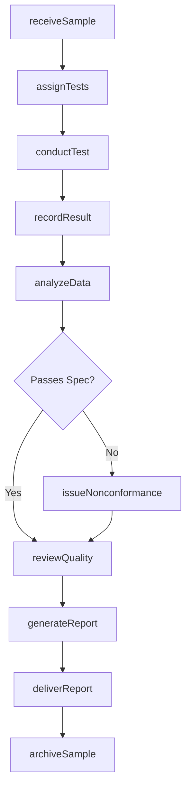
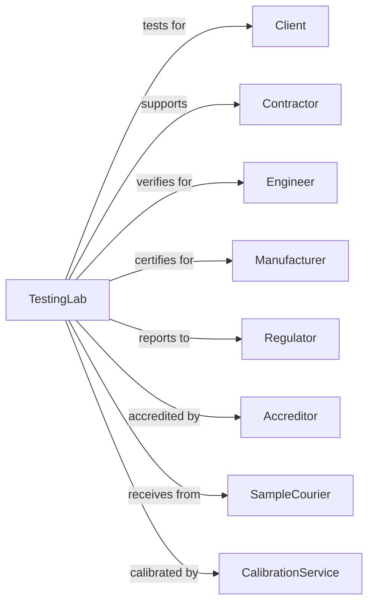

# Testing Laboratories and Services

> Business-as-Code definition for testing laboratory operations. Models the complete testing lifecycle from sample receipt through report delivery.

## Overview

Testing laboratories perform physical, chemical, and analytical testing of materials, products, and systems. This definition exposes actions for sample management, test execution, data analysis, and report generation, with events for quality control and compliance tracking.

## Actors

| Actor | Description |
|-------|-------------|
| Client | Manufacturer, contractor, or engineer commissioning tests |
| Contractor | Builder requiring material testing for construction |
| Engineer | Design professional requiring verification testing |
| Manufacturer | Producer requiring product certification testing |
| Regulator | Agency requiring compliance testing |
| Accreditor | Body certifying laboratory qualifications |
| SampleCourier | Service transporting samples to laboratory |
| CalibrationService | Provider maintaining instrument accuracy |

## Roles

| Role | Description |
|------|-------------|
| LabDirector | Licensed professional overseeing laboratory operations |
| Technician | Staff performing test procedures |
| QualityManager | Ensures testing meets quality standards |
| SampleCoordinator | Manages sample receipt and chain of custody |
| DataAnalyst | Reviews and interprets test results |
| ReportWriter | Prepares formal test documentation |

## Entities

| Entity | Description |
|--------|-------------|
| Sample | Material specimen submitted for testing |
| TestOrder | Request specifying tests to be performed |
| TestMethod | Standardized procedure for conducting test |
| Result | Measured value or observation from test |
| Report | Formal documentation of test findings |
| Specification | Acceptance criteria for test results |
| Instrument | Equipment used to perform measurements |
| Calibration | Verification of instrument accuracy |
| ChainOfCustody | Documentation tracking sample handling |
| Certificate | Formal attestation of test results |

## Actions

| Action | Description |
|--------|-------------|
| receiveSample | Accept and log sample with chain of custody |
| assignTests | Schedule sample for required test procedures |
| conductTest | Execute test method and record measurements |
| recordResult | Document test measurements and observations |
| analyzeData | Review results against specifications |
| reviewQuality | Verify test procedures and data accuracy |
| generateReport | Compile findings into formal report |
| deliverReport | Send completed report to client |
| archiveSample | Store sample per retention requirements |
| calibrateInstrument | Verify and adjust equipment accuracy |
| conductProficiency | Perform inter-laboratory comparison testing |
| issueNonconformance | Document when sample fails specifications |

## Events

| Event | Description |
|-------|-------------|
| sampleReceived | Sample logged and entered into system |
| testsAssigned | Sample scheduled for testing |
| testConducted | Test procedure executed |
| resultRecorded | Measurements documented |
| dataAnalyzed | Results reviewed against specifications |
| qualityReviewed | Procedures and data verified |
| reportGenerated | Formal documentation completed |
| reportDelivered | Findings sent to client |
| sampleArchived | Sample stored for retention |
| nonconformanceIssued | Sample failed specification limits |
| calibrationDue | Instrument requires accuracy verification |
| rushRequested | Expedited testing requested |

## Searches

| Search | Description |
|--------|-------------|
| findSamples | List samples by status, client, or date |
| getTestResults | Retrieve results by sample or test type |
| searchReports | Find reports by client, project, or date |
| getCalibrationStatus | List instruments by calibration due date |
| findNonconformances | Retrieve failed test results |
| getLabSchedule | List pending tests by date or technician |
| checkTurnaround | Calculate average test completion time |

## Workflow



## Actor Relationships



## Usage

### Calling Actions

```typescript
import { designMaterials } from '@headlessly/design-materials'

const lab = designMaterials()

// Receive concrete sample
const sample = await lab.receiveSample({
  clientId: 'contractor-123',
  projectName: 'Downtown Tower',
  materialType: 'concrete',
  sampleId: 'CYL-2024-001',
  collectionDate: '2024-03-15',
  collectedBy: 'Field Tech A',
  specifications: { minStrength: 4000, cureTime: 28 }
})

// Conduct compression test
const result = await lab.conductTest({
  sampleId: sample.id,
  testMethod: 'ASTM-C39',
  testType: 'compressiveStrength',
  ageAtTest: 28,
  technician: 'tech-456'
})

// Generate and deliver report
await lab.generateReport({
  sampleId: sample.id,
  format: 'pdf',
  includePhotos: true,
  certifiedBy: 'director-789'
})
```

### Event-Driven Automation

```typescript
// Alert on nonconformance
lab.nonconformanceIssued(async ({ sampleId, testType, result, specification }) => {
  await lab.notifyClient({
    sampleId,
    message: `Sample failed ${testType}: ${result} vs required ${specification}`,
    priority: 'urgent',
    requiresAction: true
  })
})

// Auto-schedule calibration
lab.calibrationDue(async ({ instrumentId, dueDate, calibrationType }) => {
  await lab.scheduleCalibration({
    instrumentId,
    calibrationType,
    scheduledDate: dueDate,
    vendor: getPreferredCalibrator(calibrationType)
  })
})
```
