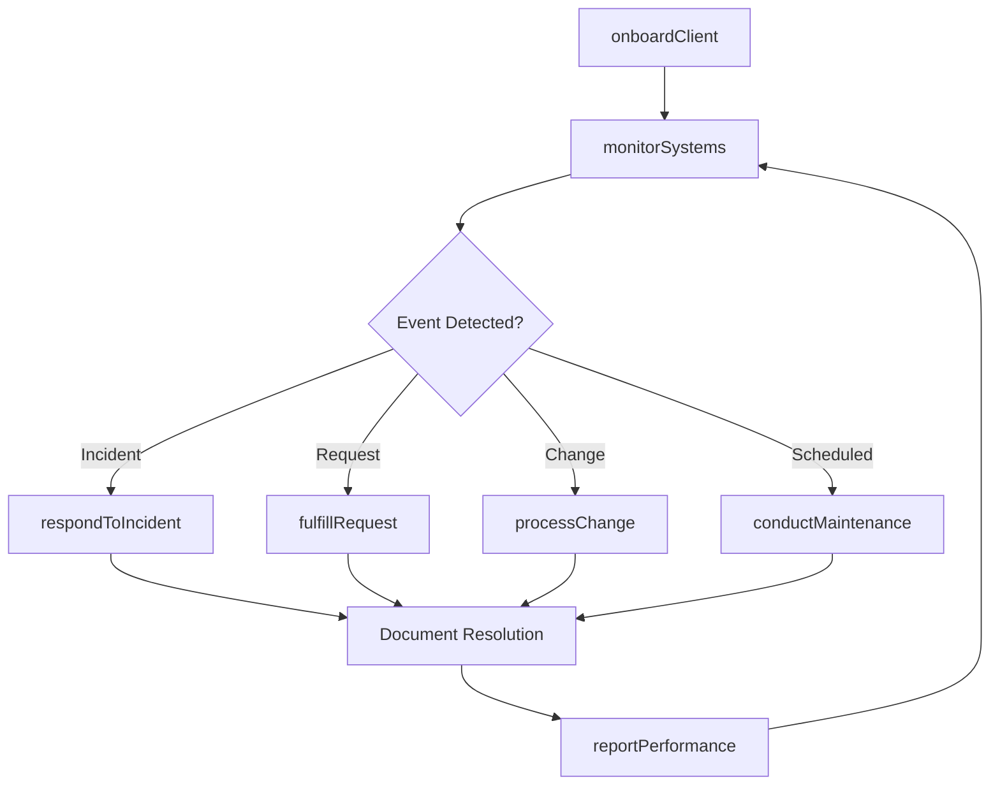
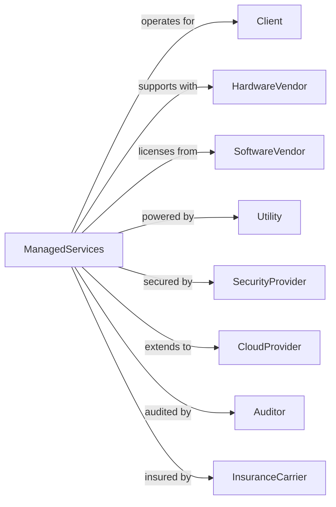

# Computer Facilities Management Services

> Business-as-Code definition for IT facilities management operations. Models the complete managed services lifecycle from onboarding through ongoing operations.

## Overview

Computer facilities management services provide on-site management and operation of client computer systems and data processing facilities. This definition exposes actions for infrastructure monitoring, maintenance, incident response, and capacity planning, with events for operational automation and service level management.

## Actors

| Actor | Description |
|-------|-------------|
| Client | Organization outsourcing IT operations management |
| HardwareVendor | Supplier providing equipment support and maintenance |
| SoftwareVendor | Provider of application support and updates |
| Utility | Provider of power, cooling, and connectivity |
| SecurityProvider | Vendor for managed security services |
| CloudProvider | Infrastructure service for hybrid environments |
| Auditor | Assessor verifying compliance and controls |
| InsuranceCarrier | Provider of technology errors and omissions coverage |

## Roles

| Role | Description |
|------|-------------|
| SiteManager | Oversees on-site team and client relationship |
| SystemsAdministrator | Manages servers, storage, and operating systems |
| NetworkAdministrator | Maintains network infrastructure and connectivity |
| HelpDeskTechnician | Provides first-line user support |
| SecurityAnalyst | Monitors and responds to security events |
| CapacityPlanner | Forecasts and plans infrastructure needs |

## Entities

| Entity | Description |
|--------|-------------|
| Contract | Managed services agreement with scope and SLAs |
| Infrastructure | Hardware, software, and network components managed |
| Incident | Unplanned interruption or reduction in service |
| ServiceRequest | User request for IT assistance or change |
| ChangeRequest | Proposed modification to managed systems |
| BackupJob | Scheduled data protection operation |
| PatchCycle | Planned software update deployment |
| CapacityReport | Analysis of resource utilization and forecasting |
| SLAReport | Performance against service level targets |
| AssetInventory | Catalog of managed hardware and software |

## Actions

| Action | Description |
|--------|-------------|
| onboardClient | Establish managed services engagement and baseline |
| monitorSystems | Continuously observe infrastructure health |
| respondToIncident | Detect, diagnose, and resolve service disruptions |
| fulfillRequest | Complete user service requests |
| processChange | Evaluate, approve, and implement system changes |
| executeBackups | Perform scheduled data protection operations |
| applyPatches | Deploy security and software updates |
| planCapacity | Forecast and recommend infrastructure needs |
| reportPerformance | Generate SLA and operational reports |
| conductMaintenance | Perform scheduled preventive maintenance |
| manageVendors | Coordinate with hardware and software suppliers |
| auditCompliance | Verify adherence to policies and regulations |

## Events

| Event | Description |
|-------|-------------|
| clientOnboarded | Managed services engagement established |
| incidentDetected | Service disruption or degradation identified |
| incidentResolved | Service restored to normal operation |
| requestFulfilled | User request completed |
| changeImplemented | System modification deployed |
| backupCompleted | Data protection job finished |
| patchesApplied | Software updates deployed |
| capacityThresholdReached | Resource utilization approaching limits |
| slaBreached | Performance fell below agreed targets |
| maintenanceCompleted | Scheduled preventive work finished |
| securityEventDetected | Potential threat or anomaly identified |
| auditCompleted | Compliance verification finished |

## Searches

| Search | Description |
|--------|-------------|
| findIncidents | List incidents by status, severity, or date |
| getServiceRequests | Retrieve user requests by status or type |
| searchAssets | Find managed hardware and software |
| getBackupStatus | Check data protection job results |
| findChanges | List change requests by status or system |
| getSLAMetrics | Retrieve performance against targets |
| getCapacityMetrics | Access resource utilization data |

## Workflow



## Actor Relationships



## Usage

### Calling Actions

```typescript
import { developInfrastructure } from '@headlessly/develop-infrastructure'

const msp = developInfrastructure()

// Check current SLA metrics across clients
const slaMetrics = await msp.getSLAMetrics({ clientId: 'client-123', period: 'current-month' })

// Find open incidents needing attention
const incidents = await msp.findIncidents({ severity: 'high', status: 'open' })

// Onboard new managed services client
const contract = await msp.onboardClient({
  clientId: 'client-123',
  scope: ['servers', 'network', 'helpdesk', 'security'],
  sla: { availability: 99.9, responseTime: 15, resolutionTime: 240 },
  assets: await discoverAssets('client-123'),
  startDate: '2024-04-01'
})

// Respond to detected incident
await msp.respondToIncident({
  incidentId: 'INC-2024-0456',
  severity: 'high',
  affectedSystem: 'production-db-01',
  symptoms: 'database unresponsive',
  assignedTo: 'dba-on-call',
  escalate: true
})

// Generate monthly performance report
const report = await msp.reportPerformance({
  clientId: 'client-123',
  period: '2024-03',
  metrics: ['availability', 'incidents', 'response-time', 'changes'],
  format: 'pdf'
})
```

### Event-Driven Automation

```typescript
// Auto-escalate high severity incidents
msp.incidentDetected(async ({ incidentId, severity, clientId }) => {
  if (severity === 'critical') {
    await msp.escalateIncident({
      incidentId,
      escalationLevel: 2,
      notifyClient: true,
      page: getOnCallManager(clientId)
    })
  }
})

// Alert on capacity thresholds
msp.capacityThresholdReached(async ({ clientId, resource, utilization }) => {
  await msp.notifyClient({
    clientId,
    subject: `Capacity Warning: ${resource}`,
    message: `${resource} at ${utilization}% utilization`,
    recommendation: generateCapacityRecommendation(resource)
  })
})
```
