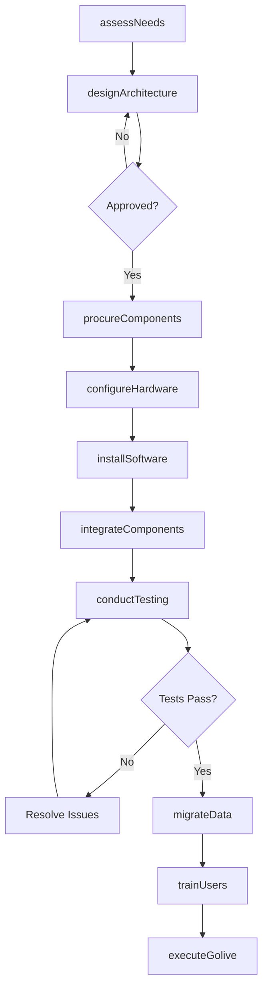
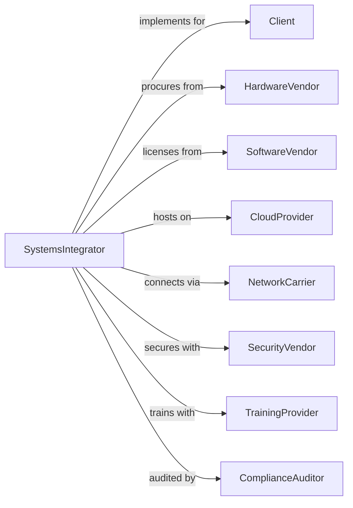

# Computer Systems Design Services

> Business-as-Code definition for systems integration operations. Models the complete integration lifecycle from assessment through deployment and support.

## Overview

Computer systems design services plan and implement integrated solutions combining hardware, software, and network components. This definition exposes actions for needs assessment, solution design, implementation, testing, and user training, with events for project milestone tracking and go-live coordination.

## Actors

| Actor | Description |
|-------|-------------|
| Client | Organization commissioning systems integration |
| HardwareVendor | Supplier of servers, networking, and devices |
| SoftwareVendor | Provider of applications and platforms |
| CloudProvider | Infrastructure and platform service provider |
| NetworkCarrier | Telecommunications provider for connectivity |
| SecurityVendor | Provider of cybersecurity tools and services |
| TrainingProvider | Service delivering end-user education |
| ComplianceAuditor | Assessor verifying regulatory requirements |

## Roles

| Role | Description |
|------|-------------|
| SolutionsArchitect | Designs integrated system architecture |
| ProjectManager | Coordinates implementation activities and timelines |
| SystemsEngineer | Configures and deploys hardware and software |
| NetworkEngineer | Implements network infrastructure and connectivity |
| SecurityEngineer | Ensures system security and compliance |
| TechnicalWriter | Creates system documentation and guides |

## Entities

| Entity | Description |
|--------|-------------|
| Project | Systems integration engagement with scope and deliverables |
| Assessment | Analysis of current state and requirements |
| Architecture | Design documenting system components and interactions |
| Hardware | Physical computing and networking equipment |
| Software | Applications and operating systems |
| Network | Connectivity infrastructure and services |
| Configuration | Settings and parameters for system components |
| TestPlan | Strategy for validating system functionality |
| Cutover | Transition plan from old to new system |
| SLA | Service level agreement defining performance targets |

## Actions

| Action | Description |
|--------|-------------|
| assessNeeds | Analyze current environment and define requirements |
| designArchitecture | Create integrated solution design |
| procureComponents | Order hardware, software, and services |
| configureHardware | Set up servers, networking, and devices |
| installSoftware | Deploy applications and operating systems |
| integrateComponents | Connect and configure system interactions |
| conductTesting | Validate system functionality and performance |
| migrateData | Transfer data from legacy to new system |
| trainUsers | Educate end users on new system |
| executeGolive | Transition production to new system |
| documentSystem | Create technical and operational documentation |
| provideSupport | Assist users and resolve issues post-deployment |

## Events

| Event | Description |
|-------|-------------|
| needsAssessed | Requirements and current state documented |
| architectureApproved | Solution design accepted by client |
| componentsProcured | Hardware and software ordered |
| hardwareConfigured | Physical infrastructure set up |
| softwareInstalled | Applications deployed and configured |
| integrationCompleted | System components connected and working |
| testingPassed | Validation completed successfully |
| dataMigrated | Information transferred to new system |
| usersTrained | End-user education completed |
| systemWentLive | Production cutover executed |
| issueDetected | Problem requiring resolution identified |
| supportProvided | User assistance delivered |

## Searches

| Search | Description |
|--------|-------------|
| findProjects | List projects by status, client, or technology |
| getArchitecture | Retrieve solution design documentation |
| searchComponents | Find hardware and software by project |
| getTestResults | Retrieve testing outcomes and issues |
| findIssues | List problems by severity or status |
| getTrainingStatus | Check user education progress |
| getSystemHealth | Access performance and availability metrics |

## Workflow



## Actor Relationships



## Usage

### Calling Actions

```typescript
import { developSystems } from '@headlessly/develop-systems'

const integrator = developSystems()

// Search existing projects for similar client architecture
const similar = await integrator.findProjects({ technology: 'azure', status: 'completed' })

// Review available system components
const components = await integrator.searchComponents({ type: 'middleware', certified: true })

// Assess client needs and current state
const assessment = await integrator.assessNeeds({
  clientId: 'client-123',
  scope: ['infrastructure', 'applications', 'security'],
  currentSystems: ['legacy-erp', 'on-prem-servers'],
  requirements: ['cloud-migration', 'scalability', 'compliance']
})

// Design integrated architecture
const architecture = await integrator.designArchitecture({
  projectId: assessment.projectId,
  platform: 'azure',
  components: ['app-services', 'sql-database', 'storage', 'networking'],
  security: ['azure-ad', 'key-vault', 'firewall'],
  highAvailability: true
})

// Execute production cutover
await integrator.executeGolive({
  projectId: assessment.projectId,
  cutoverWindow: '2024-04-15T22:00:00Z',
  rollbackPlan: 'snapshot-restore',
  monitoring: 'enhanced',
  supportTeam: ['lead-engineer', 'dba', 'network-admin']
})
```

### Event-Driven Automation

```typescript
// Track testing progress
integrator.testingPassed(async ({ projectId, phase, results }) => {
  if (phase === 'UAT') {
    await integrator.scheduleGolive({
      projectId,
      proposedDate: getNextMaintenanceWindow(),
      notify: ['client', 'team', 'vendors']
    })
  }
})

// Alert on post-golive issues
integrator.issueDetected(async ({ projectId, component, severity }) => {
  await integrator.createTicket({
    projectId,
    component,
    severity,
    assignTo: getComponentOwner(component),
    sla: getSLATarget(severity)
  })
})
```
