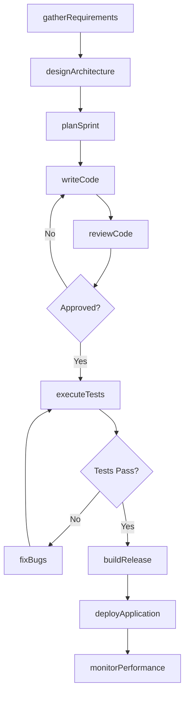
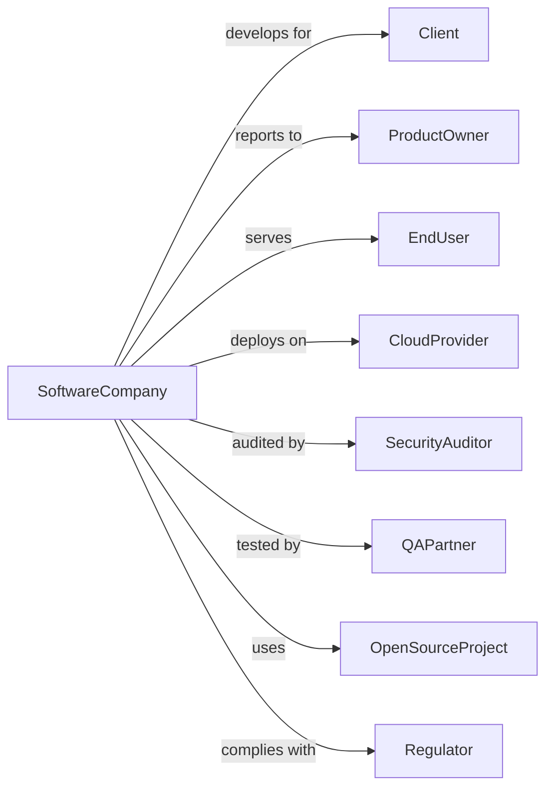

# Custom Computer Programming Services

> Business-as-Code definition for custom software development operations. Models the complete development lifecycle from requirements through deployment and support.

## Overview

Custom programming services write, modify, test, and support software tailored to client needs. This definition exposes actions for requirements gathering, development, testing, deployment, and maintenance, with events for project milestone tracking and delivery workflows.

## Actors

| Actor | Description |
|-------|-------------|
| Client | Business commissioning custom software development |
| ProductOwner | Client stakeholder defining requirements and priorities |
| EndUser | Person using the developed software application |
| CloudProvider | Infrastructure service hosting deployed applications |
| SecurityAuditor | Specialist reviewing code and infrastructure security |
| QAPartner | External testing service validating software quality |
| OpenSourceProject | Community providing libraries and frameworks |
| Regulator | Authority setting compliance requirements for software |

## Roles

| Role | Description |
|------|-------------|
| ProjectManager | Coordinates development activities, timelines, and budgets |
| TechLead | Senior developer guiding technical decisions and architecture |
| SoftwareDeveloper | Programmer writing and maintaining application code |
| QAEngineer | Specialist testing software for defects and quality |
| DevOpsEngineer | Manages deployment pipelines and infrastructure |
| UXDesigner | Designs user interfaces and experiences |

## Entities

| Entity | Description |
|--------|-------------|
| Project | Software development engagement with scope and deliverables |
| Requirement | Documented functional or technical need |
| UserStory | Description of feature from user perspective |
| Sprint | Time-boxed development iteration |
| Codebase | Repository containing application source code |
| Build | Compiled and packaged version of software |
| Test | Automated or manual verification of functionality |
| Bug | Defect requiring correction |
| Release | Version of software deployed to environment |
| Documentation | Technical and user guides for software |

## Actions

| Action | Description |
|--------|-------------|
| gatherRequirements | Document functional and technical needs from stakeholders |
| designArchitecture | Define system structure, components, and interfaces |
| planSprint | Schedule work items for upcoming development iteration |
| writeCode | Implement features and functionality in source code |
| reviewCode | Evaluate code changes for quality and standards |
| executeTests | Run automated and manual tests to verify functionality |
| fixBugs | Correct identified defects in software |
| buildRelease | Package software for deployment |
| deployApplication | Install software in target environment |
| monitorPerformance | Track application health and performance metrics |
| documentSoftware | Create technical and user documentation |
| supportUsers | Assist end users with issues and questions |

## Events

| Event | Description |
|-------|-------------|
| requirementsGathered | Functional and technical needs documented |
| architectureDesigned | System structure and components defined |
| sprintPlanned | Development iteration scheduled with work items |
| codeCommitted | Source code changes saved to repository |
| codeReviewed | Changes evaluated and approved or rejected |
| testsPassed | Automated tests completed successfully |
| testsFailed | Tests identified defects requiring attention |
| bugFixed | Defect corrected in codebase |
| releaseBuilt | Software packaged for deployment |
| applicationDeployed | Software installed in target environment |
| incidentDetected | Production issue requiring response |
| sprintCompleted | Development iteration finished |

## Searches

| Search | Description |
|--------|-------------|
| findProjects | List projects by status, client, or technology |
| getUserStories | Retrieve requirements by project, sprint, or status |
| searchCodebase | Find code by keyword, file, or author |
| getTestResults | Retrieve test outcomes by suite or date |
| findBugs | List defects by severity, status, or assignee |
| getReleases | Retrieve deployments by environment or version |
| getMetrics | Access performance and health data |

## Workflow



## Actor Relationships



## Usage

### Calling Actions

```typescript
import { developSoftware } from '@headlessly/develop-software'

const dev = developSoftware()

// Find open bugs from previous sprint
const bugs = await dev.findBugs({ severity: 'high', status: 'open', projectId: 'project-123' })

// Check recent test results
const tests = await dev.getTestResults({ suite: 'integration', dateRange: 'last-7-days' })

// Gather and document requirements
const requirements = await dev.gatherRequirements({
  projectId: 'project-123',
  stakeholders: ['product-owner', 'key-users'],
  methods: ['interviews', 'workshops', 'prototypes'],
  deliverable: 'requirements-specification'
})

// Plan sprint with prioritized stories
const sprint = await dev.planSprint({
  projectId: 'project-123',
  sprintNumber: 5,
  duration: 14,
  velocity: 32,
  stories: requirements.prioritized.slice(0, 8)
})

// Deploy to production
await dev.deployApplication({
  projectId: 'project-123',
  releaseId: 'v1.2.0',
  environment: 'production',
  strategy: 'blue-green',
  healthCheck: true
})
```

### Event-Driven Automation

```typescript
// Auto-run tests on code commit
dev.codeCommitted(async ({ projectId, branch, files }) => {
  await dev.executeTests({
    projectId,
    suite: 'unit-and-integration',
    coverage: true,
    notifyOnFail: true
  })
})

// Alert on production incident
dev.incidentDetected(async ({ projectId, severity, description }) => {
  await dev.createIncident({
    projectId,
    severity,
    description,
    assignTo: getOnCallEngineer(projectId),
    escalate: severity === 'critical'
  })
})
```
