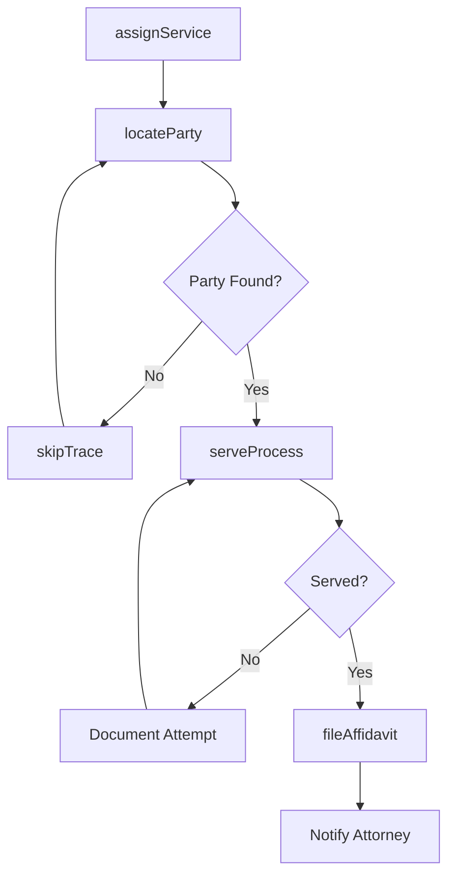
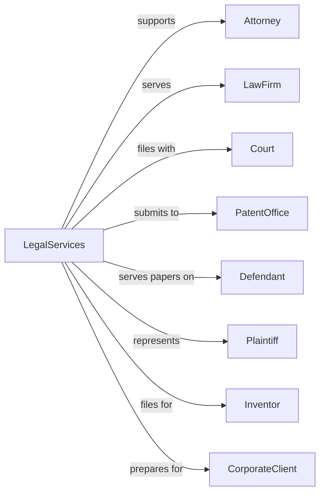

# All Other Legal Services

> Business-as-Code definition for specialized legal support services. Models paralegal, patent agent, process serving, and other non-attorney legal services.

## Overview

Other legal services establishments provide specialized support including paralegal services, patent searching and filing, process serving, court reporting, and legal document preparation. This definition exposes actions for document research, filing assistance, and legal support workflows, with events for deadline tracking and service completion.

## Actors

| Actor | Description |
|-------|-------------|
| Attorney | Licensed lawyer engaging support services for clients |
| LawFirm | Legal practice requiring specialized support services |
| Court | Judicial body requiring document filing and service |
| PatentOffice | USPTO or foreign patent authority receiving applications |
| Defendant | Party being served with legal process |
| Plaintiff | Party initiating legal action requiring service |
| Inventor | Individual or entity seeking patent protection |
| CorporateClient | Business requiring legal document preparation |

## Roles

| Role | Description |
|------|-------------|
| Paralegal | Licensed professional providing legal support under attorney supervision |
| PatentAgent | USPTO-registered professional handling patent matters |
| ProcessServer | Certified individual delivering legal documents |
| CourtReporter | Stenographer creating verbatim transcripts |
| LegalDocumentPreparer | Professional assisting with form completion |
| LegalResearcher | Specialist conducting case law and statutory research |

## Entities

| Entity | Description |
|--------|-------------|
| ServiceOfProcess | Delivery of legal documents to party in lawsuit |
| PatentApplication | Filing seeking intellectual property protection |
| Transcript | Verbatim record of legal proceeding or deposition |
| LegalDocument | Form, pleading, or contract requiring preparation |
| PriorArtSearch | Research of existing patents and publications |
| Affidavit | Sworn statement documenting service or facts |
| Subpoena | Court order requiring appearance or document production |
| DepositionNotice | Scheduling document for witness examination |
| ProofOfService | Document confirming legal papers were delivered |
| TrademarkSearch | Research of existing marks and registrations |

## Actions

| Action | Description |
|--------|-------------|
| assignService | Allocate process service job to available server |
| locateParty | Research and find current address of party to be served |
| serveProcess | Deliver legal documents to named party |
| fileAffidavit | Submit proof of service to court |
| conductPatentSearch | Research prior art and existing patent claims |
| prepareApplication | Draft patent application with claims and specifications |
| filePatent | Submit application to patent office |
| recordDeposition | Create stenographic record of witness examination |
| transcribeProceeding | Convert audio or shorthand to written transcript |
| prepareDocument | Complete legal forms and documents for clients |
| conductResearch | Perform legal research on statutes and case law |
| skipTrace | Locate difficult-to-find parties using investigative methods |

## Events

| Event | Description |
|-------|-------------|
| serviceAssigned | Process service job allocated to server |
| partyLocated | Current address confirmed for service |
| serviceCompleted | Legal documents successfully delivered |
| serviceAttempted | Delivery attempted but not completed |
| affidavitFiled | Proof of service submitted to court |
| patentSearchCompleted | Prior art research finished |
| applicationPrepared | Patent filing documents ready for review |
| patentFiled | Application submitted to patent office |
| depositionRecorded | Witness examination stenographically captured |
| transcriptDelivered | Written record delivered to ordering party |
| documentPrepared | Legal form completed and ready for execution |
| deadlineApproaching | Filing or service deadline within warning threshold |

## Searches

| Search | Description |
|--------|-------------|
| findServiceJobs | List active process service assignments by status or location |
| getServiceHistory | Retrieve attempts and completions for specific case |
| searchPatentPriorArt | Query patent databases for relevant prior art |
| findTranscripts | List depositions and proceedings by case or date |
| getDeadlines | Retrieve upcoming service or filing deadlines |
| locateAddress | Search databases for party current address |
| findPatentStatus | Check status of pending patent applications |

## Workflow



## Actor Relationships



## Usage

### Calling Actions

```typescript
import { supportLegalCases } from '@headlessly/support-legal-cases'

const legal = supportLegalCases()

// Assign process service job
const service = await legal.assignService({
  caseNumber: '2024-CV-12345',
  documentType: 'summons',
  partyName: 'John Doe',
  lastKnownAddress: '789 Pine St, Denver, CO 80202',
  deadline: '2024-04-01',
  rushService: false
})

// Attempt service and document result
const attempt = await legal.serveProcess({
  serviceId: service.id,
  attemptDate: new Date(),
  location: '789 Pine St, Denver, CO 80202',
  result: 'personalService',
  personServed: 'John Doe',
  relationship: 'defendant'
})

// File affidavit with court
await legal.fileAffidavit({
  serviceId: service.id,
  courtName: 'Denver District Court',
  caseNumber: '2024-CV-12345',
  serviceDate: attempt.date,
  serviceMethod: 'personalService'
})
```

### Event-Driven Automation

```typescript
// Auto-escalate when deadline approaching
legal.deadlineApproaching(async ({ serviceId, deadline, daysRemaining }) => {
  if (daysRemaining <= 5) {
    await legal.escalateService({
      serviceId,
      priority: 'rush',
      notifyClient: true
    })
  }
})

// Auto-notify attorney when service completed
legal.serviceCompleted(async ({ serviceId, caseNumber, servedParty }) => {
  await legal.notifyAttorney({
    serviceId,
    caseNumber,
    message: `Service completed on ${servedParty}`,
    affidavitReady: true
  })
})
```
