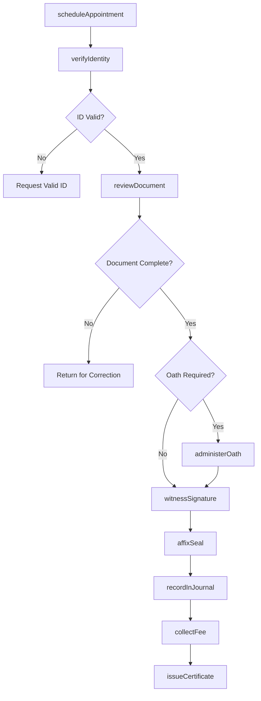
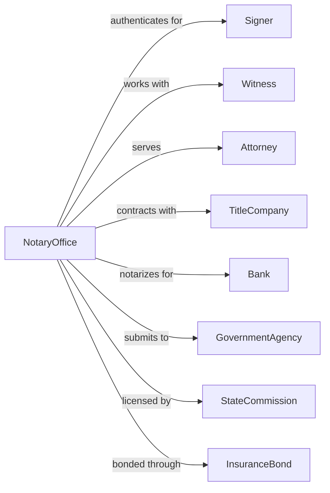

# Offices of Notaries

> Business-as-Code definition for notarial services operations. Models document authentication, witnessing, and legal recordkeeping workflows.

## Overview

Notary offices provide document authentication, witnessing, and certification services for legal instruments including real estate transactions, wills, contracts, and affidavits. This definition exposes actions for identity verification, document notarization, and official recordkeeping, with events for compliance tracking and appointment scheduling.

## Actors

| Actor | Description |
|-------|-------------|
| Signer | Individual executing a document requiring notarization |
| Witness | Person attesting to the signing of a document |
| Attorney | Legal professional requesting notarial services for clients |
| TitleCompany | Real estate closing company requiring document authentication |
| Bank | Financial institution requiring notarized loan documents |
| GovernmentAgency | Entity accepting or requiring notarized documents |
| StateCommission | Authority issuing and regulating notary commissions |
| InsuranceBond | Provider of errors and omissions coverage for notaries |

## Roles

| Role | Description |
|------|-------------|
| Notary | Commissioned official authorized to perform notarial acts |
| SigningAgent | Notary specializing in loan document signings |
| OfficeManager | Oversees scheduling, supplies, and administrative functions |
| Receptionist | Handles appointments, client intake, and document handling |

## Entities

| Entity | Description |
|--------|-------------|
| Document | Legal instrument requiring notarization or authentication |
| NotarialCertificate | Official statement attached to notarized document |
| Journal | Official record of all notarial acts performed |
| Commission | State authorization to perform notarial acts |
| Seal | Official embossed or inked stamp authenticating notarial act |
| Appointment | Scheduled time for notarization service |
| Fee | Charge for notarial services per state schedule |
| Identification | Government-issued ID used to verify signer identity |
| Acknowledgment | Certificate confirming signer appeared and acknowledged signature |
| Jurat | Certificate confirming oath or affirmation was administered |

## Actions

| Action | Description |
|--------|-------------|
| scheduleAppointment | Book time slot for notarization service |
| verifyIdentity | Confirm signer identity using acceptable identification documents |
| reviewDocument | Examine document for completeness and notarization requirements |
| administerOath | Administer oath or affirmation for jurat or sworn statement |
| witnessSignature | Observe signer executing document in presence of notary |
| affixSeal | Apply official notary seal and signature to certificate |
| recordInJournal | Log notarial act details in official journal |
| collectFee | Process payment for notarization services |
| issueCertificate | Prepare and attach notarial certificate to document |
| performAcknowledgment | Complete acknowledgment certificate for deed or contract |
| certifyCopy | Attest that copy is true reproduction of original document |
| apostille | Prepare document for international recognition |

## Events

| Event | Description |
|-------|-------------|
| appointmentScheduled | Client booking confirmed for notarization service |
| identityVerified | Signer identity confirmed through acceptable documentation |
| documentReviewed | Document examined and prepared for notarization |
| oathAdministered | Signer swore or affirmed truthfulness of document content |
| signatureWitnessed | Notary observed document execution |
| sealAffixed | Official seal and signature applied to document |
| journalRecorded | Notarial act logged in official record |
| feeCollected | Payment received for notarial services |
| commissionExpiring | Notary commission approaching renewal date |
| errorDetected | Issue identified requiring document correction |
| appointmentCanceled | Scheduled notarization canceled by client or notary |

## Searches

| Search | Description |
|--------|-------------|
| findAppointments | List scheduled appointments by date, client, or document type |
| getJournalEntries | Retrieve notarial act records with filters for date or signer |
| checkCommissionStatus | Verify current commission status and expiration date |
| findDocumentTypes | List available notarization services and requirements |
| getFeesSchedule | Retrieve current fee structure per state regulations |
| searchSigners | Find previous notarizations by signer name or identification |

## Workflow



## Actor Relationships



## Usage

### Calling Actions

```typescript
import { notarizeDocuments } from '@headlessly/notarize-documents'

const notary = notarizeDocuments()

// Check commission status and expiration
const commission = await notary.checkCommissionStatus({ state: 'CA' })

// Find upcoming appointments for the day
const appointments = await notary.findAppointments({ date: '2024-06-15', status: 'confirmed' })

// Schedule appointment for real estate closing
const appointment = await notary.scheduleAppointment({
  clientName: 'Jane Smith',
  documentType: 'deedOfTrust',
  date: '2024-03-15',
  time: '14:00',
  location: 'office'
})

// Verify signer identity
const verification = await notary.verifyIdentity({
  appointmentId: appointment.id,
  idType: 'driversLicense',
  idNumber: 'D1234567',
  idState: 'CA',
  idExpiration: '2026-08-15'
})

// Complete notarization with acknowledgment
await notary.performAcknowledgment({
  appointmentId: appointment.id,
  signerId: verification.signerId,
  documentTitle: 'Deed of Trust',
  propertyAddress: '123 Main St, Los Angeles, CA'
})
```

### Event-Driven Automation

```typescript
// Alert when commission expiring
notary.commissionExpiring(async ({ notaryId, expirationDate, daysRemaining }) => {
  if (daysRemaining <= 60) {
    await notary.sendRenewalReminder({
      notaryId,
      expirationDate,
      renewalUrl: 'https://sos.state.gov/notary/renew'
    })
  }
})

// Auto-update journal after each notarization
notary.sealAffixed(async ({ appointmentId, documentType, signerId }) => {
  await notary.recordInJournal({
    appointmentId,
    documentType,
    signerId,
    timestamp: new Date(),
    notarySignature: true
  })
})
```
