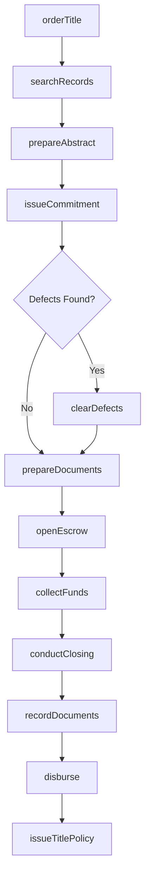
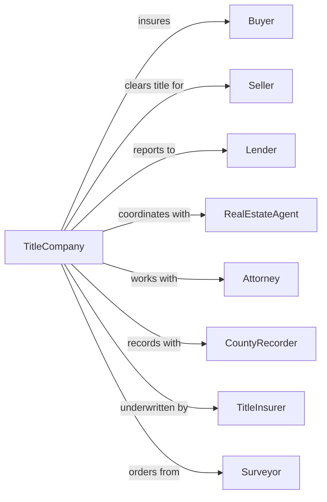

# Title Abstract and Settlement Offices

> Business-as-Code definition for real estate title and settlement operations. Models the complete title search, insurance, and closing workflow.

## Overview

Title and settlement offices research property ownership records, prepare title insurance commitments, and conduct real estate closings. This definition exposes actions for title examination, document preparation, escrow management, and closing coordination, with events for transaction milestone tracking and compliance requirements.

## Actors

| Actor | Description |
|-------|-------------|
| Buyer | Purchaser of real property requiring title services |
| Seller | Current owner conveying property in transaction |
| Lender | Financial institution providing mortgage financing |
| RealEstateAgent | Licensed agent representing buyer or seller |
| Attorney | Legal counsel for parties in transaction |
| CountyRecorder | Government office recording property documents |
| TitleInsurer | Underwriter providing title insurance policies |
| Surveyor | Professional providing property boundary surveys |
| Appraiser | Licensed professional determining property value |

## Roles

| Role | Description |
|------|-------------|
| TitleExaminer | Searches public records and prepares title abstracts |
| Escrow Officer | Manages funds, documents, and closing process |
| ClosingCoordinator | Schedules and facilitates closing appointments |
| TitleCurative | Resolves title defects and clearing issues |
| PostClosingSpecialist | Handles document recording and policy issuance |

## Entities

| Entity | Description |
|--------|-------------|
| TitleCommitment | Preliminary report of title status and requirements |
| TitlePolicy | Insurance policy protecting against title defects |
| Abstract | Summary of recorded documents affecting property title |
| Deed | Legal instrument conveying property ownership |
| Mortgage | Security instrument pledging property for loan |
| EscrowAccount | Funds held pending satisfaction of closing conditions |
| ClosingDisclosure | Itemized statement of transaction costs and credits |
| Lien | Encumbrance on property securing debt or obligation |
| Easement | Right to use portion of property for specific purpose |
| Survey | Map showing property boundaries and improvements |

## Actions

| Action | Description |
|--------|-------------|
| orderTitle | Initiate title search for property transaction |
| searchRecords | Examine public records for ownership and encumbrances |
| prepareAbstract | Compile summary of documents in chain of title |
| issueCommitment | Deliver preliminary title report with requirements |
| clearDefects | Resolve liens, judgments, or other title issues |
| prepareDocuments | Draft deed, settlement statement, and closing documents |
| openEscrow | Establish escrow account and receive earnest money |
| collectFunds | Receive and verify closing funds from all parties |
| conductClosing | Facilitate document signing and fund disbursement |
| recordDocuments | Submit executed documents to county recorder |
| issueTitlePolicy | Generate final title insurance policy after recording |
| disburse | Release funds to seller, agents, and service providers |

## Events

| Event | Description |
|-------|-------------|
| titleOrdered | Search request received and assigned |
| searchCompleted | Public records examination finished |
| abstractPrepared | Title summary compiled and ready for review |
| commitmentIssued | Preliminary title report delivered to parties |
| defectIdentified | Title issue requiring resolution discovered |
| defectCleared | Title issue successfully resolved |
| escrowOpened | Earnest money received and deposited |
| documentsReady | Closing package prepared for signing |
| closingScheduled | Appointment set for document execution |
| closingCompleted | All documents signed and funds collected |
| documentsRecorded | Deed and mortgage filed with county |
| policyIssued | Final title insurance policy delivered |
| fundsDisbursed | Closing proceeds distributed to parties |

## Searches

| Search | Description |
|--------|-------------|
| findTransactions | List files by status, property address, or party name |
| getChainOfTitle | Retrieve ownership history for property |
| searchLiens | Find recorded liens and encumbrances on property |
| getEscrowBalance | Check current balance in escrow account |
| findRequirements | List outstanding items needed for closing |
| getClosingSchedule | Retrieve upcoming closing appointments |
| searchRecordedDocs | Find documents recorded for property |

## Workflow



## Actor Relationships



## Usage

### Calling Actions

```typescript
import { clearPropertyTitles } from '@headlessly/clear-property-titles'

const title = clearPropertyTitles()

// Order title search for new purchase
const order = await title.orderTitle({
  propertyAddress: '456 Oak Lane, Austin, TX 78701',
  parcelNumber: '12345-678-90',
  transactionType: 'purchase',
  buyerName: 'John and Mary Smith',
  sellerName: 'Robert Johnson',
  lenderName: 'First National Bank',
  purchasePrice: 450000
})

// Search public records
const search = await title.searchRecords({
  orderId: order.id,
  searchPeriod: 'fullChain',
  includeJudgments: true,
  includeTaxStatus: true
})

// Issue commitment after clearing
await title.issueCommitment({
  orderId: order.id,
  effectiveDate: new Date(),
  policyAmount: 450000,
  requirements: search.requirements,
  exceptions: search.exceptions
})
```

### Event-Driven Automation

```typescript
// Auto-notify when defect found
title.defectIdentified(async ({ orderId, defectType, description }) => {
  await title.notifyParties({
    orderId,
    message: `Title defect found: ${description}`,
    defectType,
    requiresAction: true
  })
})

// Auto-issue policy after recording
title.documentsRecorded(async ({ orderId, recordingNumber, recordingDate }) => {
  await title.issueTitlePolicy({
    orderId,
    recordingNumber,
    recordingDate,
    policyType: 'owners',
    effectiveDate: recordingDate
  })
})
```
