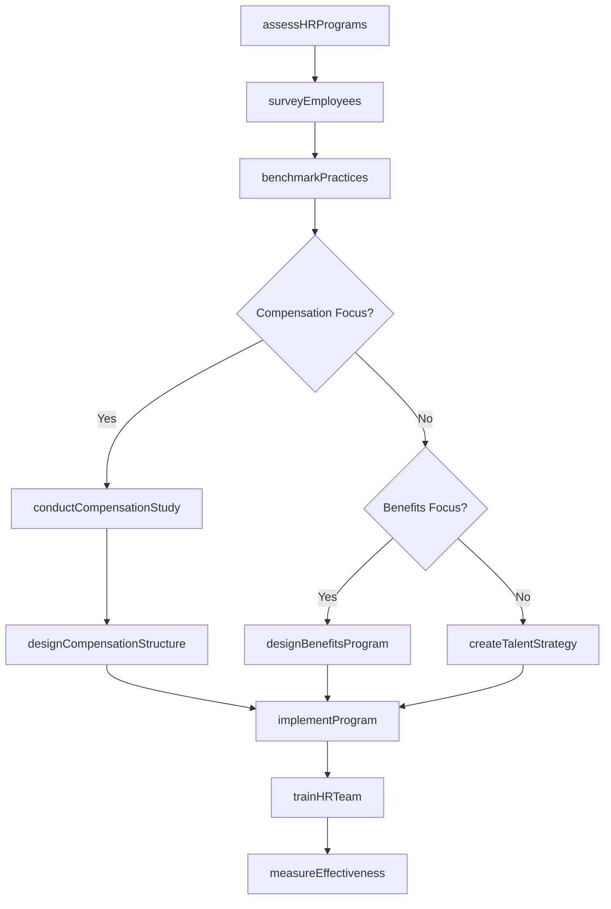
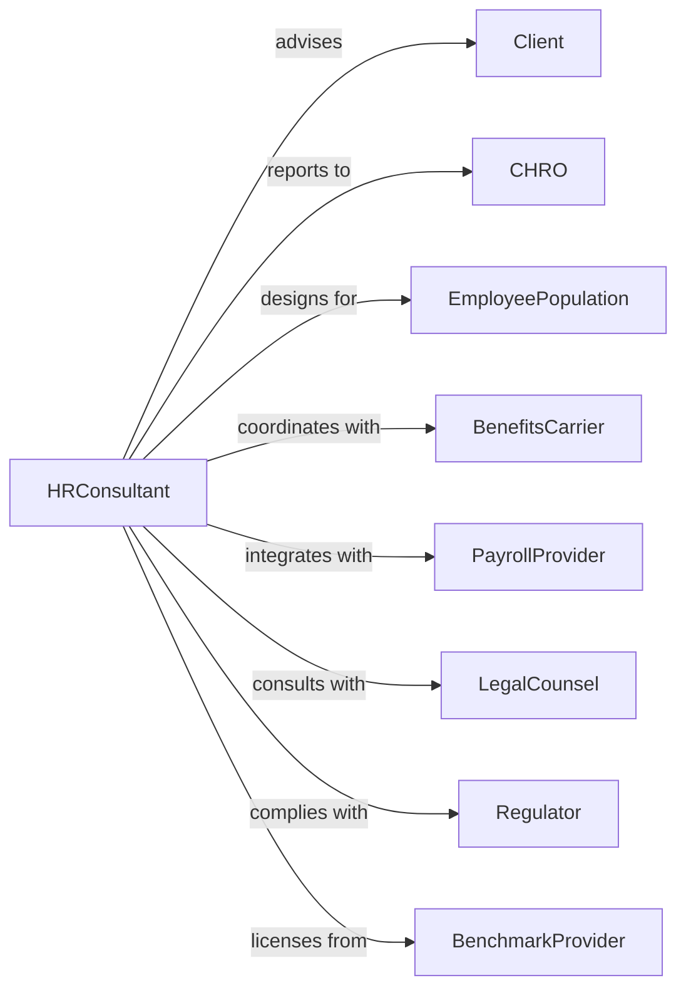

# Human Resources Consulting Services

> Business-as-Code definition for HR consulting operations. Models the complete engagement lifecycle from assessment through program implementation.

## Overview

HR consulting services provide advice on human resource policies, compensation systems, benefits planning, talent management, and organizational development. This definition exposes actions for workforce assessment, program design, and implementation support, with events for engagement tracking and compliance monitoring.

## Actors

| Actor | Description |
|-------|-------------|
| Client | Organization commissioning HR consulting services |
| CHRO | Chief Human Resources Officer sponsoring engagement |
| EmployeePopulation | Workforce affected by HR programs |
| BenefitsCarrier | Insurance provider for health and welfare programs |
| PayrollProvider | Service processing compensation payments |
| LegalCounsel | Attorney advising on employment law compliance |
| Regulator | Government agency setting employment standards |
| BenchmarkProvider | Source of compensation and benefits data |

## Roles

| Role | Description |
|------|-------------|
| EngagementPartner | Senior consultant leading client relationship |
| HRConsultant | Specialist developing HR program recommendations |
| CompensationAnalyst | Expert in pay structures and market data |
| BenefitsConsultant | Specialist in health and retirement programs |
| TalentConsultant | Expert in recruitment and development |
| ChangeConsultant | Facilitates organizational adoption of programs |

## Entities

| Entity | Description |
|--------|-------------|
| Engagement | HR consulting project with scope and deliverables |
| Assessment | Analysis of current HR programs and practices |
| CompensationStudy | Analysis of pay levels and structures |
| BenefitsPlan | Design for health, retirement, and welfare programs |
| JobArchitecture | Framework defining job levels and families |
| TalentStrategy | Approach to recruiting, developing, and retaining |
| PolicyManual | Documentation of HR policies and procedures |
| EmployeeSurvey | Assessment of workforce engagement and satisfaction |
| Benchmark | Comparison to market or peer practices |
| ComplianceAudit | Review of adherence to employment regulations |

## Actions

| Action | Description |
|--------|-------------|
| assessHRPrograms | Evaluate current policies, practices, and systems |
| conductCompensationStudy | Analyze pay levels against market |
| designBenefitsProgram | Create health and retirement plan design |
| developJobArchitecture | Build job leveling and family framework |
| createTalentStrategy | Define approach to workforce development |
| surveyEmployees | Gather workforce engagement and feedback |
| benchmarkPractices | Compare HR programs to market and peers |
| auditCompliance | Review adherence to employment regulations |
| designCompensationStructure | Create pay grades and salary ranges |
| implementProgram | Support rollout of new HR initiatives |
| trainHRTeam | Educate client HR staff on new programs |
| measureEffectiveness | Track program outcomes and impact |

## Events

| Event | Description |
|-------|-------------|
| assessmentCompleted | Current state HR review finished |
| compensationStudyCompleted | Pay analysis finished |
| benefitsProgramDesigned | Health and retirement plans created |
| jobArchitectureBuilt | Leveling framework established |
| talentStrategyDeveloped | Workforce development approach defined |
| surveyCompleted | Employee feedback collected |
| benchmarkCompleted | Market comparison finished |
| complianceIssueFound | Regulatory gap identified |
| programImplemented | New HR initiative launched |
| trainingCompleted | HR team education finished |
| effectivenessMeasured | Program outcomes tracked |
| engagementClosed | Project completed |

## Searches

| Search | Description |
|--------|-------------|
| findEngagements | List projects by status, client, or type |
| getCompensationData | Retrieve pay analysis by job or level |
| searchBenefitsPlans | Find plan designs by coverage type |
| getJobArchitecture | Access job family and level framework |
| findSurveyResults | Retrieve employee feedback data |
| getBenchmarks | Access market comparison data |
| getComplianceStatus | Check regulatory adherence |

## Workflow



## Actor Relationships



## Usage

### Calling Actions

```typescript
import { consultHR } from '@headlessly/consult-hr'

const hr = consultHR()

// Pull compensation benchmarks for the industry
const benchmarks = await hr.getCompensationData({ industry: 'technology', region: 'west-coast', size: 'mid-market' })

// Find active HR consulting engagements
const engagements = await hr.findEngagements({ status: 'active', serviceType: 'comp-review' })

// Assess current HR programs
const assessment = await hr.assessHRPrograms({
  clientId: 'client-123',
  scope: ['compensation', 'benefits', 'talent', 'compliance'],
  methods: ['document-review', 'interviews', 'data-analysis'],
  employeeCount: 2500
})

// Conduct compensation study
const compStudy = await hr.conductCompensationStudy({
  engagementId: assessment.engagementId,
  jobsToPrice: 150,
  markets: ['national', 'tech-industry'],
  percentiles: [25, 50, 75, 90],
  includeEquity: true
})

// Design new compensation structure
await hr.designCompensationStructure({
  engagementId: assessment.engagementId,
  marketData: compStudy.id,
  philosophy: 'pay-for-performance',
  targetPercentile: 60,
  gradeCount: 12,
  rangeSpread: 50
})
```

### Event-Driven Automation

```typescript
// Alert on compliance issues
hr.complianceIssueFound(async ({ engagementId, issue, severity, regulation }) => {
  await hr.escalateIssue({
    engagementId,
    issue,
    severity,
    notifyLegal: severity === 'high',
    remediation: generateRemediationPlan(issue)
  })
})

// Schedule effectiveness review
hr.programImplemented(async ({ engagementId, program, launchDate }) => {
  await hr.scheduleReview({
    engagementId,
    program,
    reviewDate: addMonths(launchDate, 6),
    metrics: getProgramMetrics(program)
  })
})
```
