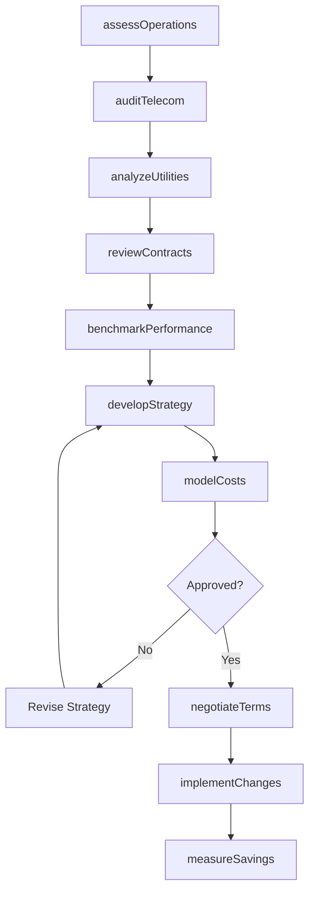
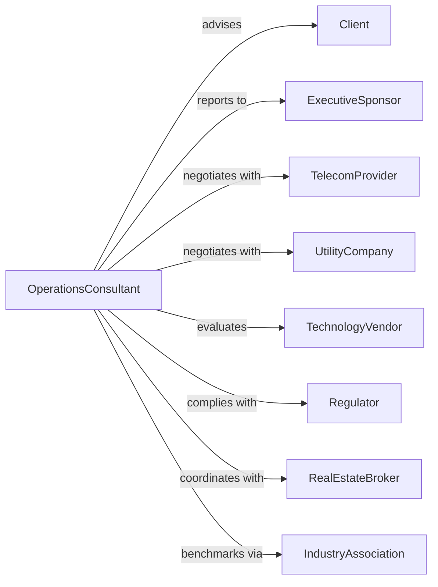

# Other Management Consulting Services

> Business-as-Code definition for specialized management consulting operations. Models consulting engagements for telecommunications, utilities, and other operational areas.

## Overview

Other management consulting services provide specialized advice on telecommunications strategy, utilities management, site selection, and operational efficiency. This definition exposes actions for operational assessment, strategy development, and implementation support, with events for engagement tracking and performance measurement.

## Actors

| Actor | Description |
|-------|-------------|
| Client | Organization commissioning specialized consulting |
| ExecutiveSponsor | Senior leader championing the engagement |
| TelecomProvider | Carrier providing communications services |
| UtilityCompany | Provider of electricity, gas, or water services |
| TechnologyVendor | Supplier of operational systems and equipment |
| Regulator | Authority governing industry-specific operations |
| RealEstateBroker | Facilitates site selection and lease negotiations |
| IndustryAssociation | Trade group providing benchmarks and standards |

## Roles

| Role | Description |
|------|-------------|
| EngagementPartner | Senior consultant leading client relationship |
| OperationsConsultant | Specialist developing operational recommendations |
| TelecomAnalyst | Expert in communications strategy and costs |
| UtilitiesConsultant | Specialist in energy management and procurement |
| SiteSelectionSpecialist | Expert in location analysis and real estate |
| ProjectManager | Coordinates engagement activities and deliverables |

## Entities

| Entity | Description |
|--------|-------------|
| Engagement | Consulting project with scope and deliverables |
| OperationalAssessment | Analysis of current operational state |
| TelecomAudit | Review of communications costs and services |
| UtilityAnalysis | Assessment of energy usage and costs |
| SiteStudy | Evaluation of location options and criteria |
| CostModel | Financial analysis of operational expenses |
| VendorEvaluation | Assessment of supplier options and capabilities |
| ImplementationPlan | Roadmap for executing recommendations |
| Benchmark | Comparison to industry standards and peers |
| ContractReview | Analysis of service agreements and terms |

## Actions

| Action | Description |
|--------|-------------|
| assessOperations | Evaluate current operational effectiveness |
| auditTelecom | Analyze communications costs and utilization |
| analyzeUtilities | Review energy consumption and procurement |
| conductSiteStudy | Evaluate location options against criteria |
| benchmarkPerformance | Compare operations to industry standards |
| reviewContracts | Analyze vendor agreements for optimization |
| developStrategy | Create operational improvement recommendations |
| modelCosts | Build financial analysis of options |
| evaluateVendors | Assess supplier capabilities and pricing |
| negotiateTerms | Support contract discussions with vendors |
| implementChanges | Guide execution of operational improvements |
| measureSavings | Track realized benefits from recommendations |

## Events

| Event | Description |
|-------|-------------|
| operationsAssessed | Operational review completed |
| telecomAudited | Communications analysis finished |
| utilitiesAnalyzed | Energy review completed |
| siteStudyCompleted | Location evaluation finished |
| benchmarkCompleted | Industry comparison finished |
| contractsReviewed | Agreement analysis completed |
| strategyDeveloped | Recommendations created |
| costsModeled | Financial analysis completed |
| vendorsEvaluated | Supplier assessment finished |
| termsNegotiated | Contract improvements secured |
| changesImplemented | Operational improvements executed |
| savingsMeasured | Benefits tracked and validated |

## Searches

| Search | Description |
|--------|-------------|
| findEngagements | List projects by status, client, or type |
| getTelecomData | Retrieve communications cost analysis |
| getUtilityData | Access energy usage and cost data |
| findSiteOptions | List location candidates meeting criteria |
| getBenchmarks | Access industry comparison data |
| getContractTerms | Retrieve agreement details and dates |
| getSavingsReports | Access realized benefits by category |

## Workflow



## Actor Relationships



## Usage

### Calling Actions

```typescript
import { consultOperations } from '@headlessly/consult-operations'

const operations = consultOperations()

// Pull telecom spend data for analysis
const telecomData = await operations.getTelecomData({ clientId: 'client-123', months: 12 })

// Find active consulting engagements
const engagements = await operations.findEngagements({ status: 'active', serviceType: 'telecom-audit' })

// Audit telecommunications costs
const telecomAudit = await operations.auditTelecom({
  clientId: 'client-123',
  scope: ['voice', 'data', 'wireless', 'conferencing'],
  locations: 45,
  annualSpend: 2500000,
  includeInventory: true
})

// Analyze utility consumption
const utilities = await operations.analyzeUtilities({
  engagementId: telecomAudit.engagementId,
  utilityTypes: ['electricity', 'natural-gas', 'water'],
  facilities: 45,
  historicalPeriod: 24, // months
  includeRateAnalysis: true
})

// Develop cost reduction strategy
await operations.developStrategy({
  engagementId: telecomAudit.engagementId,
  opportunities: [
    { category: 'telecom', initiative: 'carrier-consolidation', savings: 180000 },
    { category: 'utilities', initiative: 'rate-optimization', savings: 95000 },
    { category: 'contracts', initiative: 'term-renegotiation', savings: 75000 }
  ],
  implementationTimeline: 12 // months
})
```

### Event-Driven Automation

```typescript
// Track contract renewals
operations.contractsReviewed(async ({ engagementId, contracts }) => {
  for (const contract of contracts) {
    if (contract.renewalDate <= addMonths(new Date(), 6)) {
      await operations.scheduleRenegotiation({
        engagementId,
        contractId: contract.id,
        vendor: contract.vendor,
        targetDate: addMonths(contract.renewalDate, -3)
      })
    }
  }
})

// Report savings achievements
operations.savingsMeasured(async ({ engagementId, savings, projectedSavings }) => {
  await operations.generateReport({
    engagementId,
    actualSavings: savings,
    projectedSavings,
    variance: savings - projectedSavings,
    shareWithClient: true
  })
})
```
