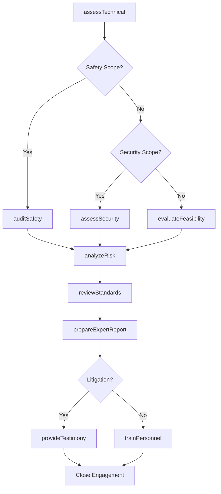
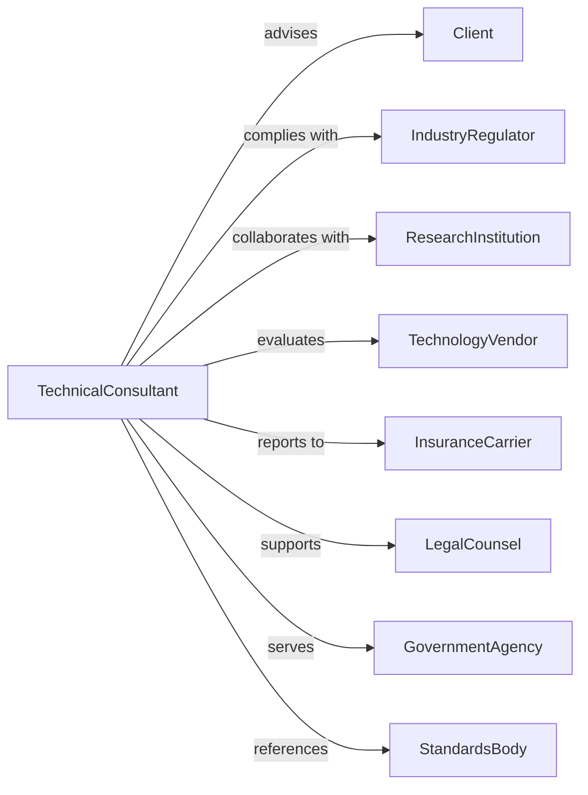

# Other Scientific and Technical Consulting Services

> Business-as-Code definition for specialized scientific and technical consulting. Models expert advisory services across diverse technical disciplines.

## Overview

Other scientific and technical consulting services provide expert advice on agricultural science, physics, chemistry, economics, safety, security, and other specialized fields. This definition exposes actions for technical assessment, expert analysis, and advisory services, with events for engagement tracking and deliverable management.

## Actors

| Actor | Description |
|-------|-------------|
| Client | Organization requiring specialized technical expertise |
| IndustryRegulator | Authority overseeing technical standards and safety |
| ResearchInstitution | University or lab providing scientific collaboration |
| TechnologyVendor | Supplier of specialized equipment or systems |
| InsuranceCarrier | Provider requiring technical risk assessments |
| LegalCounsel | Attorney engaging technical experts for litigation |
| GovernmentAgency | Public entity commissioning technical studies |
| StandardsBody | Organization defining technical specifications |

## Roles

| Role | Description |
|------|-------------|
| PrincipalConsultant | Senior technical expert leading engagements |
| SubjectMatterExpert | Specialist in specific scientific discipline |
| SafetyConsultant | Expert in occupational and process safety |
| SecurityConsultant | Specialist in physical and operational security |
| EconomicAnalyst | Expert in economic impact and feasibility studies |
| TechnicalWriter | Prepares reports and documentation |

## Entities

| Entity | Description |
|--------|-------------|
| Engagement | Technical consulting project |
| TechnicalAssessment | Evaluation of scientific or engineering issues |
| SafetyAudit | Review of hazards and protective measures |
| SecurityAssessment | Evaluation of vulnerabilities and countermeasures |
| EconomicStudy | Analysis of financial impacts and feasibility |
| ExpertReport | Documentation of technical findings and opinions |
| RiskAnalysis | Quantification of technical hazards and likelihood |
| FeasibilityStudy | Assessment of technical viability |
| StandardsReview | Evaluation of compliance with specifications |
| TestingProtocol | Methodology for technical validation |

## Actions

| Action | Description |
|--------|-------------|
| assessTechnical | Evaluate scientific or engineering conditions |
| auditSafety | Review occupational and process hazards |
| assessSecurity | Evaluate vulnerabilities and protection measures |
| conductEconomicStudy | Analyze financial impacts and returns |
| prepareExpertReport | Document technical findings and opinions |
| analyzeRisk | Quantify hazards and probability of occurrence |
| evaluateFeasibility | Assess technical viability of proposals |
| reviewStandards | Check compliance with technical specifications |
| developProtocol | Create methodology for testing or validation |
| provideTestimony | Present expert opinions in legal proceedings |
| trainPersonnel | Educate client staff on technical subjects |
| monitorCompliance | Track ongoing adherence to standards |

## Events

| Event | Description |
|-------|-------------|
| technicalAssessed | Scientific evaluation completed |
| safetyAudited | Hazard review finished |
| securityAssessed | Vulnerability evaluation completed |
| economicStudyCompleted | Financial analysis finished |
| expertReportDelivered | Technical documentation provided |
| riskAnalyzed | Hazard quantification completed |
| feasibilityEvaluated | Viability assessment finished |
| standardsReviewed | Compliance check completed |
| protocolDeveloped | Testing methodology created |
| testimonyProvided | Expert presentation completed |
| personnelTrained | Education session finished |
| complianceVerified | Ongoing adherence confirmed |

## Searches

| Search | Description |
|--------|-------------|
| findEngagements | List projects by status, client, or discipline |
| getAssessments | Retrieve technical evaluations |
| searchExperts | Find consultants by specialty |
| getRiskAnalyses | Access hazard quantification reports |
| findStandards | List applicable technical specifications |
| getTestResults | Retrieve validation data |
| getComplianceStatus | Check adherence to requirements |

## Workflow



## Actor Relationships



## Usage

### Calling Actions

```typescript
import { consultTechnical } from '@headlessly/consult-technical'

const technical = consultTechnical()

// Find active technical consulting engagements
const engagements = await technical.findEngagements({ status: 'active', discipline: 'safety' })

// Check past assessments for the facility
const prior = await technical.getAssessments({ facilityId: 'plant-west', type: 'safety-audit' })

// Conduct safety audit
const safetyAudit = await technical.auditSafety({
  clientId: 'client-123',
  facilityType: 'chemical-manufacturing',
  scope: ['process-safety', 'occupational-safety', 'emergency-response'],
  standards: ['OSHA-PSM', 'EPA-RMP', 'NFPA-codes'],
  employees: 250
})

// Analyze risk quantitatively
const risk = await technical.analyzeRisk({
  engagementId: safetyAudit.engagementId,
  methodology: 'bow-tie-analysis',
  scenarios: safetyAudit.hazardScenarios,
  consequenceModeling: ['fire', 'explosion', 'toxic-release'],
  includeFrequencyAnalysis: true
})

// Prepare expert report
await technical.prepareExpertReport({
  engagementId: safetyAudit.engagementId,
  sections: ['executive-summary', 'methodology', 'findings', 'recommendations'],
  audience: 'board-of-directors',
  includeRiskMatrix: true,
  actionPrioritization: true
})
```

### Event-Driven Automation

```typescript
// Alert on critical findings
technical.safetyAudited(async ({ engagementId, findings }) => {
  const criticalFindings = findings.filter(f => f.severity === 'critical')
  if (criticalFindings.length > 0) {
    await technical.escalateFindings({
      engagementId,
      findings: criticalFindings,
      notifyExecutive: true,
      requireImmediateAction: true
    })
  }
})

// Schedule compliance monitoring
technical.standardsReviewed(async ({ engagementId, gaps, clientId }) => {
  if (gaps.length > 0) {
    await technical.scheduleFollowUp({
      engagementId,
      clientId,
      gaps,
      reviewDate: addMonths(new Date(), 6),
      trackRemediation: true
    })
  }
})
```
